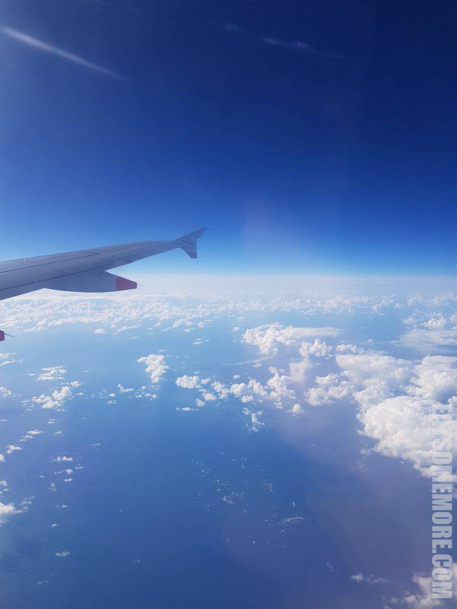
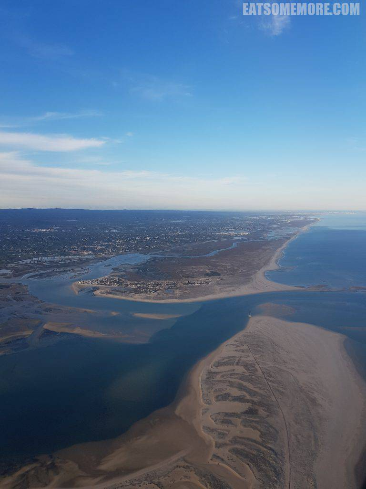
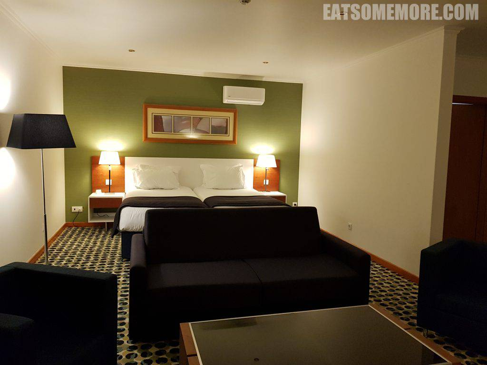
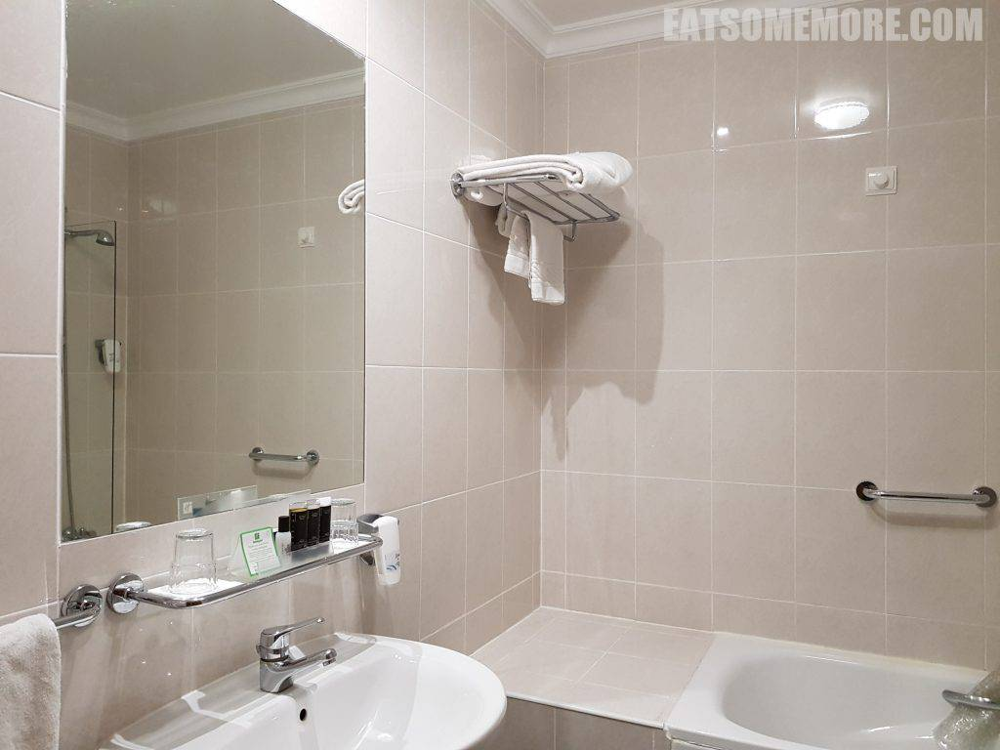
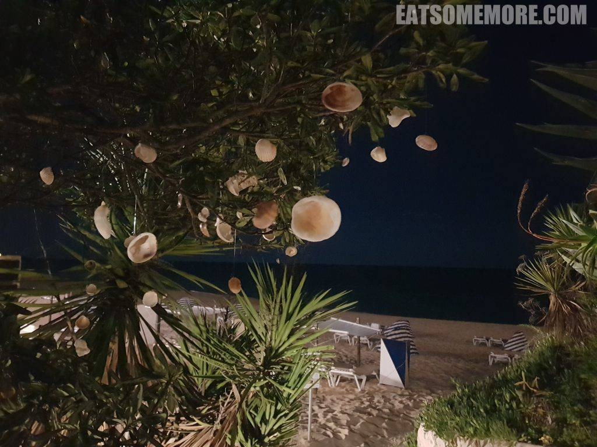
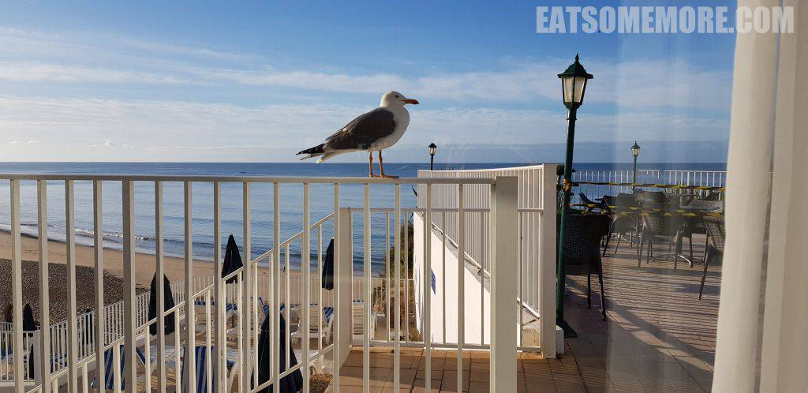
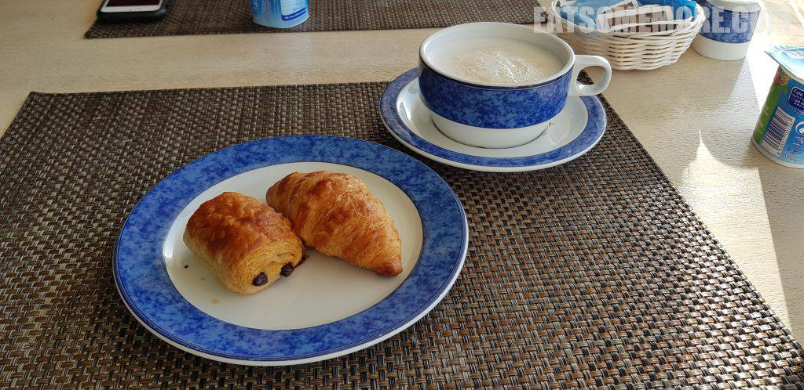
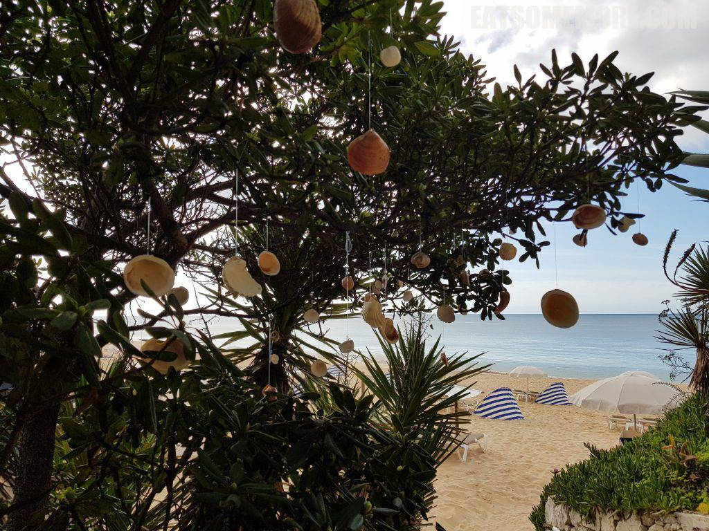
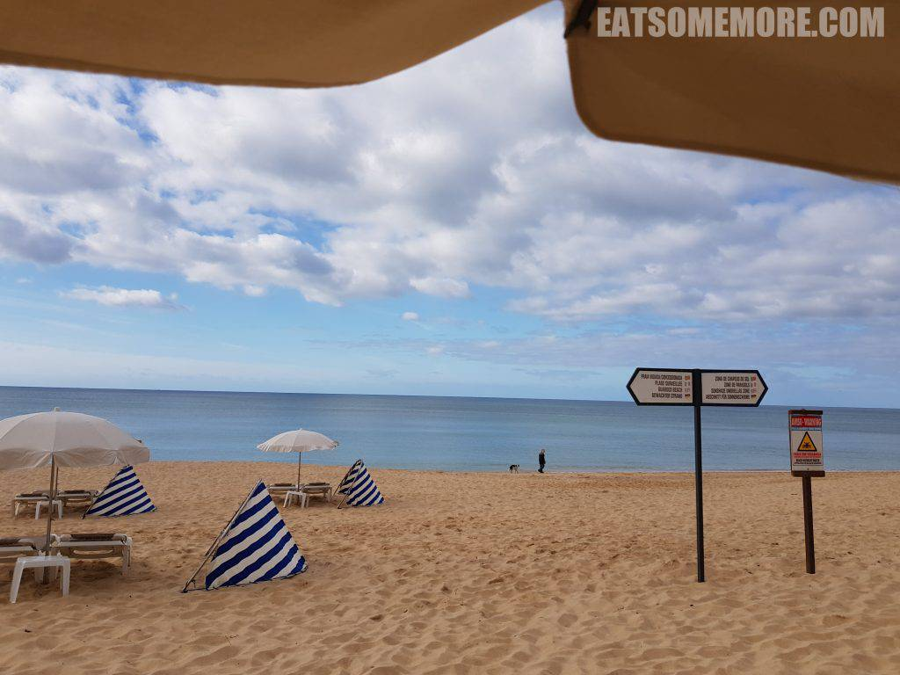

>候鸟尚且南迁，为人岂不向阳？

## 行程总览

>下班后赶往Gatwick机场搭乘英国航空前往法鲁(Faro)。

>葡萄牙南部海岸线有许多沙丘。

## Holiday Inn Algarve

>酒店安排了一间套房。

>窗帘外是一个露台。

>洗手间空间宽敞。

>下了楼就是海滩，地理位置一流。树枝上用鱼线悬着贝壳，随着海风轻轻摇曳。

>转眼在葡萄牙开始了新的一天。天亮后酒店的地理位置优势更加一览无遗。一片沙滩、两种颜色的海、三盏街灯、四朵阳伞、五把躺椅，还有来自本地居民——海鸥的殷切关注。

>早餐品类有限，但是丹麦包素质还是过硬的，外皮酥脆、内里柔软、口味香甜。

>蓝天下的贝壳树更加梦幻可爱。

>走出酒店30秒内就能零距离感受大西洋的水清沙幼。

