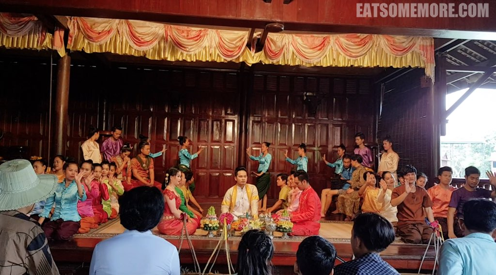
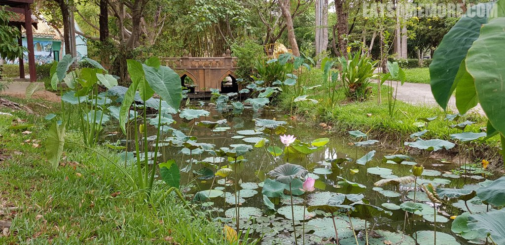
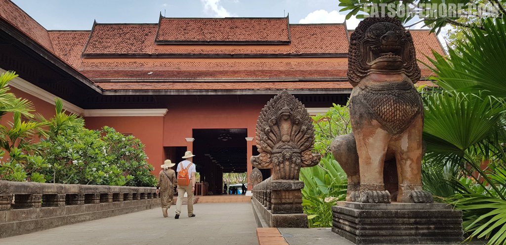
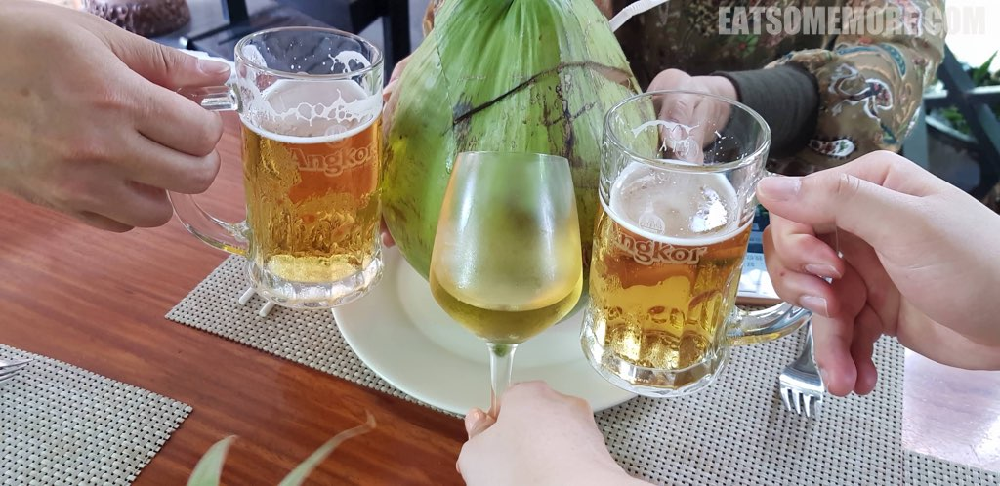
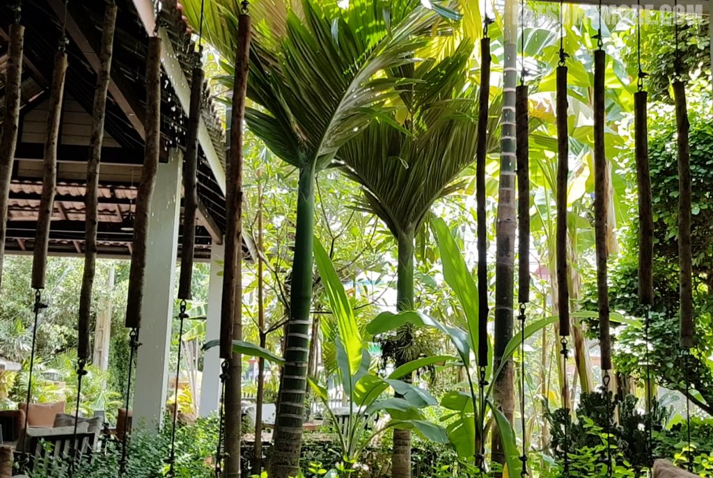
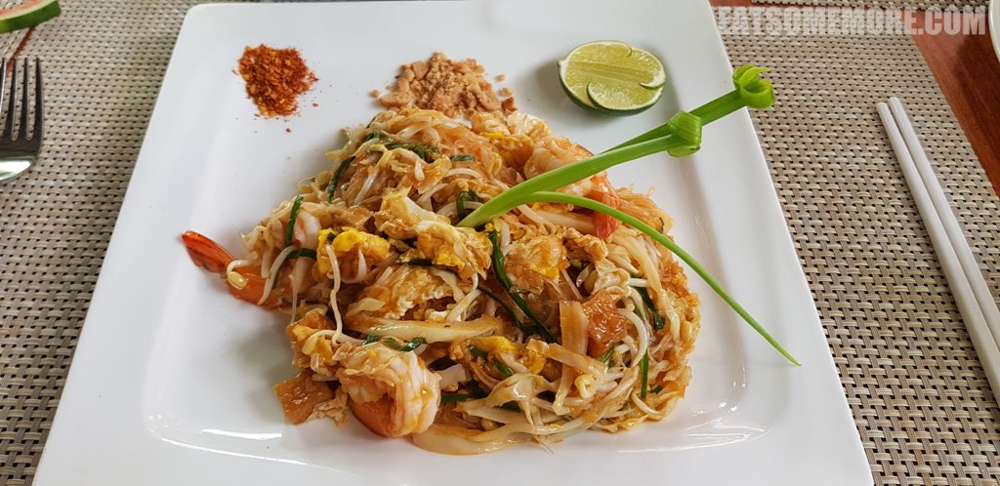

>一波三折地来到旅行的最后一天。

## 行程总览

## 民俗文化村

>在民俗文化村里可以参观暹粒传统民居，观看民俗表演，听导览员讲故事和推销银梳子。由于我们整个团没有人接推销的梗，导览员恼羞成怒地放我们去自由活动了。

>耳根清净下来后，忽然感受到了民俗村的荷塘花开之美。

>九头蛇石像在暹粒很常见，代表的是印度神话中的那伽蛇神，被当地人视为保护神。

## Slek Morn Restaurant

>从民俗村出来，又被送进了免税店。稍作购物后，我们便向导游报备去吃午饭了。看官们通过下图可以感受到我们雀跃的心情吗？

>餐厅环境清幽雅致。

>海鲜炒面真材实料，非常推荐！

再见啦柬埔寨，希望有机会与你更好地相遇。