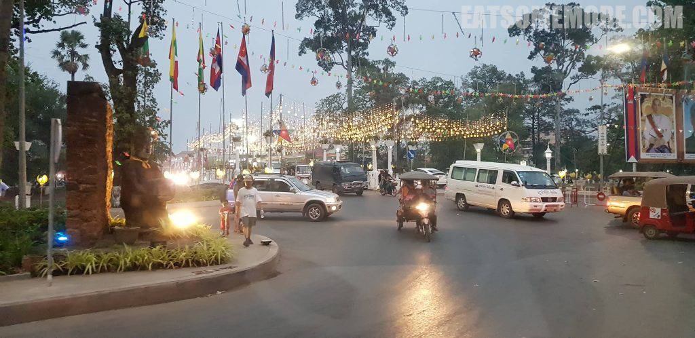
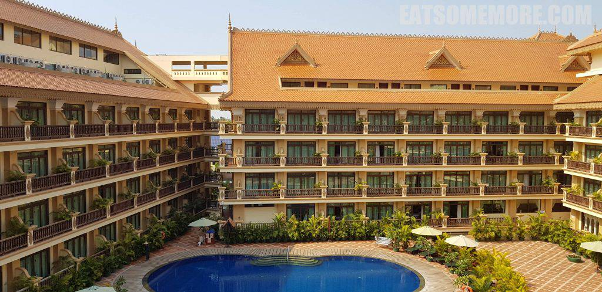
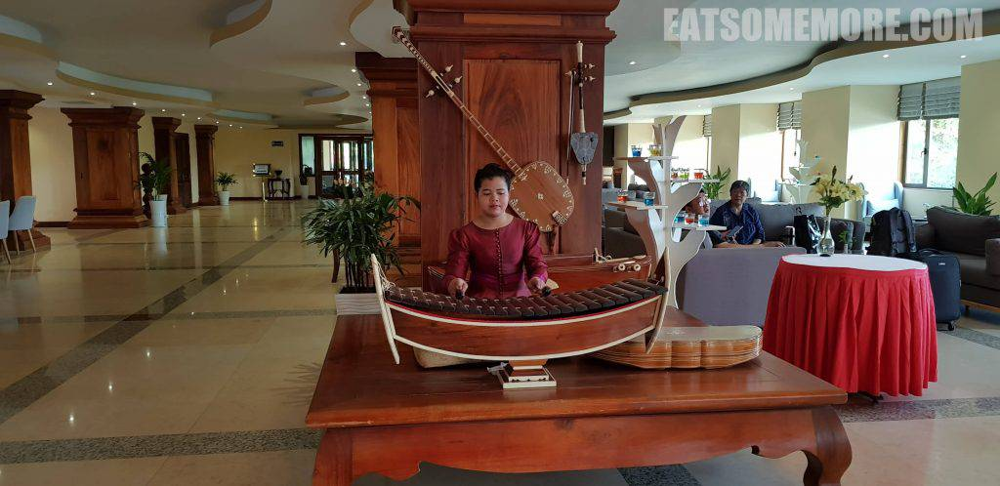
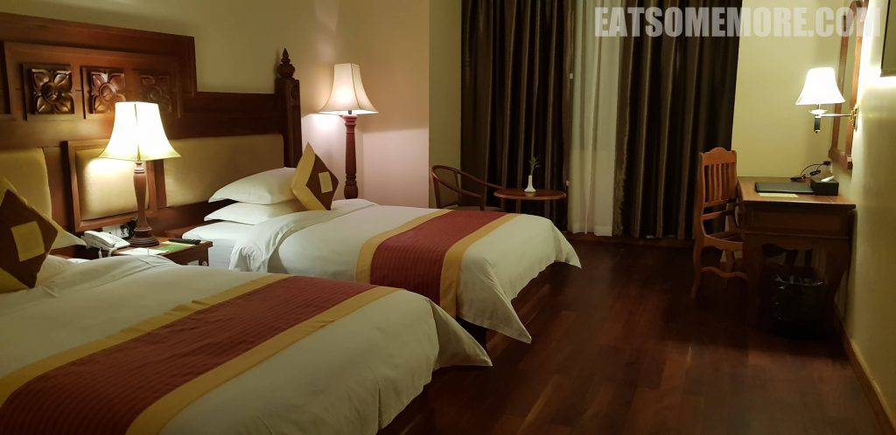
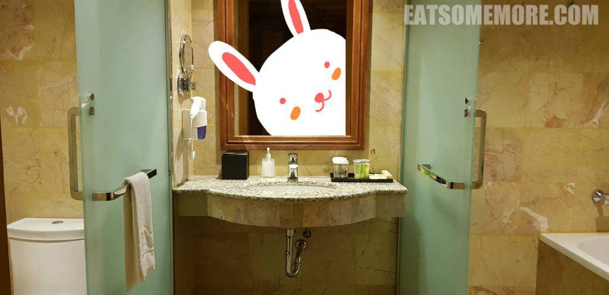
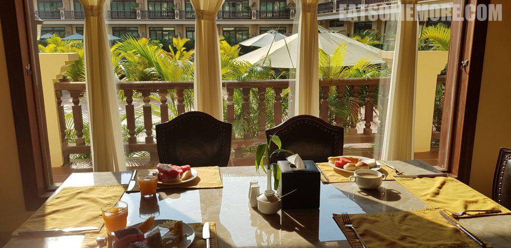
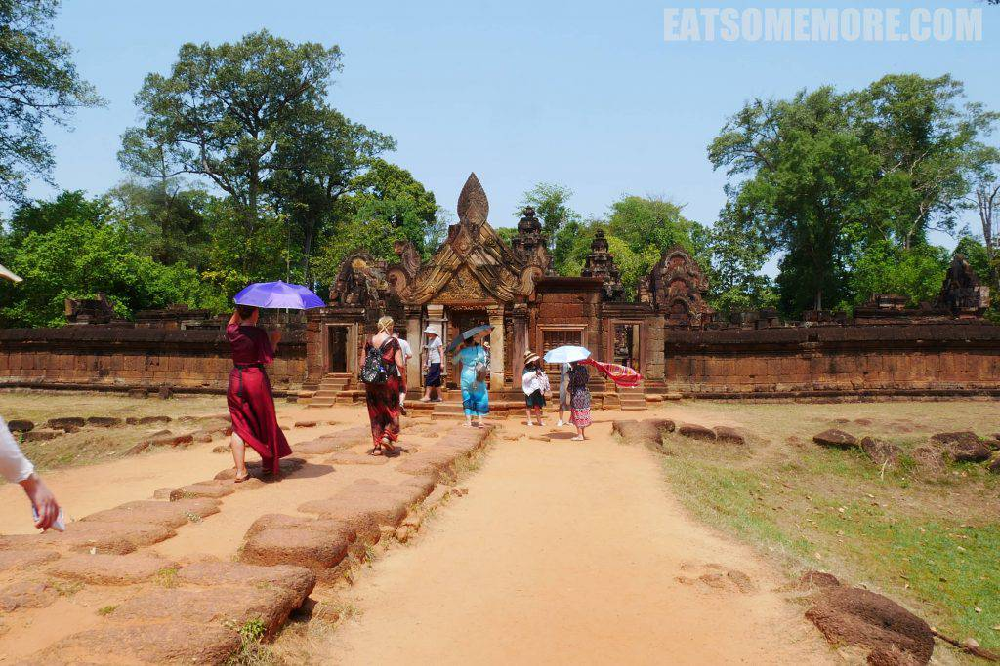
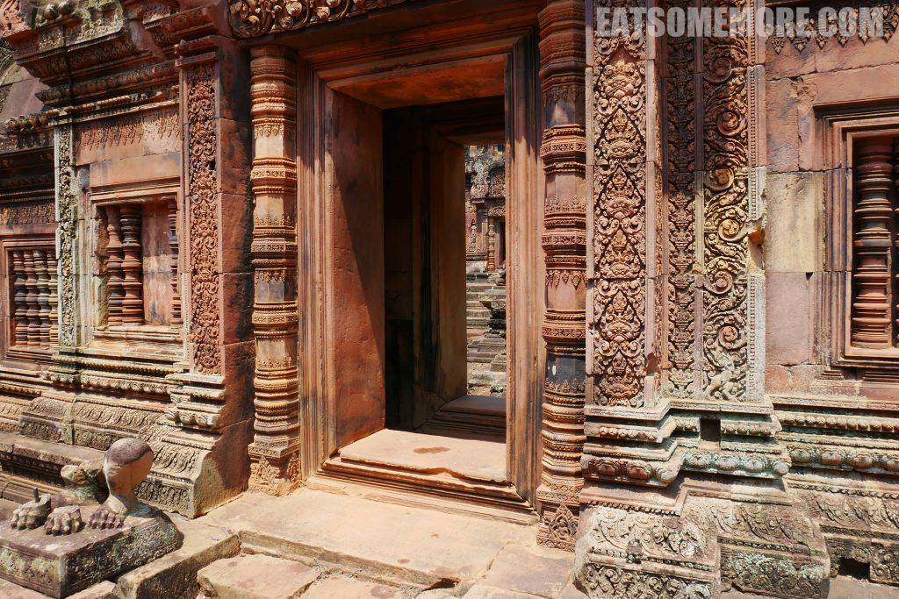
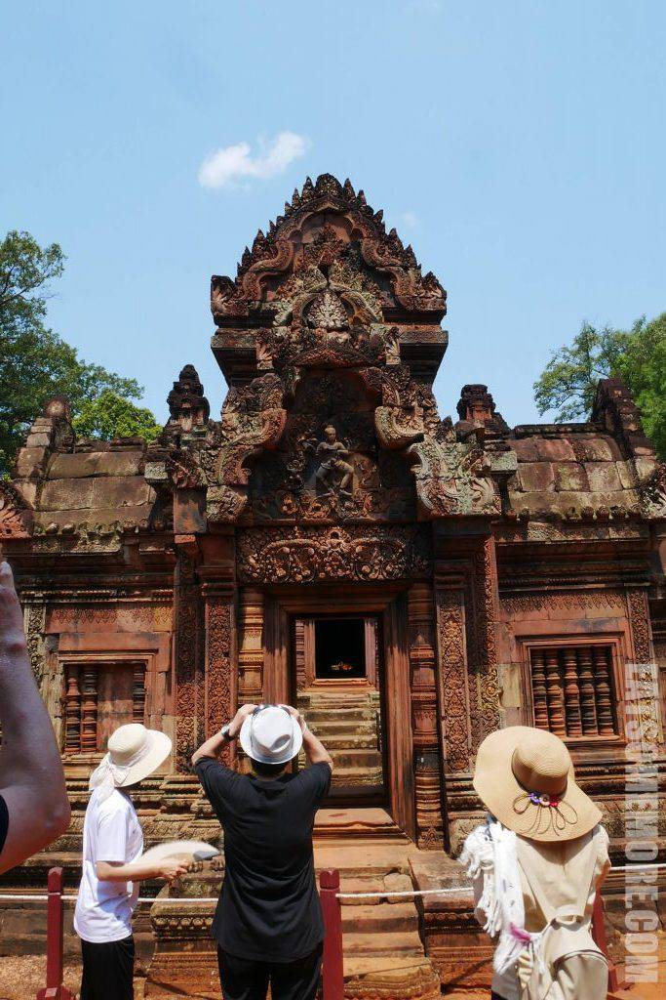
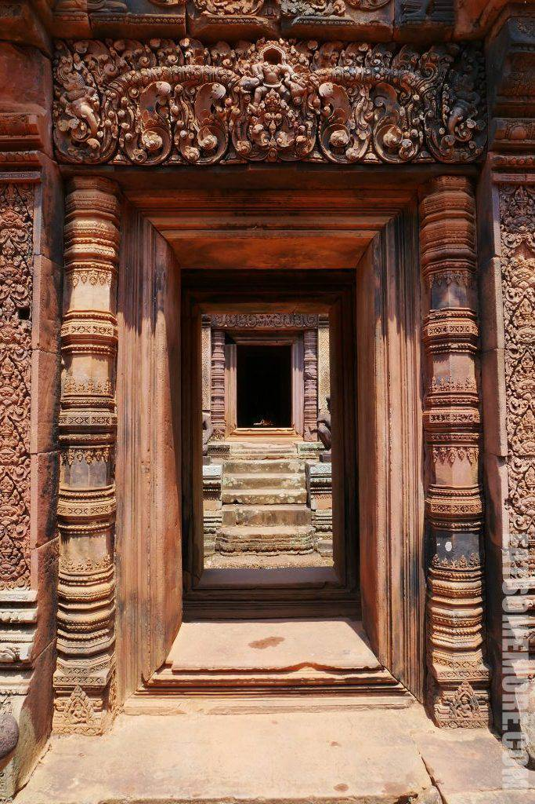

旅游狂热爱好者九姨的东南亚第一站是柬埔寨暹粒。而对我来说这次更加新奇的体验是——跟团游！

## 行程总览

## 吴哥时代酒店

到达暹粒时已接近傍晚。街上朴素又如繁星一般的霓虹灯深得我心。在马路上稳占C位的突突车，提醒着大家此刻正身处东南亚。

 

酒店离市区大约需要15-20分钟车程，但是宽敞古朴，还有一个露天大泳池。

 

酒店大堂有柬埔寨传统乐器的现场表演。

 

房间宽敞整洁。

 

洗手间干湿分离。

 

次日一早，来到酒店餐厅用自助早餐。

 

## 女王宫

早餐后来到位于荔枝山附近的女王宫，又称班迭斯雷。

女王宫始建于公元十世纪，大规模地使用了红色砂岩，建筑上满是精致的浮雕，被誉为“吴哥艺术宝石”。

 

女王宫最具辨识度当属其精致的砂岩楣石和山形墙。巨大的山形墙上雕刻的是印度史诗中的故事，跨立在门框之上，显得气势磅礴。

女王宫坐西向东，共有三层红色砂岩围墙。

 

石门内有三座钟形寺塔。据说，中间最高的寺塔里供奉的是湿婆神，其南是梵天神，其北则是毗湿奴神。

 

团餐和购物点就不一一赘述了。下期景点密集预警，真是叫人期待呢！