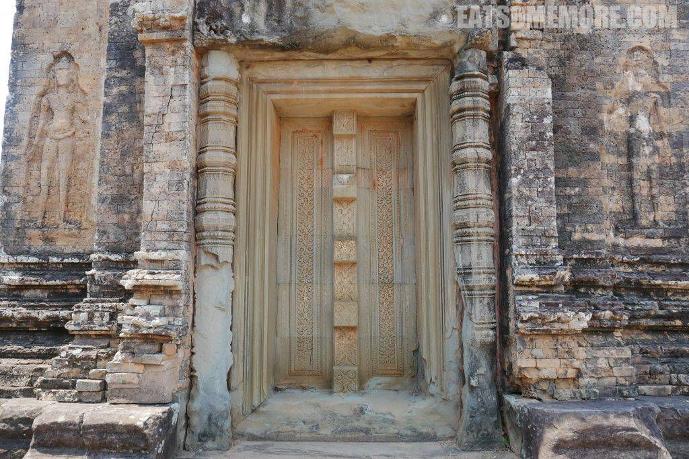
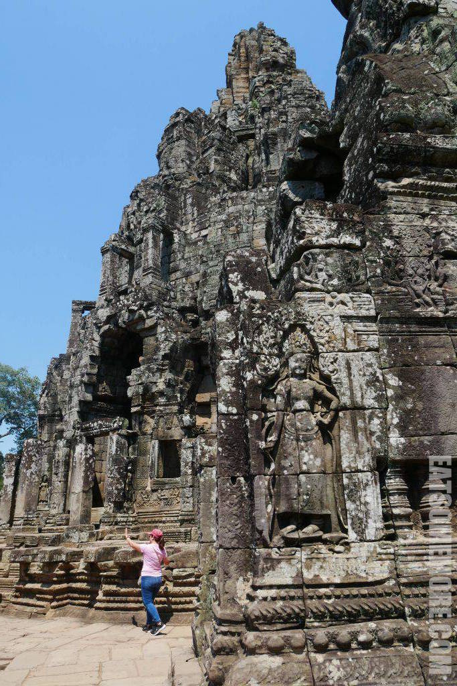

123

## 行程总览

## 比粒寺

state temple of Khmer king Rajendravarman and dedicated in 961 or early 962. It is a temple mountain of combined brick, laterite and sandstone construction. The temple's name is a comparatively modern one meaning "turn the body". This reflects the common belief among Cambodians that funerals were conducted at the temple, with the ashes of the body being ritually rotated in different directions as the service progressed.

 

柬埔寨古刹建筑当中的门有真有假，有些惊悚。

 

## 塔逊寺

达松将军庙（高棉语：ប្រាសាទតាសោម，Ta Som），位于亚洲柬埔寨吴哥古迹内，完成于12世纪末，用以祭祀微笑国王加雅巴尔曼七世（Jayavarman VII）的父亲。四周被卡波克树（吉贝）环抱，而东门可以看到巨树包裹了整个门廊的景象。

    

## 龙蟠水池

  

## 吴哥窟

或译小吴哥、吴哥寺，位于柬埔寨暹粒省暹粒市北5.5公里，是大吴哥城南的一个寺庙建筑群，占地面积162.6平方公里。[2]原为印度教寺庙，12世纪末改为佛教寺庙。[3]吴哥窟是吴哥古都中保存得最完好的的圣殿，以建筑宏伟与浮雕细致闻名于世，是世界上最大的神庙[4]。 12世纪的吴哥王朝国王苏利耶跋摩二世希望在平地兴建一座规模宏伟的石窟“庙山”，并举全国之力花了大约35年建成[5]。吴哥窟建成于14世纪前半[6]。作为一座圣城，吴哥窟属于禁地，供奉化身为逝去的国王暨毗湿奴[7]。 吴哥窟结合了高棉历代庙宇建筑的两个基本的元素：立体庙山的多层方坛和平地庙宇的回廊[8]。吴哥窟中央的庙山由三层长方形有回廊环绕的平台组成，层层高叠，形如金字塔，象征印度神话中位于世界中心的须弥山。庙山顶部矗立着按五点梅花式排列的五座宝塔，象征须弥山的五座山峰。三道回廊象征须弥山所在地的土、水、风；庙山周边环绕一道护城河，象征环绕须弥山的咸海[9][8]。多年从事吴哥窟维修工作的法国远东学院古迹维修专家莫里斯·格莱斯（Maurice Glaize）认为“吴哥窟是吴哥古迹中以造型之雄伟、布局之平衡、比例之协调、线条之优美，威风赫赫，可比美世界上任何最杰出的建筑成就，而毫不逊色。”[9]。 1992年，联合国教科文组织将吴哥古迹列入世界文化遗产[10]，世界各地来吴哥窟观光的游客一持续增加，从1993年不到一万人次，迄至2007年已达二百万人次，吴哥窟已成为旅游胜地[11]。一百多年来，世界各国投入大量资金在吴哥窟的维护工程上，以保护这份世界文化遗产。 吴哥窟被认为是柬埔寨和高棉民族的重要象征。从1863年开始，吴哥窟造型就已经成为柬埔寨国家的标志，被描绘在柬埔寨国旗上[12]。

吴哥窟东西方向1500米长，南北方向1300米阔的长方形，连护城河在内，占地近200公顷[76]，主体建筑群吴哥窟是吴哥古迹中最大的庙宇[77]。吴哥窟的整体布局，坐飞机从空中可以一目了然：一道明亮如镜的长方形护城河，围绕一个长方形的满是郁郁葱葱树木的绿洲，绿洲有一道寺庙围墙环绕[78][79]。围墙由红土石构成，全长1025米，宽802米[80]。绿洲正中的建筑乃是象征须弥山的吴哥窟。吴哥窟坐东朝西。两道东、西长堤，横穿护城河，直通庙宇围墙的东西大门。过西大门，一条长长的大道，穿过翠绿的草地，直达庙宇的西大门。在金字塔式的庙山之巅，矗立着五座宝塔，如骰子五点梅花，其中四个宝塔较小，排四隅，一个大宝塔巍然矗立正中，与印度金刚宝座式塔布局相似，但五塔的间距宽阔，宝塔与宝塔之间连接游游廊，此外，庙山的每一层都有回廊环绕，乃是吴哥窟建筑的特色。

   

吴哥窟有1532个石柱子[55]。有门柱和廊柱两类，门柱立于门的两侧，上支门楣；门柱截面有正方形的也有圆形的。门柱的柱础刻有立于小壁龛内的雕像，从柱础直到柱冠，布满树叶图案，中有层层环圈分割[193]。支撑廊庑拱顶的方石柱，由整块沙岩雕成，柱础和柱冠有简单的花卉图案圈，柱身有的刻仙女浮雕，有的素净[194][195]，还有的柱基装饰着苦行僧双手合十在壁龛内打坐[196]。

 

第二层台基又高出第一层台基五米半，也有长方形廊庑环绕，东西方向长约115米，南北方向宽约100米[108]。回廊宽约2.45米，朝外一面是普通的墙，朝内的墙壁开棂窗，没有石柱，也没有侧廊；从二院观看，回廊的墙壁装竖棂盲窗，盲窗之间的墙壁，有许多服装和发型多姿多彩的仙女浮雕[108]。回廊有四座门楼，分布四偶，还有六座廊门，西边三座，东、南、北各一。四隅的门楼，有两座不同方向的下行台阶通一院；南、北、西廊门各有上下二石阶，下通一院，上通二院；三座西廊门的三座台阶，居中的台阶上通二院藏经阁的十字台，下通田字阁，其余二廊门的台阶，上通二院，下通田字阁[118]。回廊北侧有回音厅[108]。第二平台回廊四角的门楼，顶部各矗立一座宝塔；因年久失修，四座宝塔的顶部大半缺损，九层宝塔只剩二三层。北廊东门和南廊中门有保存得十分完好的三角墙[119][120]。第二院的西南、西北隅各有一座小小的藏经阁，两壁的楞窗和残破的屋顶，使内堂明亮。两座藏经阁之间由一个架在矮石柱上的十字台在南北方向相连，十字台的东西道接连第二平台回廊的西门和第三平台回廊的西门。这个十字台也后人添加的[108]。

  

吴哥窟布局十分均称，富有节奏。吴哥窟建筑群，有两种形式的对称，镜像对称和旋转对称。从护城河、外郭围墙到中心建筑群，以横贯东西方向的中轴线为中心，呈现准确的镜像对称：甚至广场大道中轴线上南北两个藏经阁、两个水池，也对称的分布在两边。从广场大道望吴哥寺见正中一高塔，两座较小的塔在左右对称地陪衬著，构成一个山字形。寺庙顶层的五子梅花塔群，除了中轴对称之外，有更严谨的两组旋转对称：从东、西、南、北四方，呈现相同的山字形构图，成90度旋转对称。还有第二组90度旋转对称：从西北、西南、东南、东北、四个对角方向看，也是一样的山字形构图[注 1]。五座宝塔也只有如此安排，才有最大限度的对称效果，四面八方地重复展示同一造型主题。

 

有东西南北四道长廊组成的回廊是吴哥窟庙山另一个突出的建筑艺术特色。吴哥窟的长廊由三个元素组成，内侧的墙壁兼朔壁，外向的成排立柱和双重屋檐的廊顶。这三个元素除去明显的实用功能之外，对于美感的贡献，三者缺一不可。长长的廊庑，数十根立柱，一字排开，为吴哥窟的总体外观，添加横向空间的节奏感。廊庑的重檐，为吴哥窟的外观添加纵向节奏感。回廊首先出现于空中宫殿的顶层台基，而在吴哥窟发展到颠峰，三层台基各有回廊，如同乐曲旋律的重复，步步高，步步增强，最终归结到主体中心宝塔。

吴哥窟的长廊，形式多种多样，有的有石柱，凡有石柱的长廊或是一边两排石柱，或两边各两排石柱，没有一边一排或两边各一排的格式。吴哥窟的长廊的筒形拱顶较高，跨度较小，如果只有单排石柱，单靠一道又高又窄的筒形拱顶，难起防雨作用，因此必需加筑侧廊，增加半个拱顶，加宽拱顶的总宽度，以起防雨的效果。因此在同一边的两排石柱，一排支撑主拱顶，一排支撑侧廊拱顶。吴哥窟凡有双柱的长廊必有单边偏廊，只有一边看去是重檐；凡有四排石柱的长廊，即每边各两排石柱，则两边各有侧廊；从任何一边看去都是重檐。长廊有两排石柱的一边是敞开的，另一边是石墙壁。吴哥窟长廊的墙壁，有的是整片雕墙，中间不留窗子，有的开着明窗，可以外望，有的开著装饰性的直葫芦棂盲窗；明窗之间或盲窗之间的墙壁，装饰著头戴金冠，足带金镯的女神的浮雕。回廊的出入通道，相当考究，有两种形式：有塔的塔门和没有塔的廊门。廊门像个亭子间，在与游廊成直角的方向，向外延伸两三进，每进的亭子有拱顶，有二三对方柱，每进的顶上有雕刻精细的门楣和三角墙。长廊的布局有一字廊、回廊和十字游廊三种形式；十字游廊通常和回廊组成田字廊。从外郭到顶层的长廊形式如下：

外郭围墙：直葫芦棂虚窗双柱重檐长廊。
基层围囿：雕屏双柱重檐回廊。
中层围囿：直葫芦棂虚窗单檐回廊。
顶层围囿：明窗双柱重檐回廊。
顶层、中层田字阁：四柱十字重檐游廊。
吴哥窟的建筑师巧妙地运用空间，用长长的大道显示空间深度感，用回廊的横展，构造出建筑物的宽阔感，用不同层面回廊的透视重叠，构造出建筑物的高峻感；吴哥窟虽无大型的中心建筑，但其外观可以媲美于一座庞大的中心建筑。

 

吴哥窟的门楣，有两种风格，一种是图案式门楣，中央横贯彩虹图案，两翼装饰着花环，另一种是叙事雕刻，布满各种雕像；其中的多头蛇，多数有头饰；草木花卉，蜷曲紧凑，形象鲜明；神明和仙女各有扮相，布满画面，不留空白[190]。从9世纪以来，高棉的雕师就用彩虹图案象征人间同往仙界的桥梁，在吴哥窟门楣上常见印度教众神之首因陀罗像，横贯画面中央的彩虹图案，就是因陀罗之弓，人们从彩虹门楣之下进入吴哥寺，就象征人们由人间踏入仙境[191]。

吴哥窟内许多门颊有花卉图案浮雕，花卉枝条卷中雕刻一串莲花座上头顶冠冕双手合十的神像，门颊的周边围绕一圈小莲花图案[192]。

 

毗湿奴骑金翅鸟

 

印度神话故事

 

吴哥窟内有一千八百多个仙女的沙岩浮雕分布在东南西北四大门的外壁和金兹坛的内外壁[179]。仙女有的身穿轻纱，在天空飞翔，有的亭亭玉立于莲花之上，纤手执花束，满脸迷人的笑容，她们的头饰多姿多彩，她们戴着耳环、项链、手镯、臂镯和脚镯，她们露出酥胸，穿着绣花裙子[180]，有的站立在壁龛里，头戴镶珠宝的三叉冠冕，项上围一圈珠宝项链，还有三串珍珠链悬挂酥胸，垂达纤腰，小围裙镶满宝石，外套一件纱笼[181][182]。仙女的容貌，来自王宫中的宫女，周达观《真腊风土记》中记载，国中美貌的女子，都被召入宫中，加入数千嫔妃的队伍中，宫女们肌肤洁白如玉[183][184]。笑容可掬的仙女是高棉绒欢乐的象征[185]，她们使得严峻的石室化为天堂[186]。也有的仙女束发，没有冠带，她们的脸和乳房，被无数游客的手摸得漆黑如花岗石[187]。仙女有时成单，有时成群，刻画在平整的沙岩石壁面，有时在壁龛之中；仙女的舞姿，几乎千篇一律，显然是依靠着样板雕刻的[185]。仙女的足部比较别扭，一律雕侧面，不是正面，富有才华的高棉雕师，突然在在技术问题上了栽跟头[149]；也许高棉的雕师，还未能掌握正面透视[185]。在中层廊庑，许多仙女是半成品，有的雕了头部，身躯还未雕刻，有的已雕出身躯，但服饰仅有轮廓，有的还仅仅在石壁上勾画出轮廓，半途而废的原因不明[149]。

  

## 巴戎寺

         
567
  

## 圣剑寺

     

## 巴肯山

   
