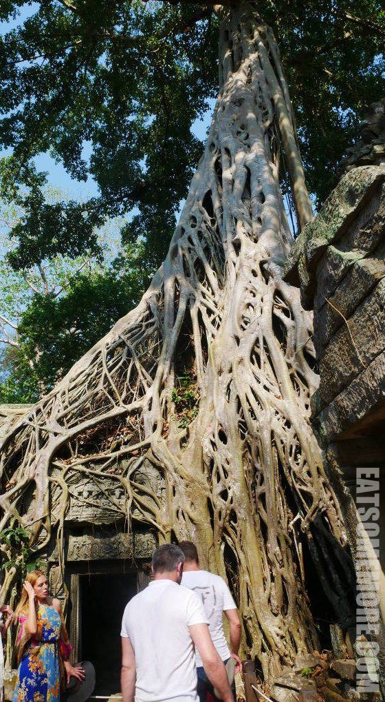

在暹粒的第二天，大家起了个大早，因为这一天要去好多地方。

## 行程总览

## 吴哥窟

吴哥窟，又称小吴哥，自1992年被列入世界文化遗产名录以来，访客人数从每年不足万人增加到如今以百万计。因此，为了避开人潮，我们一早就赶往这座圣城。

 

这晨曦中的剪影正是柬埔寨国旗上描绘的样子。

走在横跨护城河的长堤上，见到红莲开得正好。

 

吴哥窟始建于公元十二世纪。彼时吴哥王朝国王苏利耶跋摩二世倾举国之力，历时约三十五年才建成这座坐东朝西、占地将近两百公顷的、世界上最大的神庙。

 

吴哥窟的上千根石柱，组成了许多兜兜转转的廊庑。

 

石柱上的门楣，装饰有草木花卉图案的浮雕。

 

到了第二层，建筑的平衡、协调与优美在明亮的采光当中更加明显。

 

回廊的一侧开有直葫芦棂盲窗。所谓盲窗，具备通风和采光的功能，同时有遮挡视线的特点，常见于寺庙建筑当中。

 

从内向外望去，吴哥窟严格对称的布局净收眼底。位于广场中轴线大道的南北两侧各有一座藏经阁。远处还有一颗热气球正在冉冉升起。

 

空间在吴哥窟的一个个回廊和一组组窗棂梁柱之间显得高深莫测。

 

长廊有整片的雕墙，诉说着印度神话故事。

 

骑着金翅鸟的毗湿奴跃然墙上。

 

据说吴哥窟有约两千个仙女浮雕，其中有许多半成品。咱们偶遇的这一位仙女却姣好曼妙得很，头戴三叉冠冕，身着珠宝轻纱，手执缱绻花束，手环臂钏脚镯亦一应俱全。

 

离开前，大家来到了广场南侧的水池前观赏吴哥窟的倒影，真是3D对称呢！

 

## 比粒寺

比粒寺建于公元十世纪，主要建材为砖、红土和砂石。

 

气喘吁吁地登上庙山，有种一览众生小的观感。

## 塔逊寺

塔逊寺，别名达松将军庙，祭祀的是微笑国王阇耶跋摩七世的父亲。

 

巨大的山形墙十分具有高棉特色。

 

阳光穿过十二世纪的砖石洒在身上的感觉可能就是历史的厚重感吧！

 

一路向前，还能见到巨树环抱门廊的奇妙景象。

 

## 龙蟠水池

这里据说是古时的疗养场所。由于是旱季的关系，主要的水池已经见底。传说这里以前种植着具有医疗效果的草药，雨季来临时池中就会蓄起药水。

 

主水池的四面各有一个这样的小水池。

 

## 圣剑寺

接下来就来到了这一天当中我个人觉得最神奇的一个寺。佛教当中，由于僧众合聚犹如大树簇集，所以有以“丛林”代指可以安僧办道的大寺院的说法。而圣剑寺真真有“丛林”的即视感。

 

在这里，巨木与古刹密不可分。

 

树根的空隙处还隐约能看见雕像。

 

据说安吉丽娜裘丽主演的《古墓丽影》就是在这里取景的。

 

树根粗壮得显得游人都格外渺小。原来无论社会如何发展，建筑怎样巧夺天工，自然的力量从不会缺席。

 

## 巴戎寺

巴戎寺位于吴哥城的中心，意为“美丽的塔”，建筑布局上圆下方，共计54座石刻佛塔，代表了高棉国时期的54个省份。

 

佛塔上雕刻的四面佛均为阇耶跋摩七世的形象。

 

其中只有一座微笑的四面佛，被称为“高棉的微笑”。

 

漫步巴戎寺中，发现了一张“高棉的微笑”的“证件照”。

 

换一个角度，又发现了一张他的“沙龙照”。

 

寺中的其他浮雕也栩栩如生，姿势轻盈。

 

据闻巴戎寺的浮雕刻画了超过一万个人物。

 

鳞次栉比的巨石门框，仿佛是穿越时空的通道。

 

## 巴肯山

将近傍晚时，我们离开了吴哥城，前往这天的最后一个景点。

 

护城河上桥面两侧的雕像，浑身都是岁月的沧桑痕迹。

 

登上巴肯山后俯瞰吴哥城，好像在看一片森林。

 

间或有些石塔从树林里冒出头来。这样的景观，教人分不清自己是身处十二世纪还是二十一世纪。

 

远处的热气球又升了起来。如果不是参加了旅行团，我也好想去乘一乘那热气球，去空中看看神秘的吴哥。

 

虽然是看日落的行程，但是约定的返程集合时间是在日落之前。可以想象丛林日落一定是特别又美丽，然而跟这个团是无法看见的。所以，为了优化同行的爸爸妈妈的旅行体验，接下来的两天将会有一些自助安排的行程。大家会期待吗？

