经过前一日的奔波，这天我们计划着在下一个行程之前体验一下酒店的按摩服务。

## 行程总览

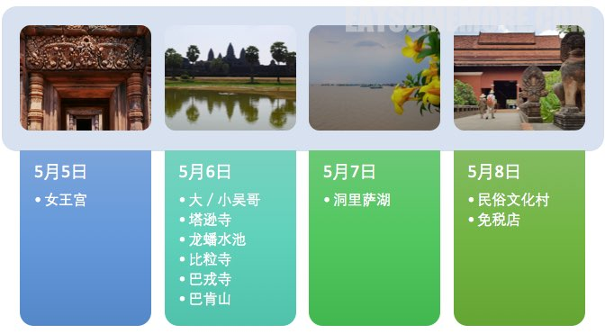

## 吴哥时代酒店

前一晚回到酒店时就在前台预约了次日的按摩服务。技师们第二天非常准时地来到了房间。整套按摩大约一个半小时，舒适放松，畅快爽利。在酒店休息放松的另外一个小收获是发现了墙上的画简直是柬埔寨乡村的真实写照。

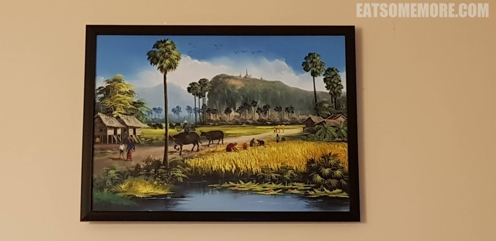

按摩后下楼在酒店的餐厅吃午餐。砂锅大虾鲜甜弹牙，非常值得推荐。

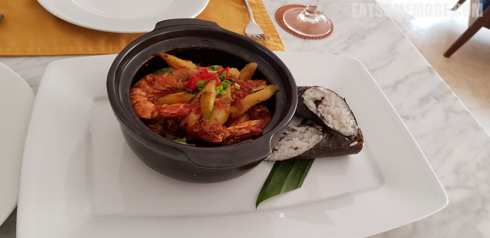

小炒通菜咸中带甜，蒜香提鲜，爽口下饭。

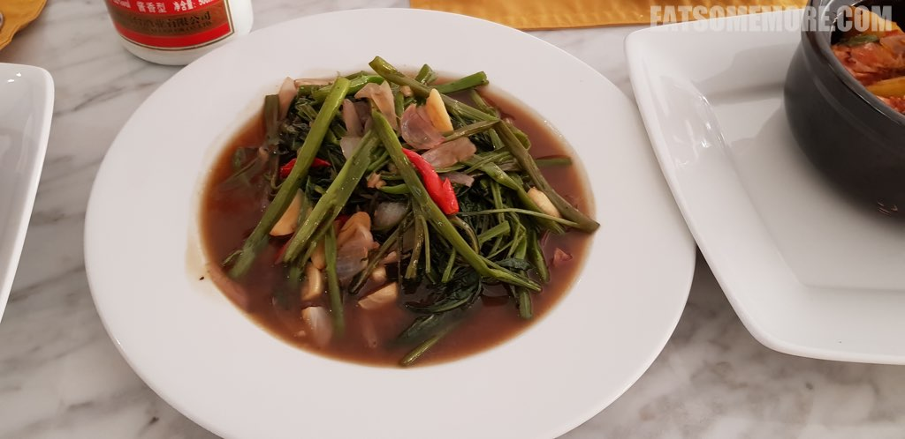

恕在下牙口不好，这道砂锅牛肉丁就不多做妄评了。

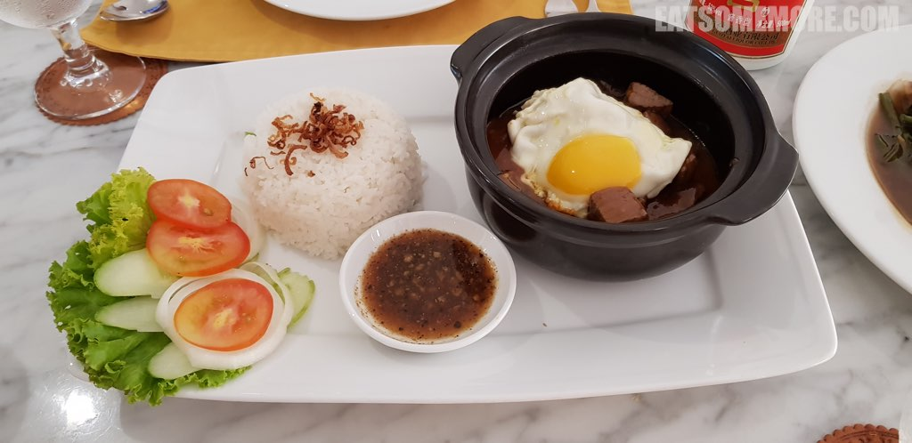

## 洞里萨湖

午餐后，导游来接我们去游览东南亚最大的淡水湖，洞里萨湖。

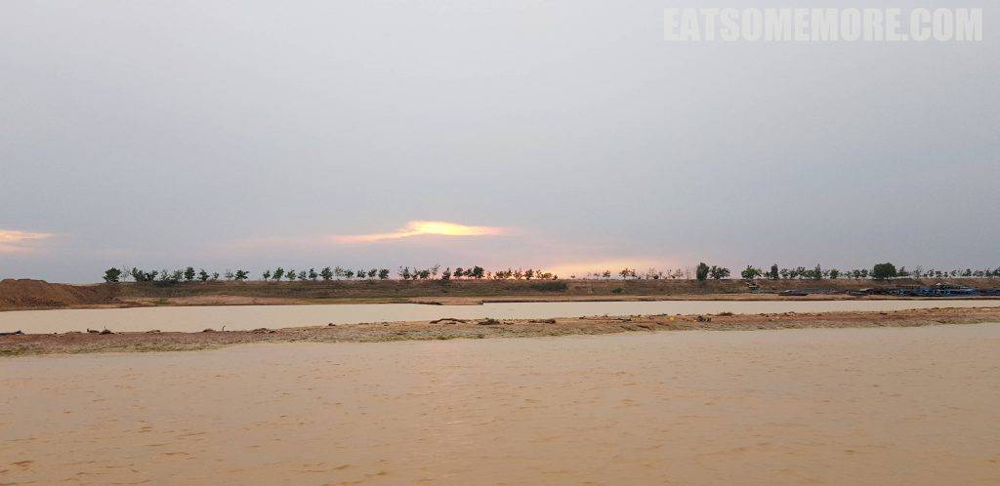 

船行大约15分钟后，我们上了一座船寨，里面供应纪念品、水果和其他小吃，还有鳄鱼可以观赏。

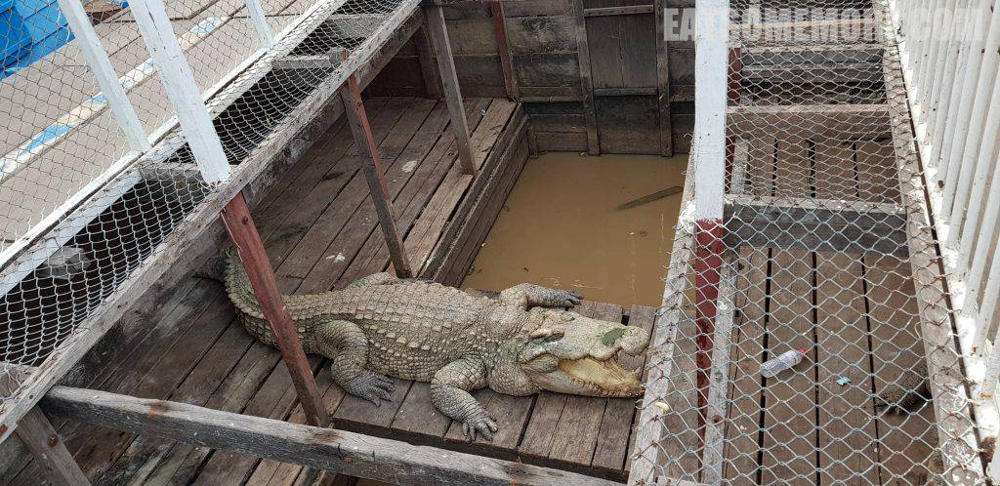

据说湖里还有越南人的船寨。

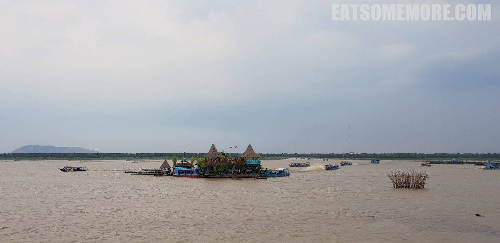 

又见“故事的小黄花，从出生那年就飘着”，好像洞里萨湖的小孩，还在襁褓当中就被大蟒蛇盘着睡在妈妈的怀里，再大一些就划着塑料盆甚至泡沫箱子追着游船要小费，还有些看起来不过十岁左右的男孩子就已经在帮着掌舵开船，真的太不容易了。

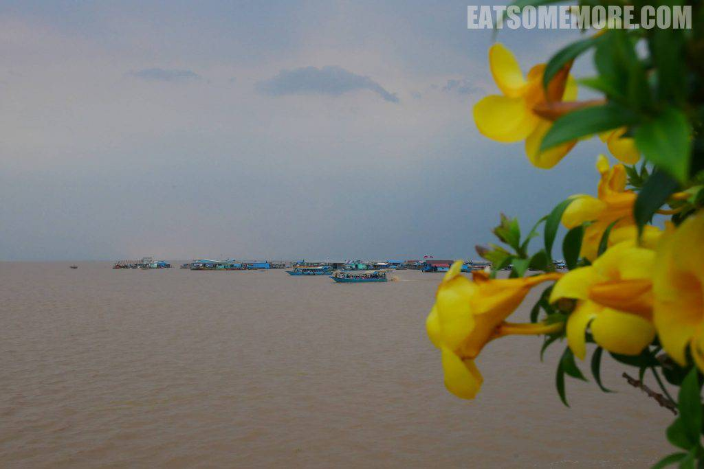

## Five Sons

晚餐时我们来到了暹粒市区的柬埔寨餐厅。牛油果沙拉非常新鲜。香煎羊排软嫩多汁。柬埔寨特色咖喱和红咖喱层次丰富，鲜甜入味。

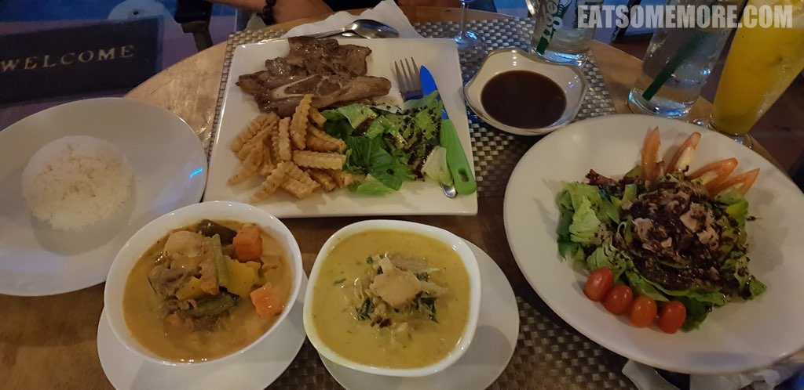

回酒店的路上遇见了同样在散步的壁虎。

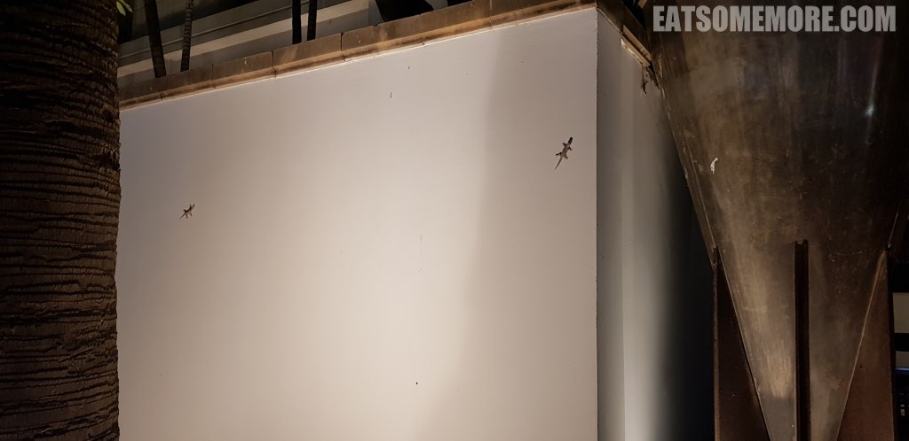

## 吴哥时代酒店水果铺

回来后，自然还是要在酒店门口的水果摊喝个现开椰子汁。

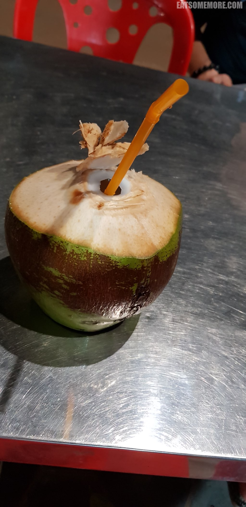

暹粒的芒果也不能错过，甜润鲜香，美味无双，吃过才能睡得着的呢！

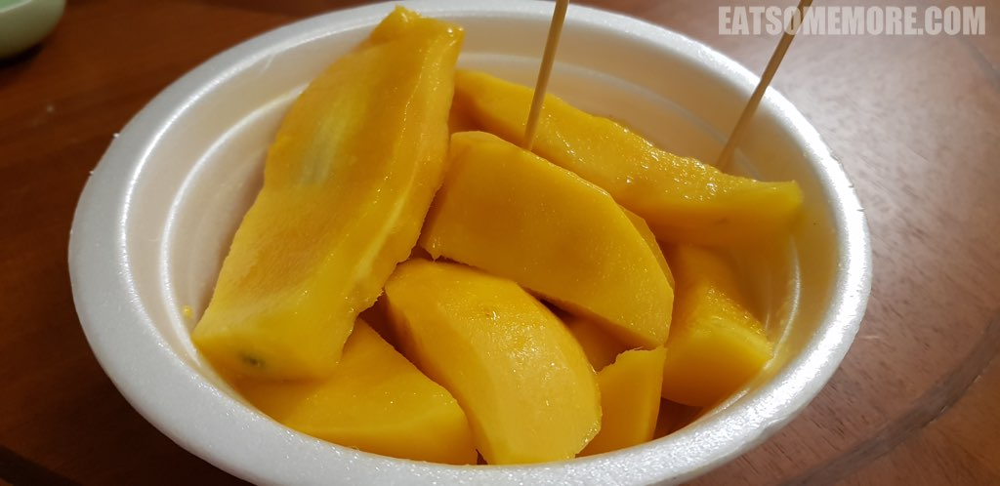