## 前言

>传说中的“九省通衢”武汉，拥有横贯东西的黄金水道和纵跨南北的京汉铁路，进而形成了通达包容的地域文化。

```
一座老市大城，两岸隔江相望。
文化东西合璧，民风南北交融。
始尝豆丝脆弹，醉心江徊鱼汤。
最好清炒菜苔，方得热干面香。
```

## 行程总览

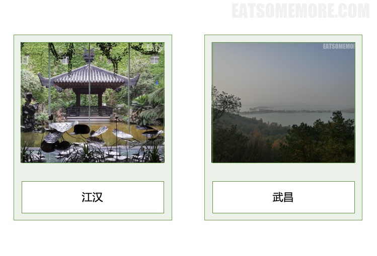

### 东方建国大酒店

>中国南方航空在武汉的合作酒店是位于汉口火车站附近的五星级商务酒店，东方建国大酒店。现代欧式的建筑风格，精致优雅。

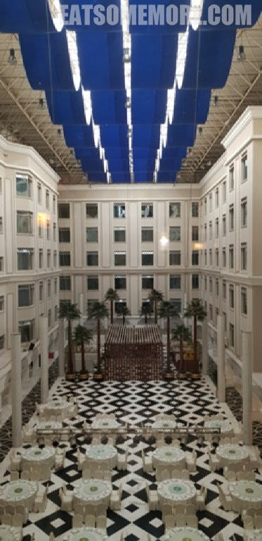

>客房走道静谧雅致。

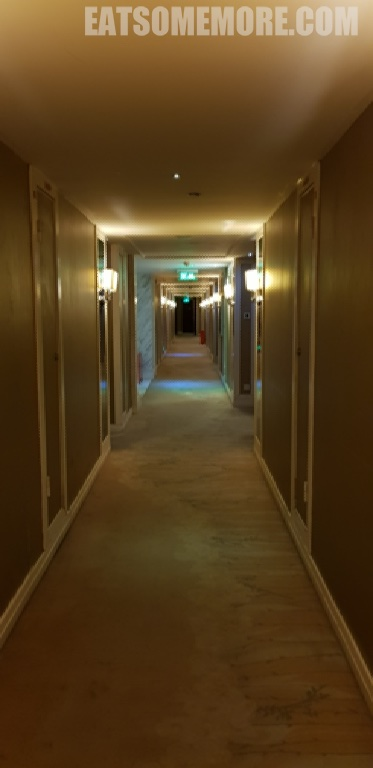

>房间宽敞典雅。

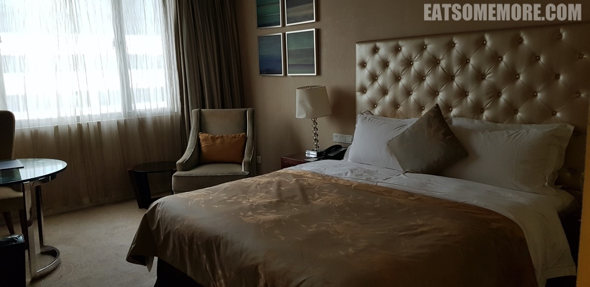

>早餐是蒸功夫的套餐，虽然选择非常少，但是豆浆非常香。


### 武汉博物馆

>武汉博物馆是下雨天的好去处。博物馆一楼大厅的落地窗引入了户外的湖中凉亭之景，搭配室内的荷塘铜塑，好一幅动态雨中荷塘图。

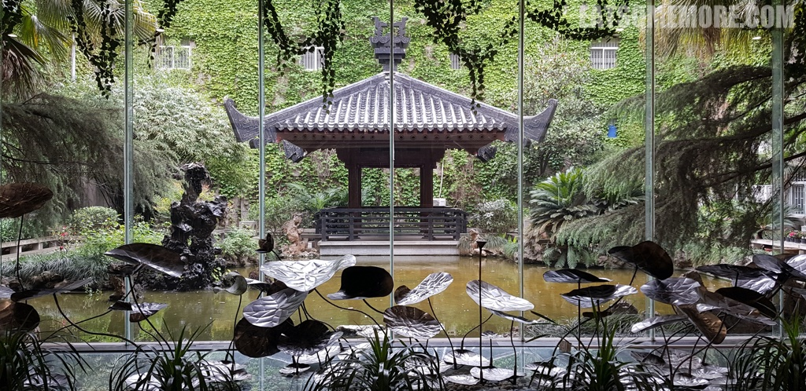

>中国的博物馆自然少不了瓷器。其中，清乾隆黄地粉彩缠枝莲八宝花觚个性鲜明，圈足、敞口、长身，色彩丰富立体。

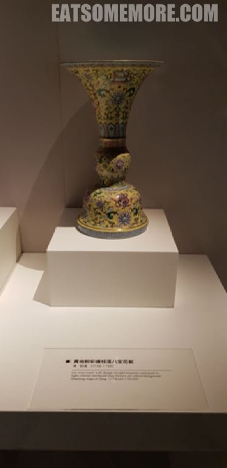

>清乾隆天青釉梅花天球瓶则是另一种风格，小口、直颈、丰肩、圆腹，温柔优雅。
```
天青何必等烟雨，自有雪梅绽枝头。
```
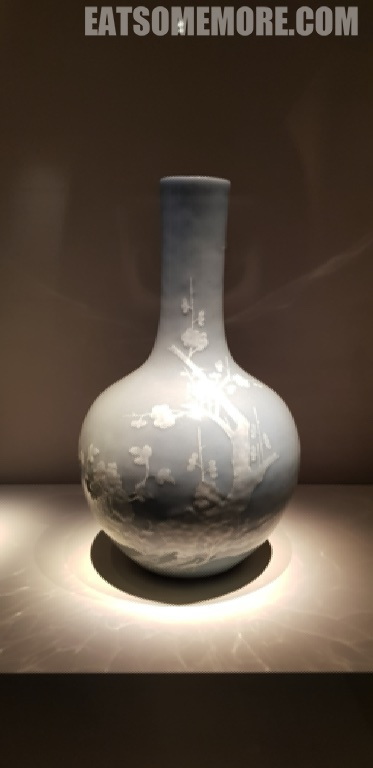

>这里展览的还有木质家具。

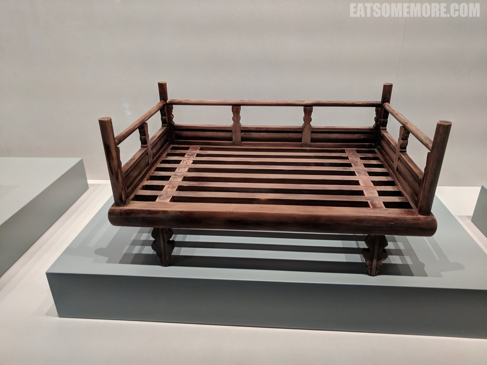

>点翠首饰的展柜也令我印象深刻，雪青色的翠鸟羽毛色泽鲜亮、风华绝代。

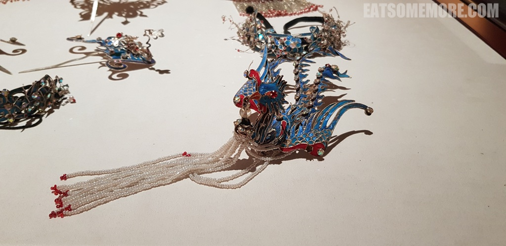

### 龟龙片甲

>午餐时我们来到了人气颇高的网红餐厅龟龙片甲。

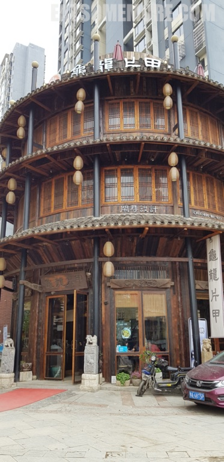

>无论是室内还是室外的装修都非常有特色。

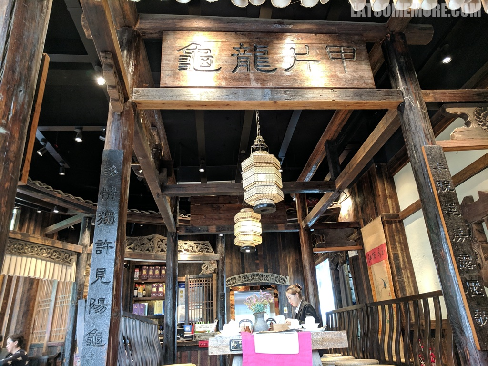

>特色菜是乌龟甲鱼煲，味道咸香浓郁，裙边部位的胶质炖得软糯Q弹。

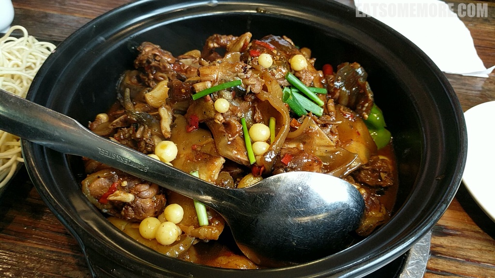

>往煲里加入娃娃菜和油面，吸收汤汁精华，别有一番滋味。

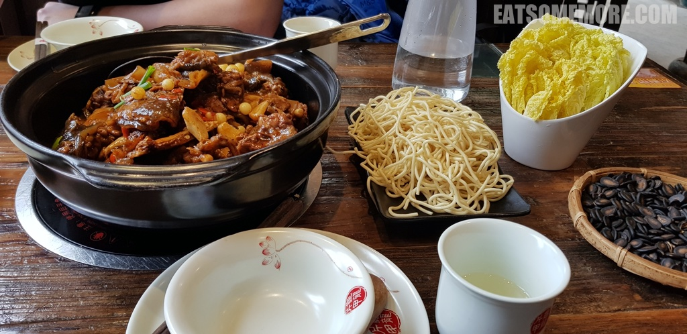

### 武汉美术馆

>饭后又到了武汉美术馆消消食，遇到了一群正在围观美术作品的“群众”，忍俊不禁。

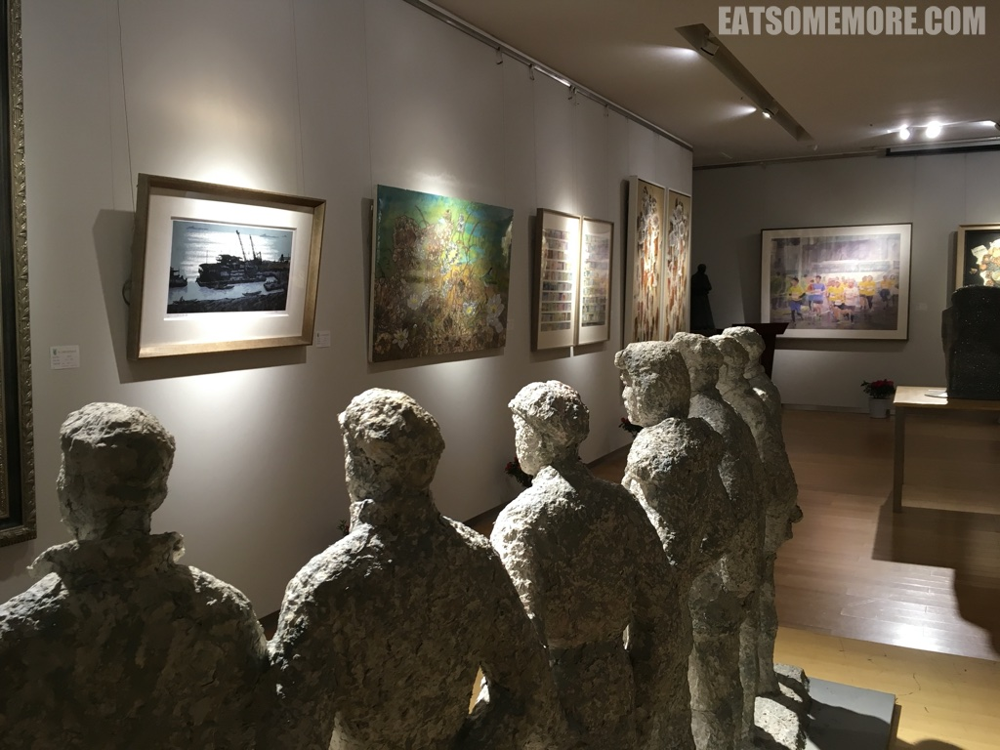

>从武汉美术馆出来向北走两个街区，有一家本地人十分青睐的汤包店。

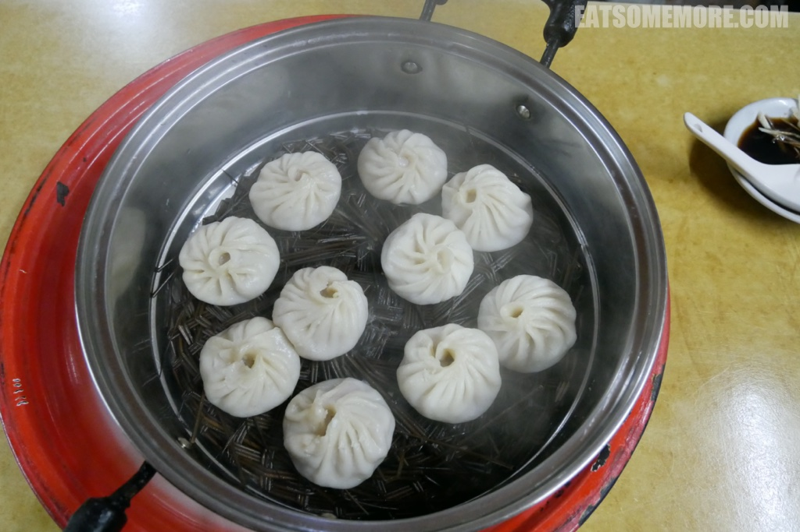

>姜丝醋碟恰到好处地突显出汤包里肉馅和肉汁的鲜美，也为我们在江汉的行程画上了一个美味的句号。下一站武昌更多好吃好玩好精彩，请千万不要错过哦！

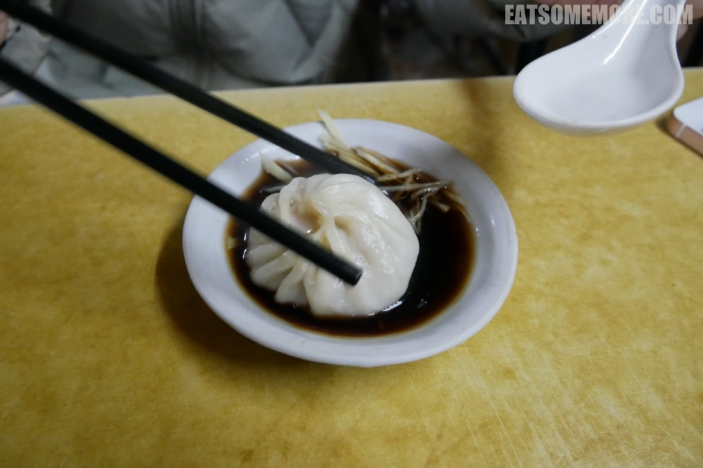
