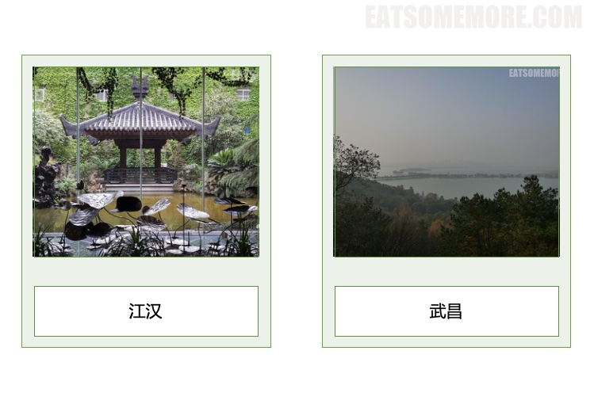
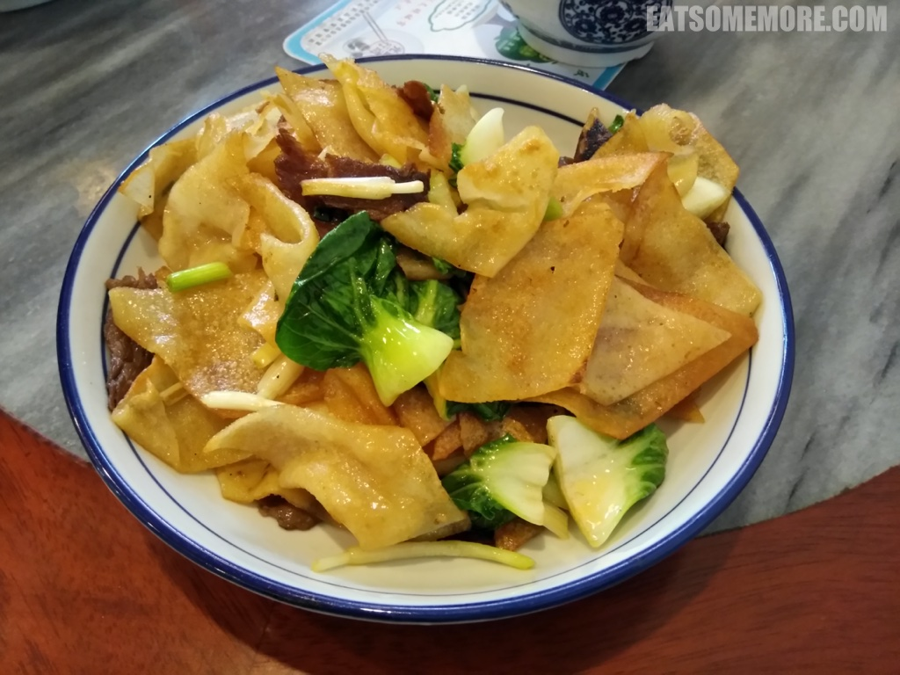

>不知古人当如何搭船过桥，如今只需一辆地铁就能轻松地从江汉来到武昌。

## 行程总览



### 楚河汉街

>下午来到武昌万达广场的公寓式酒店办理入住后，当然要先去体验一下网红下午茶啦。拍照什么的再合适不过啦。


>微微苦涩的拿铁和异香甜蜜的榴莲千层蛋糕，美则美矣……


>相比起来，我更喜欢中式糖水，色香味的层次都更加丰富，甜得清新、香得复合、苦也苦得沁人心脾。


>下午茶后的散步从汉街大戏台开始。


>港式茶楼惟妙惟肖。


>欧式露台华灯初上。


>地下商业街宛若仙境。


>颇具历史感的红砖楼上，霓虹灯闪耀着变换着色彩。


>晚餐时来到了附近的一间湖北菜馆。铁板牛蛙酱香浓郁。


>红烧鳊鱼带着具有湖北特色的香辣味道。


>蒜蓉大虾别出心裁。


>上汤娃娃菜鲜甜爽口。


>饭后来到万达广场的漫咖啡。


>晚上来咖啡店又怕睡不着，只好点了两杯奶昔。


### 万达诗寓酒店

>酒店的夜景也算缤纷，沙湖大桥尽收眼底。


>有如此美景，当然得再来点夜宵烧烤啦。第一次吃烧烤外卖的我感到非常快乐。


### 三镇民生甜食馆

>在武汉过早（武汉话当中吃早饭的意思）怎么能少了特色小吃热干面呢？武汉的热干面，以碱水面过滚水淋麻油，摊凉后再煮一遍，拌上芝麻酱、辣萝卜丁和葱花等配料，其独特的香味吸引了数量庞大的拥趸。


>武汉人用蛋酒搭配热干面，蛋滑酒香酿甜。我觉得这种在早餐时摄入少量酒精的行为非常地社会。


### 老味儿

>附近的一家广式烧腊店广受好评，成功地吸引了我的注意。


>店里同时提供非常具有武汉特色的早餐，例如热干面和蛋酒，甚至用料更加扎实，味道更经得起推敲。


>我的最爱是炒豆丝。薄薄的豆丝，外皮被爆炒得酥脆，咀嚼当中又带着弹韧的口感，搭配牛肉片、小青菜和韭黄，既营养又美味，不愧要被我写进诗里（错过的小伙伴可以在上一篇的前言找到我充满了真情实感的五言【打油】律诗）。



>重口味的朋友们还可以选择牛杂面。


### 户部巷

>这次武汉过早三部曲的最后一站来到了被誉为“汉味早点第一巷”的户部巷。户部巷紧临长江码头，自古人来人往、络绎不绝，自然吸引了往来交易的商贾和各色小吃摊贩。其中，门前有两颗大树的蔡家成了今天在早餐届声名大噪的蔡林记。


>热干面酱浓面爽，但量并不很多。糯米爱好者可以选择曾获饮食业“金鼎奖”的三鲜豆皮，原料有脱壳绿豆、米浆薄皮、以及鲜肉、鲜菇、鲜虾和糯米软馅，形厚薄适中，色金黄透亮，味鲜美香甜。


>爽滑的甜豆花也值得推荐。


>然而蔡林记仅仅是户部巷美食的开始。出了蔡林记，巷子里还有许多各式各样的其他美食，比如说加了辣萝卜丁和葱花的鲜鱼糊汤粉。相辅相成的鱼骨鲜和胡椒香是这道粉食的特色。


>烤面筋口感弹牙、味道咸香。


>最后是中式早餐的中流砥柱，糯米包油条，兼糯米之饱满、油条之酥脆、花生粉之甘香，是元气满满的晨之必备。


### 黄鹤楼

>始建于三国时期的天下绝景黄鹤楼，虽然屡建屡废，但留下了古往今来许多著名诗人的诗歌赞颂。


>在崔颢写下“昔人已乘黄鹤去，此地空余黄鹤楼”的时候，他可能不会想到有一天黄鹤楼也会异址。


>如今的黄鹤楼建于武昌蛇山，五层建筑层层飞檐，加葫芦形宝顶。第一层大厅正面的墙上镶嵌着一幅巨大的《白云黄鹤》陶瓷壁画。画中的黄鹤楼是以三层古楼为原型的。


>登顶后远眺长江大桥，已经没有了“晴川历历汉阳树，芳草萋萋鹦鹉洲“，但还多少有些”孤帆远影碧空尽，惟见长江天际流“。


### 昙华林

>从黄鹤楼出来，散着步去充满文艺气息的昙华林。路上偶遇了一间像模像样的火锅大戏院。


>昙华林有好多有意思的小店。这一家明信片专门店里立着一个英式邮筒，也许我明信片的失踪早就有迹可循。


>当然也有一些小吃店，嘴馋的朋友们不要错过啦。


>有间别致的咖啡店，提供的抹茶蛋糕挺特别。带着茶香的外皮酥酥的，包裹着香甜的奶油馅，搭配一球香草冰淇淋，是让人觉得幸福的味道啊！


### 南京大牌档

>午饭的时候我们选择了连锁店南京大牌档，从装修风格到服务人员都古色古香，让来客有种穿越感。


>重口味吃辣爱好者可以试试毛血旺，主要原料为毛肚和鸭血。


>油爆鳝丝爽脆香滑。


>杏鲍菇用麻油和香菜一拌，清新鲜香。


### 东湖

>武昌东部的大型自然城中湖泊，东湖自古以来就十分受欢迎。


>超过一百公里的东湖绿道上不乏起伏和缓的湖上长堤。


>长堤尽头是磨山楚城。


>城里古色古香。


>走不多远就能看见建在磨山第二主峰上的楚天台。


>登楚天台的一路上东湖的美景在慢慢地展开。


>从楚天台俯瞰东湖，确是“念去去，千里烟波，暮霭沉沉楚天阔”。


### 靓靓蒸虾

>晚上终于来到了我在本次武汉之行当中最期待的一家馆子，火爆的小龙虾专门店，靓靓蒸虾。没有想到在小龙虾专门店还能吃上烤串。


>香炸藕海，果然波涛汹涌——外表酥脆，内里爽脆，甘鲜可口。


>最后当然是招牌蒸虾，百闻不如一见，不得不长篇大论地细细描述一下这盘小龙虾，作为本次武汉之行浓墨重彩的一个结尾。
```
壳薄肉壮兮，黄肥脑满。
蒸至弹嫩兮，原味鲜甜。
蘸配调料兮，香滑解腻。
吮指回味兮，再来一盘。
```

