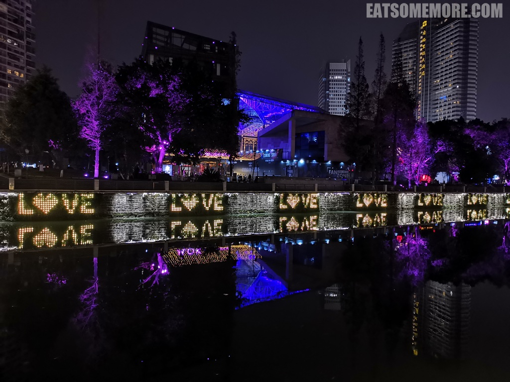

>一个偶然的转机，让我可以去成都的街头走一走。

### 春熙路

>春熙路步行街好像上海的南京东路。然而非常具有地域特色的是这里的IFS招牌边上有一只正在爬墙的熊猫。

### 钢管厂五区小郡肝火锅串串

>听说四川最有名的食物是火锅串串，而串串当中最受欢迎的就是钢管厂五区小郡肝火锅串串。

>跟火锅一起上桌的还有酸角汁，生津解辣、酸甜可口。

>自助选取的料碟里是我喜欢的香菜、花生和蒜泥。

>串在串上的食材摆放在冷柜当中。我们选取了一些小郡肝、香菜牛肉、折耳根牛肉、鱿鱼、豆腐皮、冻豆腐和腐皮卷，有些平平无奇。

>凉菜红油兔腰口味不是一般的重。

>洒了黄豆粉的红糖糍粑软糯香甜。

### 合江亭

>在排队等位下一间食肆的间隙，正好在附近散散步、消消食。

>成都的夜璀璨耀眼。

>风止后的府河静得像一面镜子，倒映着成都光鲜绚丽的夜色。

>夜色与水，溢彩流光。

>大约步行十五分钟来到了锦江上始建于唐朝的合江亭。

>从合江亭向东能够眺望青石建成的安顺廊桥。

### 小龙坎老火锅

>观光活动告一段落，也是时间去尝一尝好评如潮的小龙坎老火锅。

>锅底有三种，红油锅底又香又麻，番茄锅底搭配红枣枸杞黄瓜，菌菇锅底里的茶树菇香味浓郁。

>火锅必备食材牛百叶、嫩牛肉、鸭肠、鱼肉燕饺、藕片等等都来上一份。我最喜欢的是厚薄适中、鲜嫩甘香的牛肉片，在红油当中涮过一涮，更添香辣麻爽。

### 尚祥航空大酒店

### 甘食记

### 严太婆锅魁

### 洞子口张老二凉粉

