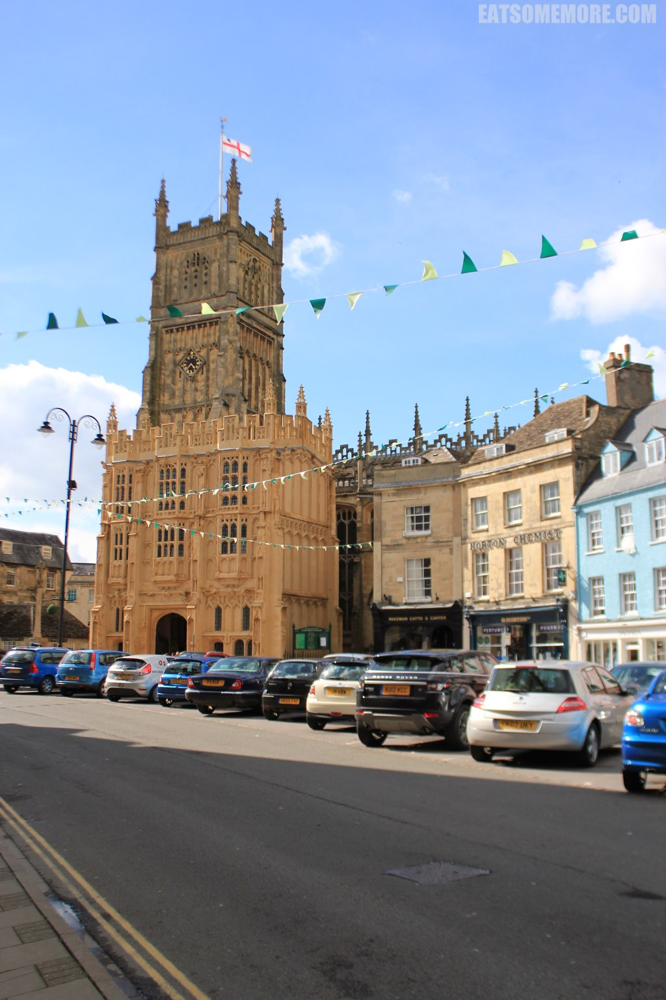
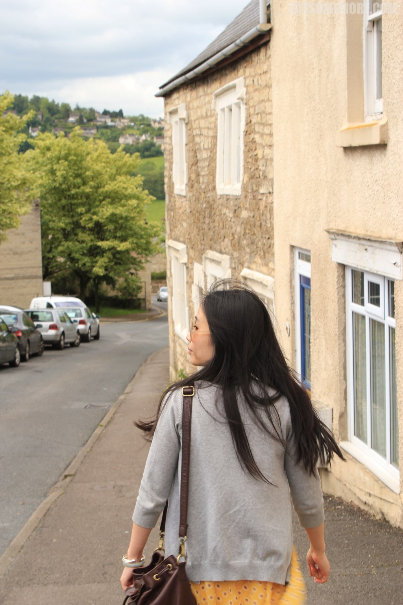

题记：英国乡村之美固然有其质朴和贴近自然之处，而我现在才发现到它的更胜之处在于时间在它身上留下的痕迹之微小，叫人惊叹又羡慕不已。 趁着英国上半年的最后一个小长假，我和几个小伙伴一起来到了慕名已久的Cotswolds地区。

## Bibury

第一天，我们从伦敦搭乘Megabus到达Cotswolds地区较大的城镇Cheltenham。我们下车的地方叫Cheltenham Royal Well Station，正好可以换乘801路巴士去到Northleach。

写到这里不得不提一下题外话，英国的乡村地区更适合自驾旅行，不论是时间安排还是景点选择都会自由非常多。而公共交通在平日还算方便，但是周末和公共假期的时候巴士班次就会很少，甚至根本没有了；不过另一方面，自驾的朋友们也要注意有一些古典小镇对机动车辆的经行有所限制。不论如何，出行前都要先做好功课哦。说回这一天，我们到Northleach的主要目的是换乘855路公交前去古典小镇Bibury。为了避免时间太紧赶不上班车，我在两班车之间预留了比较多的时间，然后选择了一些风景较秀丽的小镇转车。当中的时间可以在周围观光一下，到了时间就回去搭车去下一个小镇。

这两天里面，Bibury果然是我最喜欢的一个小镇。

一下车就把小伙伴们都美呆了。

Bibury是个水乡。

清浅的河水上架着石拱桥。

石头屋子瓦砾顶，三三两两缀乡间。

英村春光最可贵，绿叶成荫映溪泉。

小花园也格外别致。

好羡慕这样繁花似锦深处的人家。

在这样的地方，天鹅和奶牛是邻居，溪流与树林作伴，童话一般的情境。

河水清澈得能看见黑天鹅的烈焰红唇。

连路上开过的复古巴士看起来都好可爱。

## Cirencester

傍晚，我们搭上855路末班车前往另一个较大的城镇Cirencester，准备搭车回酒店所在的Swindon。又一个中转站带来的惊喜——彩色房子小教堂，蓝白彩旗满天扬。

Cotswolds地区一年当中有许多节日。乡镇里不时出现的兔子像，让我们知道了March Hare Festival。看着这些角色各异的兔子们，就觉得这个地方真有爱呢！

搭上46路巴士，我们去往Swindon，夜宿Marriott。Marriott Swindon不得不提的一个酷点是它不仅有泳池，还有按摩浴缸。经过一天的奔波，我需要的正是这个呀！

第二天是一个可爱又残酷的星期天，鲜有巴士照常运行。所以咱们一早就搭火车前往峡谷中的小镇Stroud。这个小镇不仅地形地貌与Cotswolds地区的其他小镇迥然不同，周日还有公交车前往超级中转站Cheltenham。 

## Stroud

烂漫春花丛中的尖顶教堂格外挺拔。

周日的小镇街道非常冷清。

教堂花园里的小树林被修剪得圆滚滚的。

## Bourton on the water

中午因为在Cheltenham吃饭，耽误了好多功夫，为了赶车也没有能在Cheltenham四处走走。可以说是此行的一个遗憾呢。当然啦，放弃一样观光是为了另一样更难放弃的观光——久负盛名的Bourton on the water。

读书的时候曾经在一户Bournemouth的英国老夫妇家借住，我曾问他们英国最值得一玩的地方是哪里？他们考虑了一阵子，然后说是Bourton on the Water。

四年后的今天，终于有机会一睹芳容。 

的确是风景秀丽，水清且浅。穿着短裤的小男孩踩着水，走过淡定的鸭子们身边。人和自然能够那么近，而又互不打扰，让人觉得好幸福又好惊奇。连狗狗来了这里也欢乐地戏起水来。 

短暂的旅行就这样结束了。心里却充满了满满的正能量。旅行好棒！

