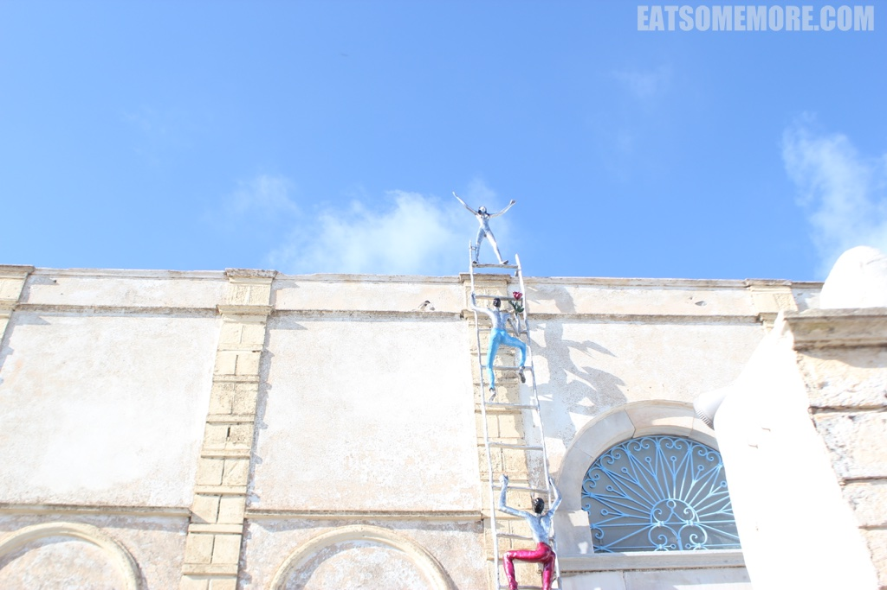

## 缘起

>已经想不起第一次被爱琴海的美景惊呆是什么时候，但对它的向往经年累月却越来越深。 2015年4月的复活节，终于来到了这个传说中的童话小镇美丽地方。

## 行程总览

 

## 匆匆路过雅典，颓败难掩风华。

>刚降落在雅典，一走出机场就感受到了这里的天高云淡和山峦苍茫，很有加利福尼亚的即视感。从一下飞机，我们也开始感受到了希腊人民随意洒脱的民族个性，沿着一路上的指示牌绕了一个大圈才到达地铁站。不过好在天气晴朗、阳光明媚、凉风习习，这个过程一点也不令人烦扰。上了地铁准备到宪法广场站下车。一路上可以看见雅典风光。快到宪法广场时，就有人提醒我们这里是宪法广场，并且示意我们准备下车，还把我们的行李往车门推。但是当我们起身跟着行李打算走到门口去的时候，发现当时提醒我们的一男一女已经把手伸进了我们的口袋。我们连忙捂好其他的行李，并且把手插到裤兜里。所幸下车时检查了什么都没有丢。如果没有弄错的话，下面这个就是宪法广场了，感觉并不很酷。

 

>走着走着看见一家有人在排队的卷饼店，心想一定是好吃的才有人排队吧。于是就有了我来到希腊后的第一个卷饼(pita)。有鸡肉串(souvlaki)、芝士、西红柿、洋葱和青菜。其实味道比较单一，饼皮本身也有点也有点太面了。有趣的是店老板的找零机制，基本是靠顾客自助的。如果遇见像我这样不熟的顾客，老板会用小镊子将找的硬币纸币夹给顾客。看起来食品卫生真是棒得不得了。另外，老板的收银台上放了好多一寸照，问了老板以后才知道那些都是朋友和客户留的。好有爱。

 

>我们到达奥林匹亚宙斯神庙的时候大概是下午3点左右，奥林匹亚宙斯神庙已经关门，只能在铁栅栏外观赏一下。

 

>雅典卫城再往前走就到了卫城山脚了。因为要赶晚上6点去圣托里尼的船，我们就没有进去游览。

 

>于是我们沿着这个卫城公园一路上坡，朝小修道院地铁站去。

 

>雅典的背街小巷萌萌嗒。下山时路过许多小店、别具风格的咖啡厅和葡萄藤下的小餐馆，一派闲适。

 

>在雅典的一路上，常常见到断壁残垣，敞着的屋顶、裸露的砖块，但也不时会看见一些充满岁月风情老建筑，精美优雅得令人难以置信。

 

>到了Piraeus站后，网上预定船票的需要先在蓝星专门店换船票，然后到达指定港口乘船。我们预定的是航空座位票，但是船上空间很大，大家都非常自由地坐来坐去。 船上也有几个吃饭的地方，一些在落地窗前的座位，景观很棒。

 

>晚餐尝试了希腊名产moussaka, 有点像Lasagne，但是是一层土豆一层肉酱，肉酱里还有一些蔬菜，例如番茄和茄子。个人觉得比lasagne好吃。

 

## 徜徉圣托里尼，拥抱不世美景

>00:30夜正酣时，到达圣托里尼。

>希腊和伦敦在4月初是两个小时的时差，但漏夜到达的我们还是一早就兴奋地起身，想快一点看一看这个传说中的小镇。

>早餐后，搭乘酒店巴士到达费拉镇，开始了一天的“晨练”。四月初的圣托里尼，早晚还是挺凉的。但是走几步就觉得这里也美那里也美。

>走几步又觉得海也蓝，天也蓝。风一吹，海水还打起褶来，好像那种高级的宝蓝色斜纹软呢料。

>再走几步太阳更猛了，也觉得热了。一回头看见一片白色的村庄立在爱琴海滨的悬崖上，在春天小野花的掩映下闪闪发光。

>圣托里尼还有很多神奇的门，不仅有大面积的镂空，更妙的是这些门的两边不但没有墙，而且有种四通八达的感觉。那究竟是什么人需要用到这些门，而这些门又是用来做什么的呢？

### 菲拉斯特凡尼

>走不多久，就到达了因为国家地理杂志封面红遍大江南北的蓝顶教堂。菲拉斯特凡尼这个面向爱琴海的教堂的本意初衷如何我不得而知。到如今这样的游人如织，它还是静静地矗立在那里，望着爱琴海，不知道它到底是开心还是不开心。

>菲拉斯特凡尼悬崖步道的石头路其实不太好走。街边总有三五小店，有卖冰激凌的，有卖艺术品的，有卖旅游纪念品的。我身后这家艺术品小店每天的开门时间是早上11点到下午2:30，这个工作时间也太令人羡慕了吧！

>在悬崖步道转了一个早上，中午回到镇上广受好评的Nick the Grill吃了个肉卷。猪肉卷、羊肉卷和鱿鱼卷都很香，各具风味，面饼有弹性，非常值得推荐。

### 伊亚

>下午两点搭巴士前往圣托里尼的人气小镇伊亚，车程大概30分钟，有很多盘山公路。当我们到达这个白色的城，见它随阳光的愈发耀眼而耀眼，简直睁不开眼睛。还有人契而不舍地傍着一大桶白油漆继续粉刷这些白房子。神奇的是，在太阳的暴晒下，这些白墙壁却是冰凉冰凉的触感，这是什么原理？

>伊亚镇的三蓝顶也很美，它背后的村庄更加多彩。

>这一天是2015年4月3日，我们在伊亚还遇上了类似真人秀节目的拍摄，能认出来的明星有杨威和黄国伦。坐等节目播出，看看究竟是什么电视。

>在一天的下午到达伊亚，并不是一件非常令人心旷神怡的事，因为游客实在是太多了！（对，我自己也是游客，但是我还是觉得游客太多了。）每个人都行色匆匆，闹得自己也不知道在赶什么。

>傍晚时，我们来到了人气推荐的章鱼餐厅。味道果然不错。 伊亚镇招牌章鱼的外皮烤得香香的，肉质又鲜又嫩又有弹性。

>烤鱿鱼的口感更加弹。

>炖章鱼做出了炖肉的味道，酱香浓郁，软糯入味。

>即使是童话的世界，也会有落日、有夕阳。每每是这种天将晚、人匆匆的时候，就有一种焦虑不安的感觉出现，好像小时候陪妈妈逛商场，到了广播说店要打烊的时候我们还在奔忙，而我又不知道是为什么而奔忙的感觉。而人生，又有多少次悠闲从容的日落时光。

### 费拉

>看完日落回到酒店已经快半夜，跟小伙伴们分享了一下如何抵达蓝顶教堂后，想起那里的美景，就愉快地决定第二天一早带着小伙伴们一起再去一次蓝顶教堂。前一天到的时候，费拉镇代步驴子们会路过的台阶已经是满地黄金、气味醉人，这一天因为到得早，还能体验一把这个地方小清新的感觉。 

早上的圣托里尼有着地中海地区的本色慵懒：狗狗还在街上睡觉、猫咪在发呆、大多商店还没有开门、行人稀疏、从酒店退了房的游客自己背着大行李举步维艰。

### 红沙滩

>回到费拉镇中心，在mama's house吃了午饭后，我们一行4人乘坐2点的巴士前往红沙滩。 下车后前往红沙滩大约需要步行7分钟左右。一路春光明媚、景色秀丽。到达远观红沙滩的观景点后，我们没有就此停歇，接着走了一些略艰险的山路到达沙滩本尊。论景色可能不及观景点，但是感受那一刻的静谧、阳光洒在沙滩上的温热和扑向脚面的海浪的冰凉晶莹，还是远眺所不能及的。

### 火山景酒店

>早起了两天也是有点累，于是我们愉快地决定从红沙滩直接返回酒店欣赏这一天的日落，却发现这两天天天一早就出门玩，没有留意酒店的景色也是极好的。 

>自家门口的夕阳靓位，不用赶不用匆忙，两瓶红酒和三五好友，还有比这更惬意的吗？

>我不知道该怎么描述圣托里尼的美，也许我根本都不了解它。也许是不识庐山真面目，只缘身在此山中。但我可以从这美妙的地方寄出我的想念的祝福，或许收到的人也能感受到一点不在言语当中的圣岛之美吧。

