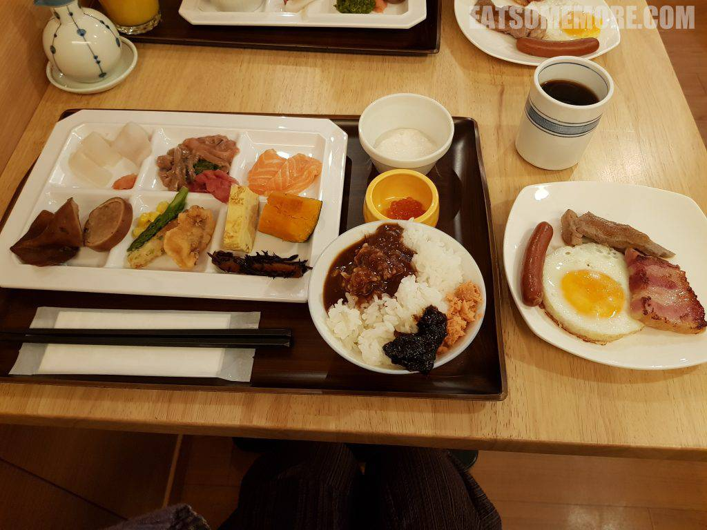
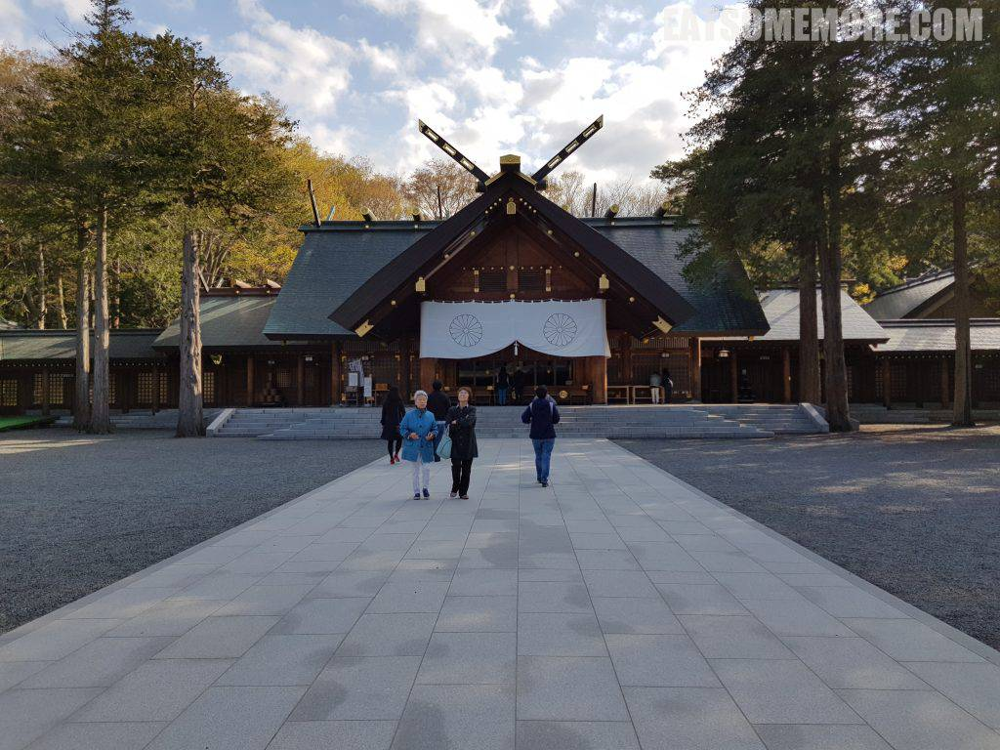
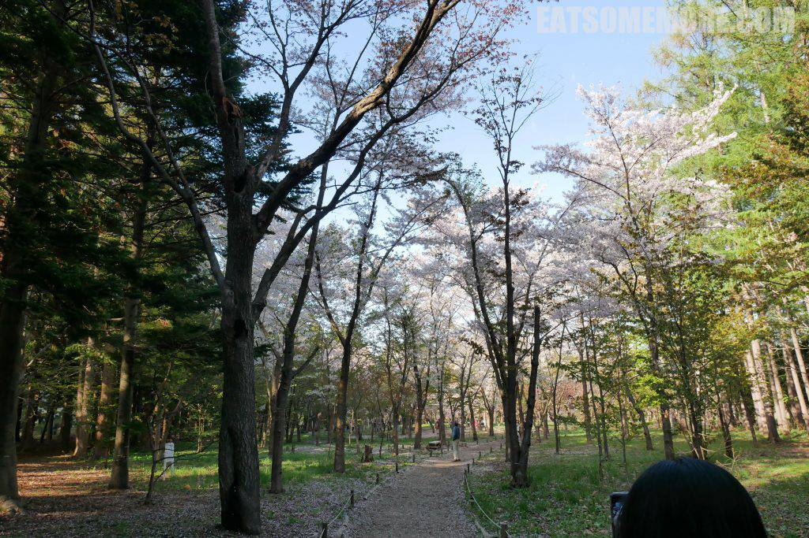
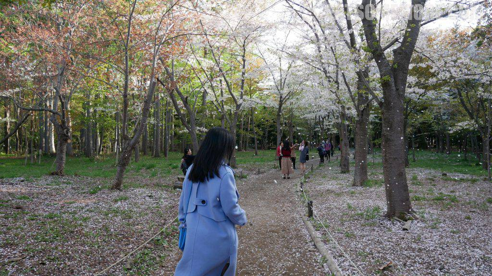
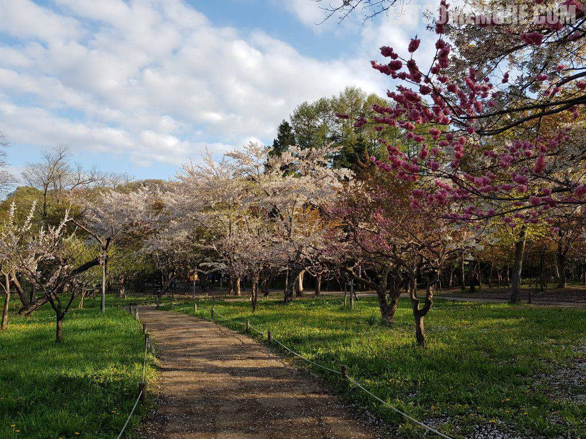
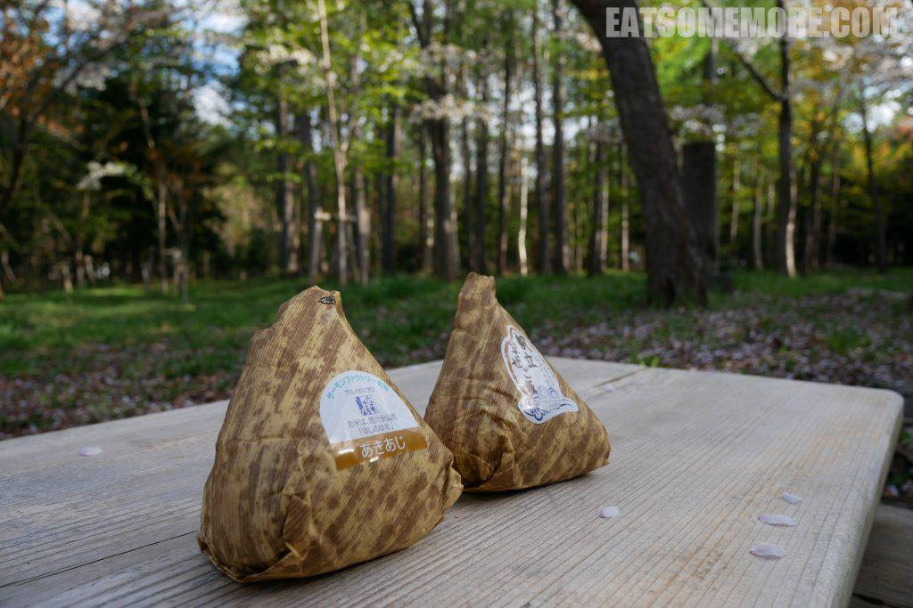
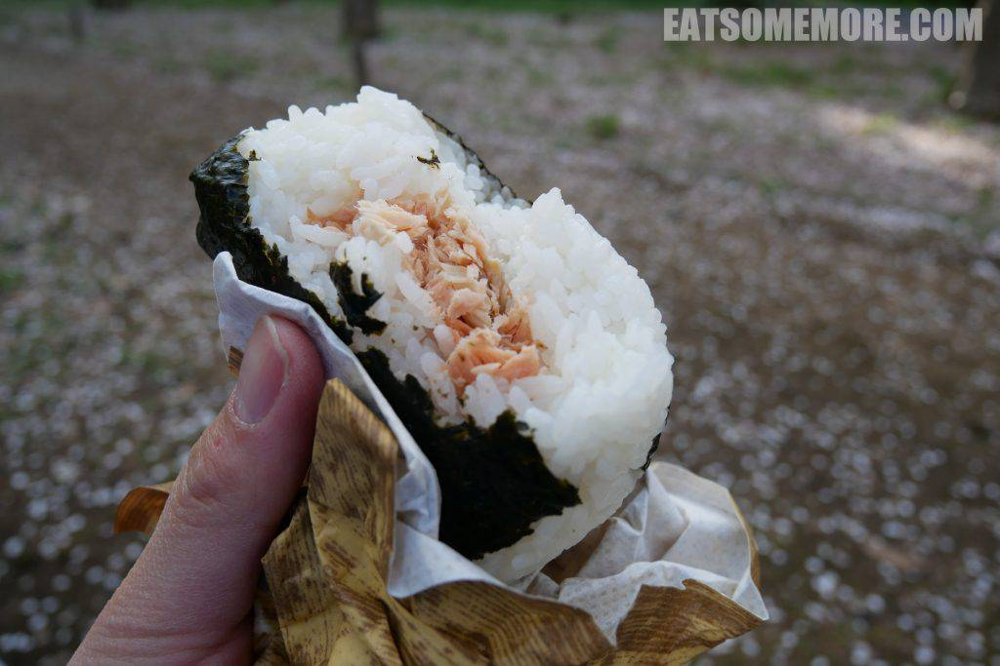
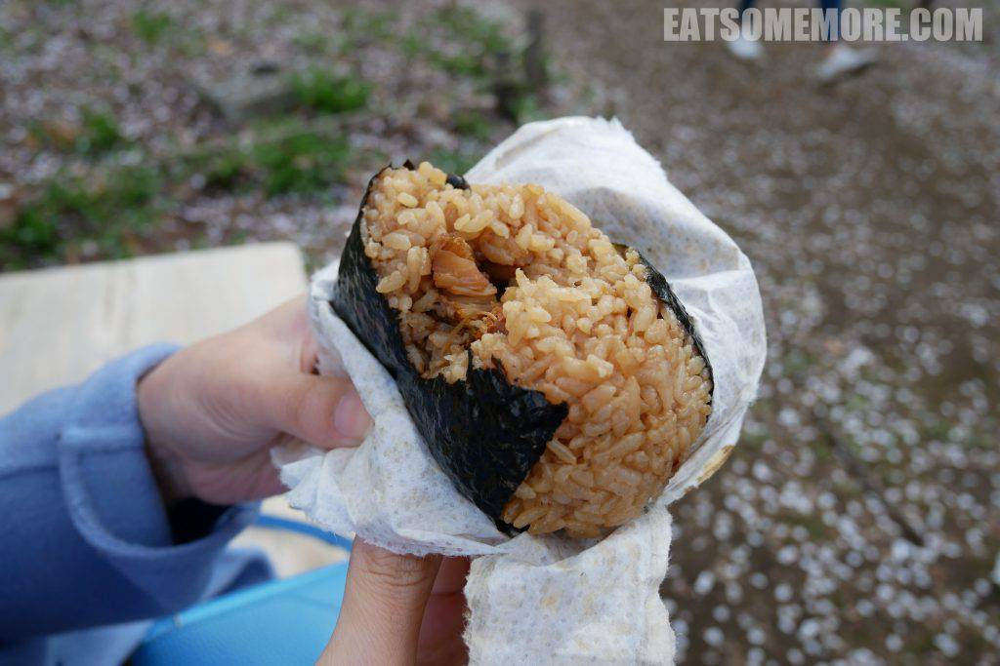

>也只有在日本才能养成每早泡一汤的奢侈习惯吧！

## 行程总览

## 函馆

>笑函馆屋的房间内还提供了一包咖啡豆和手摇磨豆机。清晨的一壶现磨咖啡正是开启一天的良方无两！

>早餐的海鲜比前一天晚上的新鲜许多，令我对酒店的餐食大大改观。然而最惊艳的当属蒸南瓜，香甜软糯。

## 札幌

>早餐后便启程搭乘火车前往北海道首府札幌。一路田园矮房太平洋，景色恬淡优美。

>明治时期建造的北海道神宫庄严持重，入口处悬挂着象征日本皇室的十六瓣菊花徽纹。

>毗邻神宫的円山公园更是北海道闻名的赏樱胜处。公园小道两侧的染井吉野樱花开得正好。

>风起时，花瓣倏然间翩翩落下，此情此景心里充满了感动。

>公园梅林的对面更有染井吉野、虾夷山樱和八重樱，三大樱花品种集于一处的胜景。

>“花见”是日本自古以来流行的春季盛事，即在樱花树下赏樱飨宴作乐。到了今天，这一习俗演化成了在樱花树下野餐。入乡随俗的我们，在佐藤水产店瞎蒙着购入了两个海鲜饭团，也来凑个热闹。

>烟熏三文鱼馅的饭团太适合野餐了。

>帆立贝酱油饭团的鲜味更浓。短暂的悠闲时光后，我们便启程前往今晚的宿处登别。下一篇再来好好介绍一下温泉乡登别。

