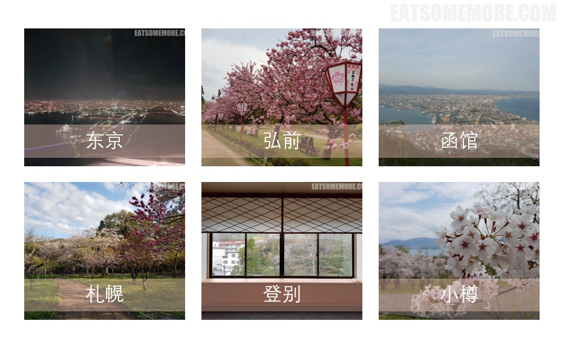

>书接上回，说到温泉爱好者终于来到了著名温泉乡，位列日本温泉百赏的前十的登别温泉。

## 行程总览

## 登别

>出了高速公路的匝道，迎面而来的便是登别温泉谷的守护神，汤鬼神。

>到达第一潼本馆酒店时已经入夜。一如既往地选择了日式房间。

>酒店还贴心地提供了小点心。

>晚餐是自助形式。味增汤里还有真材实料的螃蟹，鲜甜加一。虾子天妇罗由厨师不断地现炸出来，外皮酥脆、虾肉脆弹甘鲜。蟹腿肉质紧实、咸鲜香甜。牡丹虾是我在刺身当中的最爱，口感软弹，尔后化在嘴里，甜度鲜度爆表。客制化的海鲜丼，可以根据住客的喜好进行搭配，而我最喜欢的就是鲑鱼卵盖饭，鲜香油脂包裹着饭粒，总想还要再来一碗！

>连订两晚的住客还能获赠蟹腿天妇罗和海胆蒸蛋。

>甜品的选择也极其丰富，有巨峰提子瑞士卷、抹茶巧克力蛋糕、蜜瓜慕斯、樱桃泡芙、白桃瑞士卷、草莓千层和各种口味的雪糕。

>晚餐后，女将已经如常铺好了床，又可以睡榻榻米啦！

>有汤泡的一天又是美好的一天。去温泉的路上会路过大约两层楼高的汤鬼神大金棒。这个酒店的温泉颇具规模，室内室外都有好多个池，不过人也是挺多的，难免影响用户体验。祝各位要去的朋友们好运哦！

>从温泉出来骤然了解到窗户是最好的装饰画的意思。

>早餐也是自助。烤章鱼、渍豆腐泡和烧芋头最好吃！早餐后要去的地方更加精彩，敬请期待。

