>早餐后便得从登别长途跋涉地赶赴小樽。

## 行程总览

## 小樽

>被称为“虾夷富士”的羊蹄山还积着雪，对称规矩的形状近在咫尺。

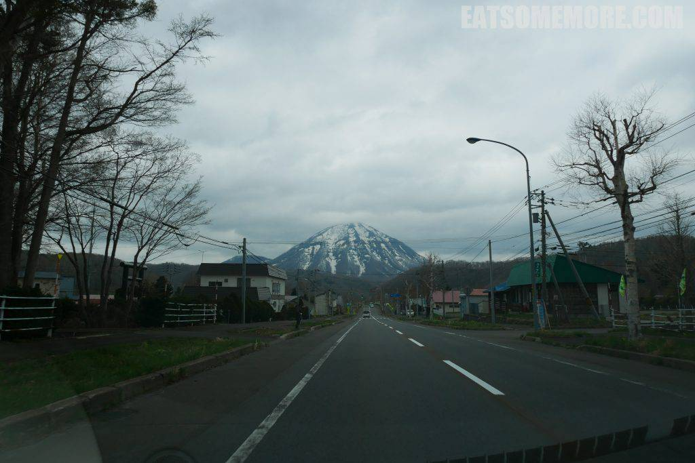

>手宫公园正位于小樽港北面的山坡上。在盛开的染井吉野衬托下，繁忙的码头都清新了起来。

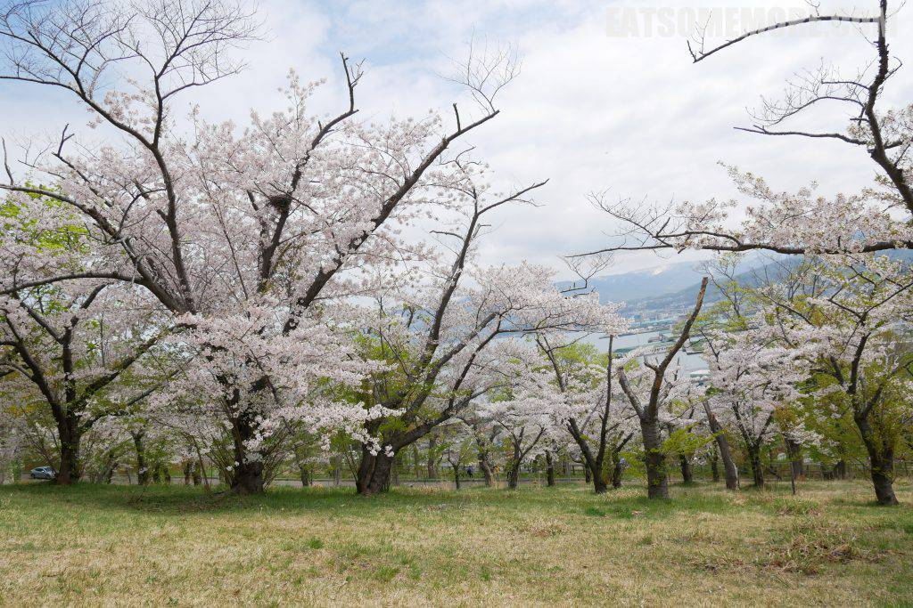

>樱花与石狩湾相映成趣，一个是过期不候的美景，另一个提供着不容错过的美食。

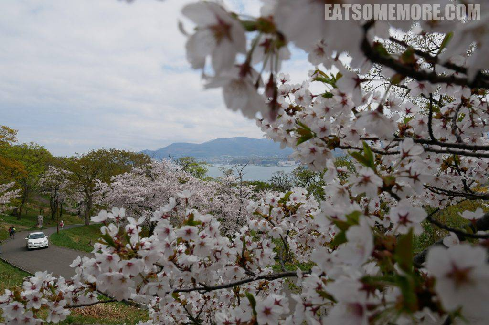

>下山后不久就来到了北运河。穿过运河公园的喷泉可以看到重要文化遗产，颇具欧式文艺复兴风格的日本邮船公司旧址。

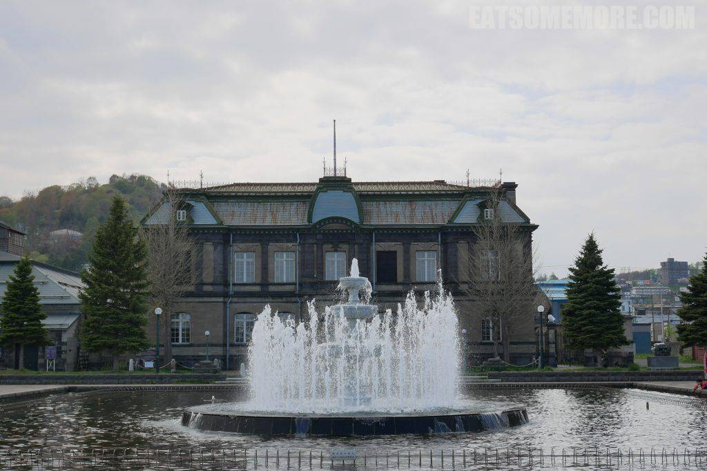

>继续顺着运河向前走，来到了中央桥。桥上有一座优雅纤细的少女铜像，在影影绰绰的樱花和新绿的衬托下，显得格外漂亮。

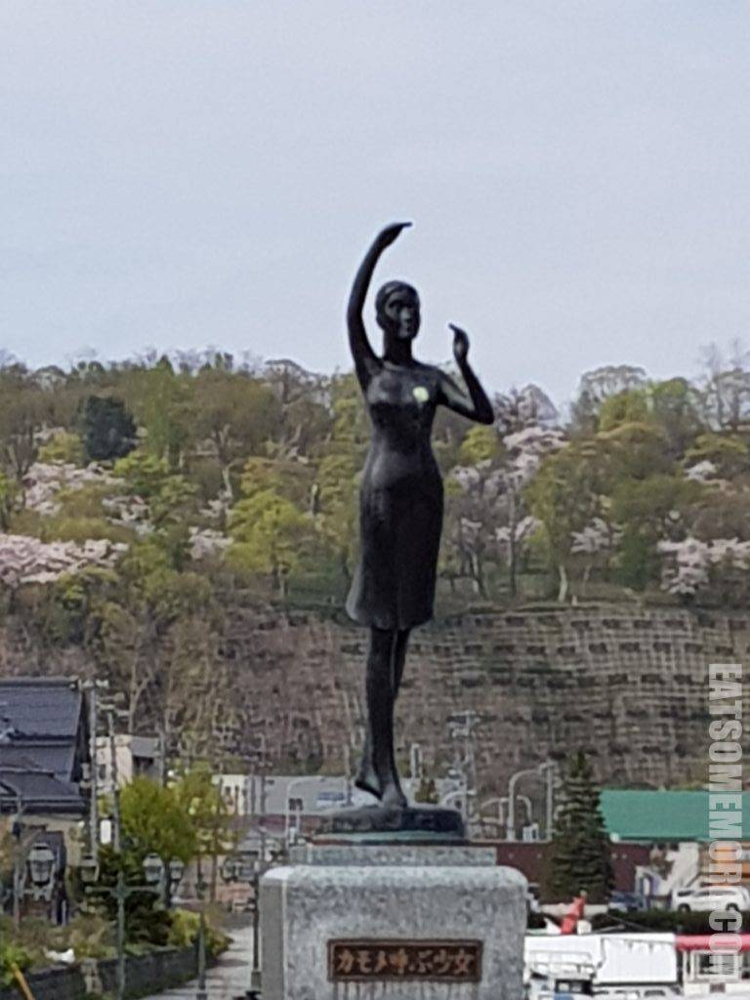

>到了镇上，就开始出现虾夷特产皮革工房。

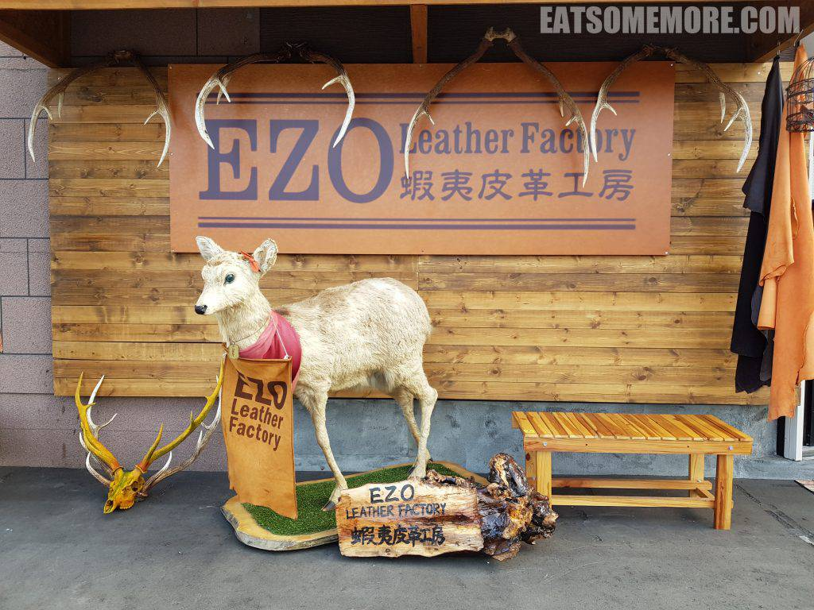

>雪山脚下的小镇特别讨喜，有种东亚瑞士之景。

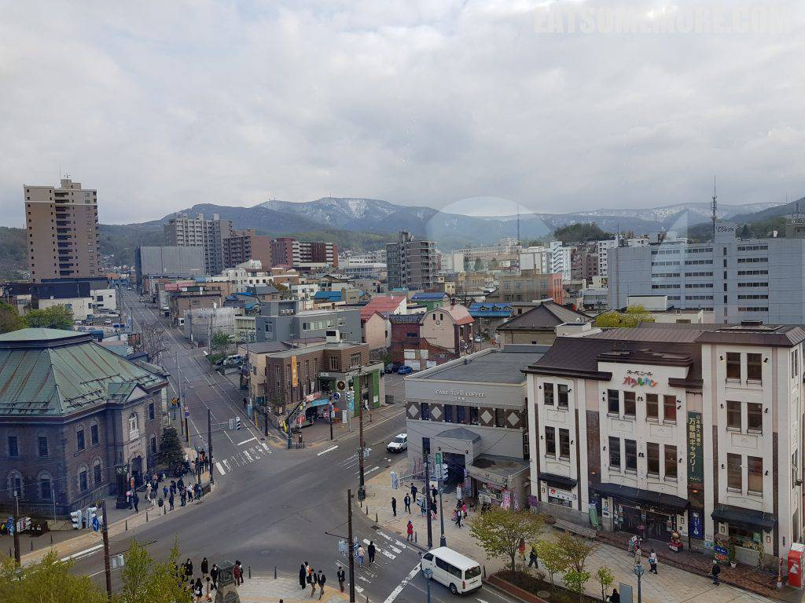

>上图左手边门庭若市的便是大名鼎鼎的八音盒商店。

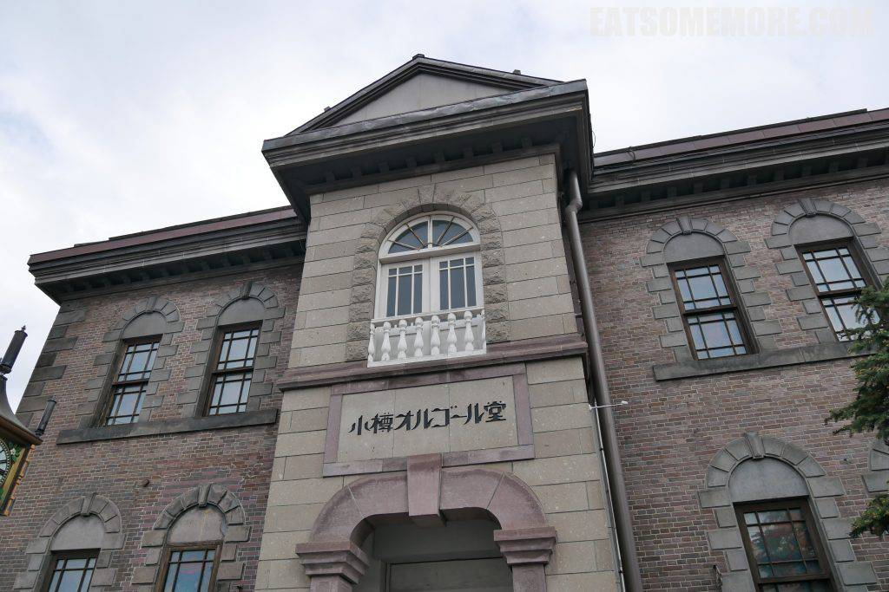

>这个季节里，商店的走廊里都是应景的樱花装饰。

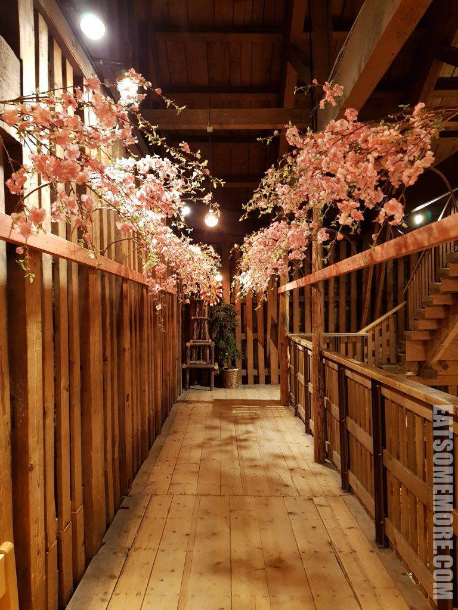

>各式八音盒玲琅满目。

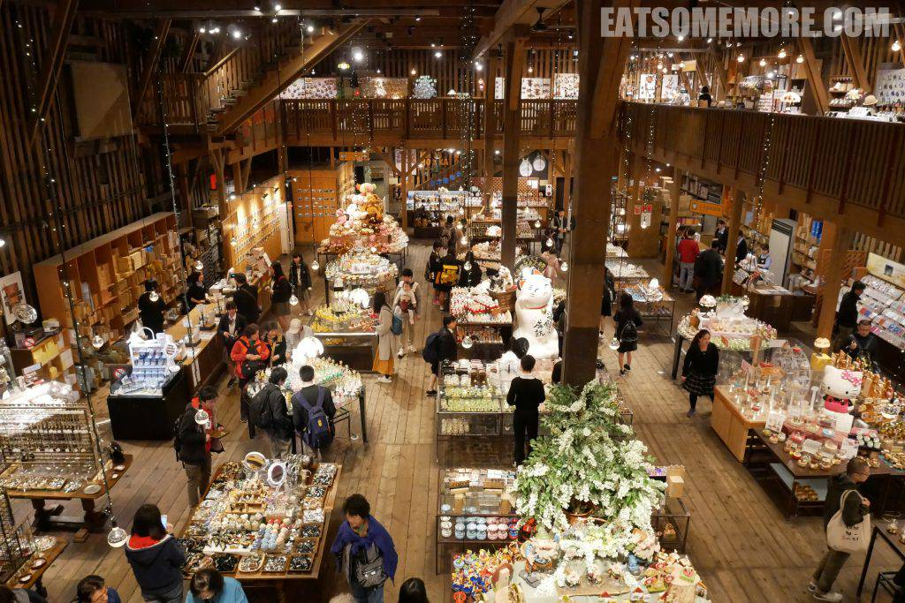

>古色古香的石砌建筑是小樽特产果子店，六花亭。

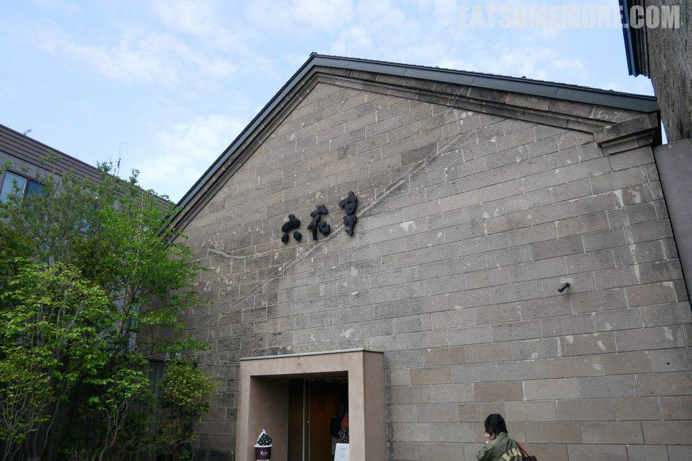

>北海道的牛奶出类拔萃，奶制甜点也特别醇香。耍尽兴了就赶紧回酒店泡温泉咯！

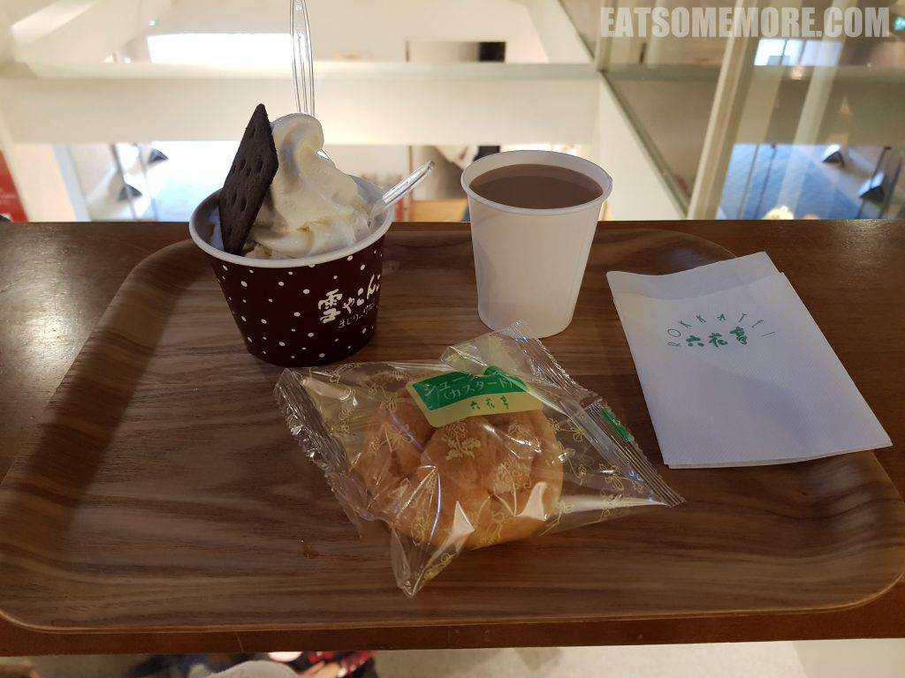

## 千岁

>欢乐的时光总是过得特别快，转眼就来到旅行的最后一天。去机场的路上，有一间非常大的AEON商场。出去玩的时候，我总爱逛超商和百货，可以看看那么好玩的地方的人都在用什么吃什么，也是留些旅行的纪念。来到日本，值得一买的东西自然更多啦。个人觉得化妆品最好买，用户体验佳；最难的则是电器，尺寸、电压、运输，方方面面都需要考虑。祝各位玩得愉快、买得尽兴！

