>里斯本之行有个番外篇，是葡萄牙最大、最重要和最发达的旅游区之一，阿尔加维。

## 行程总览

## 阿尔加维

>从里斯本离开的时候，在大桥上看到静谧美丽的海上日出。

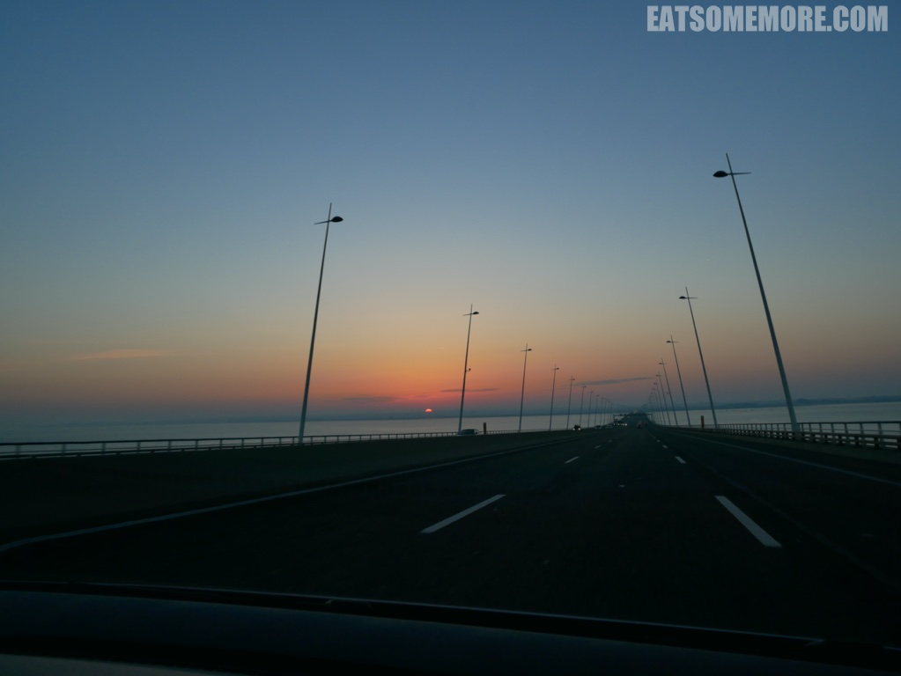

>在朝霞当中穿越树林。

>到了阿尔加维，感觉阳光都明媚一些，蓝天下的樱花树也格外绚烂。

>法鲁以北十公里处，有一座 Estoi 宫。

>地势较高，可以眺望附近的城镇。

>新巴洛克和新洛可可风格的建筑十分漂亮。精美的法式花园里还摆放着许多石像。

>不论是石像、栏杆还是水池看起来都非常和谐。

>内部的装饰，特别是石膏天花板被认为是阿尔加维地区最精致的。

>这里现在是一间奢华酒店。

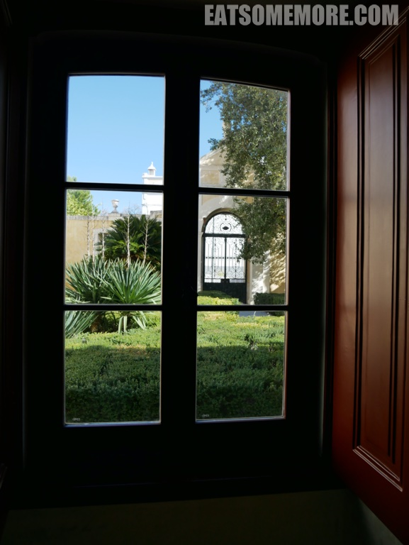

>建筑的另一面是对称的青白色阶梯。

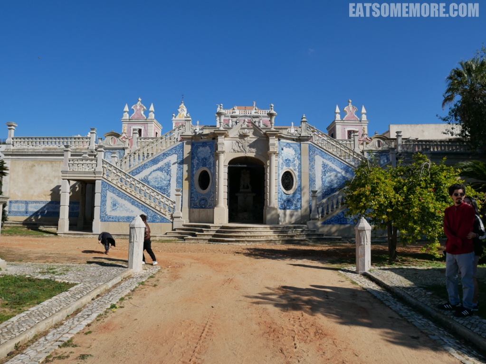

>这种颜色来自于白底青花的瓷砖。

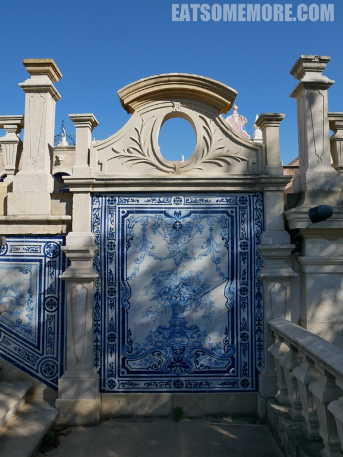

>午餐时来到了当时是米其林一星的宝藏餐厅。所有的菜品都体现出了很高得水准，注重食材得原味。

>餐厅的环境非常可爱。

>餐厅在二层，宽敞舒适，并且可以眺望到乡村和远处的大海。

>餐厅的服务也很好，酒水和食物菜单分别有专门的人员负责。用餐的最后，我们还见到了餐厅的主厨。

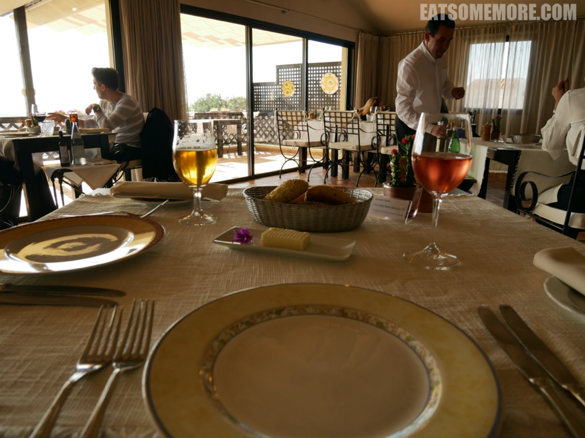

>这里的餐前包是我吃过最好吃的面包卷，香甜松软。

>大厨特赠甜菜马卡龙和花菜汤，一个入口酥松，一个回味清甜。

>生牛肉芝士沙拉，牛肉鲜香嫩滑，搭配芝士和食材，口感均衡。

>四海八荒最好喝的奶油南瓜汤，甜而不腻，既浓且滑。

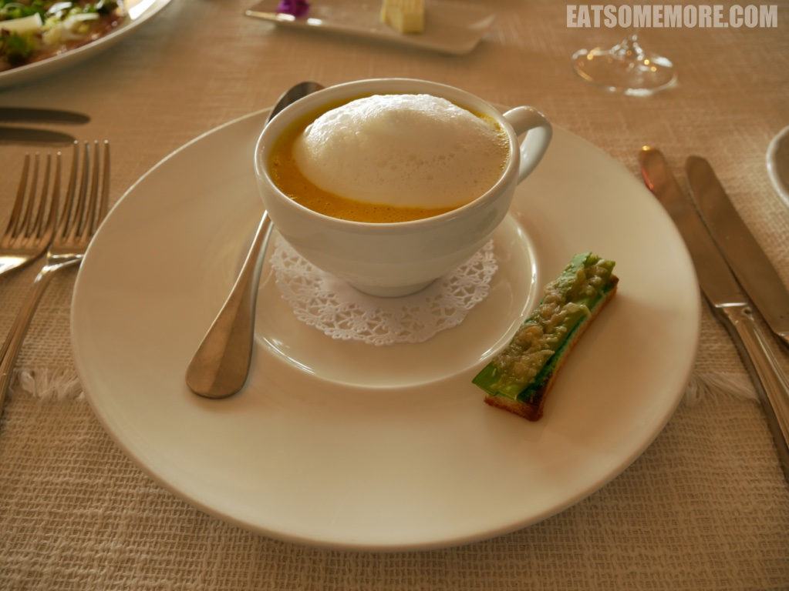

>酥炸小牛肉，皮脆肉嫩，咸香浓郁。

>香煎鳕鱼比较清淡。

>草莓啫喱雪糕，酸酸甜甜，清清凉凉。

>坚果脆饼香甜松脆。

>

>1

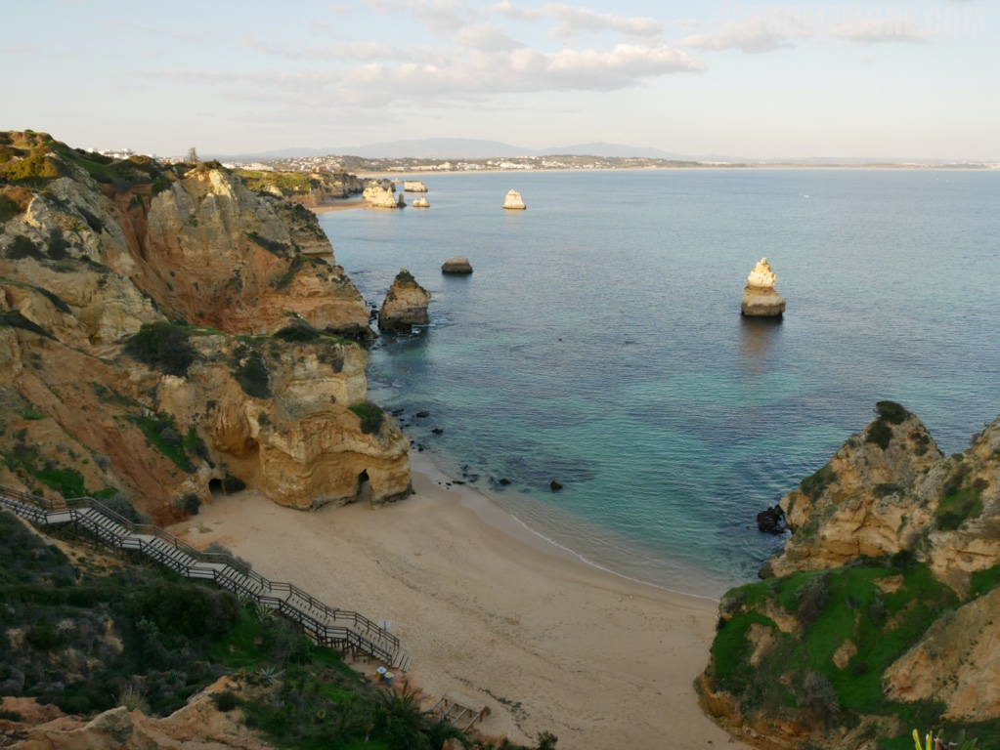

>

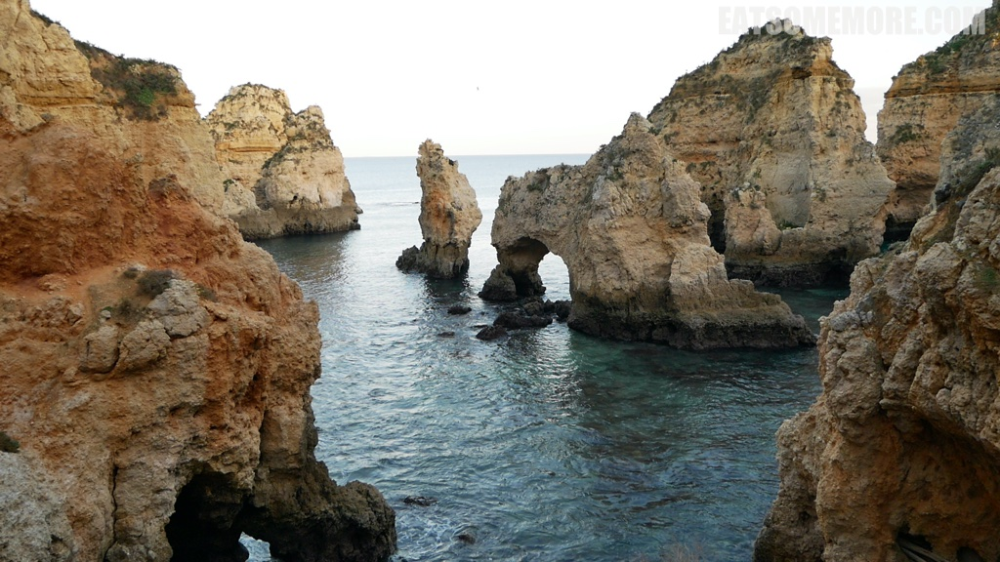

>

>

>

>Cozy local restaurant

>米其林指南推荐 The food is grounded yet innovative, well flavoured with amazing flavours.

>The restaurant is very cosy with sharp colours, a lovely yard, a well-functioned fireplace and many paintings.

>"bread with flavoured butters"

>"soup and appetizer"

>

>"veal with corn and cauliflower"

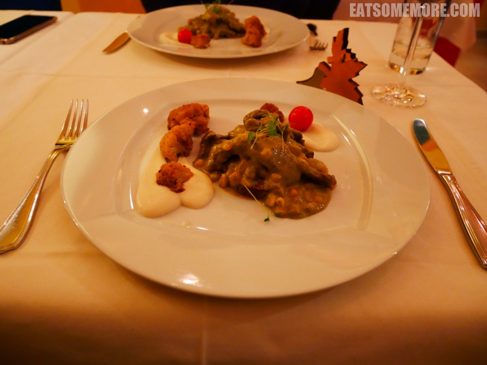

>"raspberry ice-cream mille feuille"

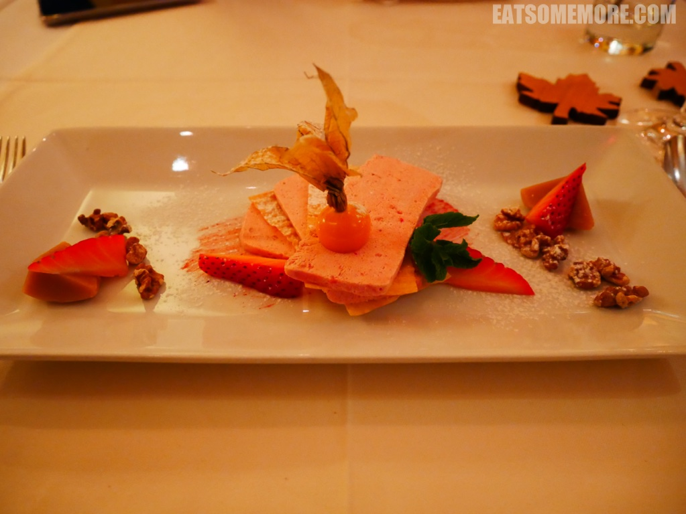

>"mint ice-cream"

>

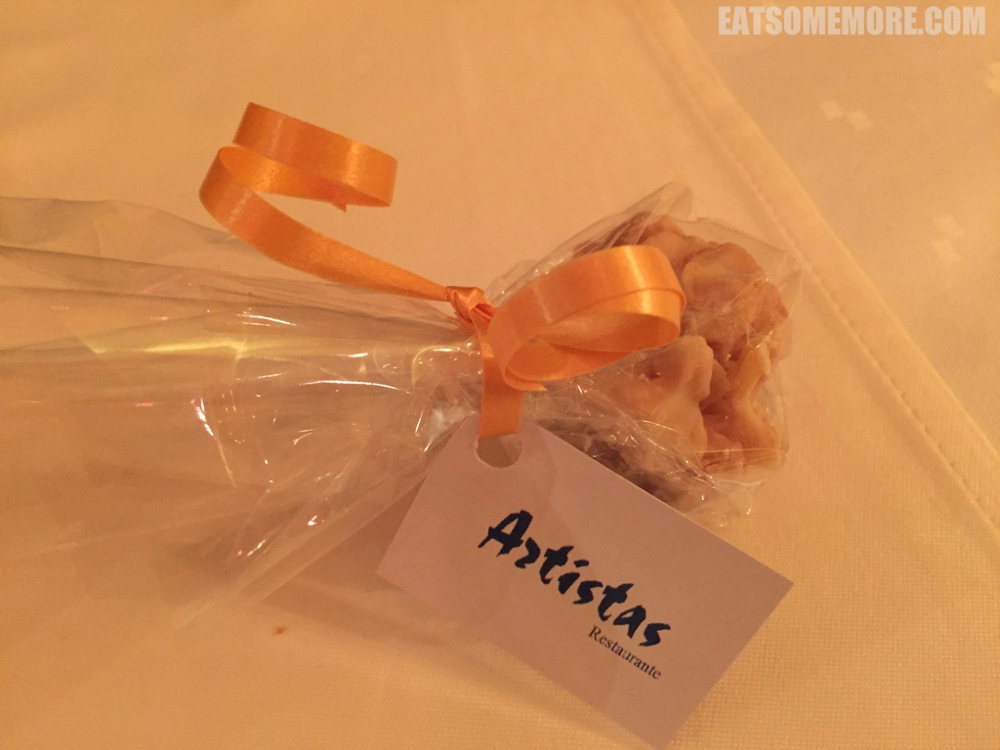

>1

>

>

>

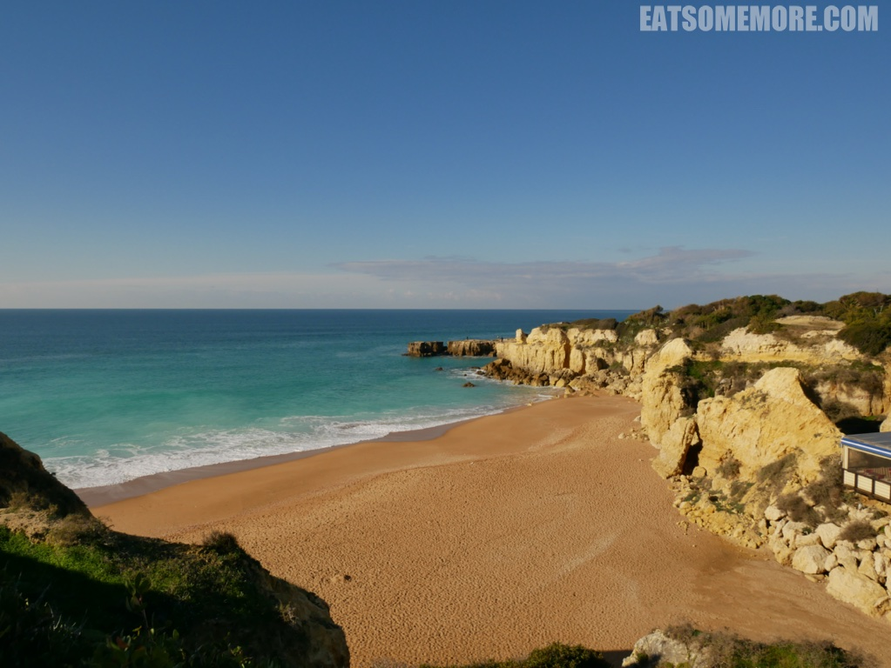

>

>

>

>

>

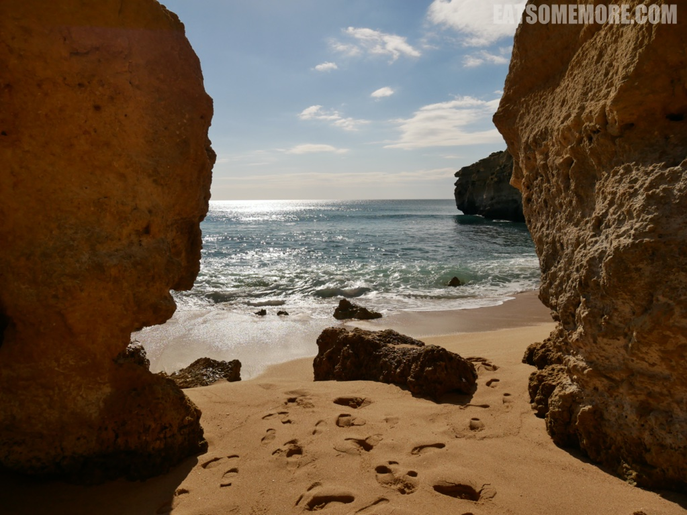

>

>

>

>

>

