>里斯本之行有个番外篇，是葡萄牙最大、最重要和最发达的旅游区之一，阿尔加维。

## 行程总览

## 阿尔加维

>从里斯本离开的时候，在大桥上看到静谧美丽的海上日出。

>在朝霞当中穿越树林。

>到了阿尔加维，感觉阳光都明媚一些，蓝天下的樱花树也格外绚烂。

>法鲁以北十公里处，有一座 Estoi 宫。

>地势较高，可以眺望附近的城镇。

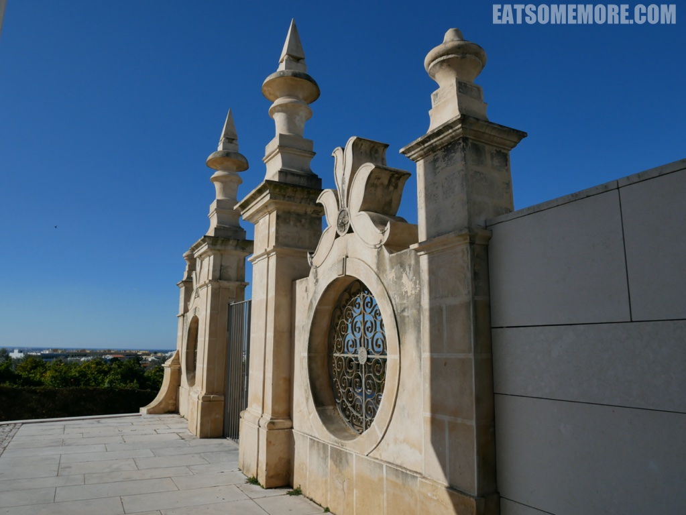

>新巴洛克和新洛可可风格的建筑十分漂亮。精美的法式花园里还摆放着许多石像。

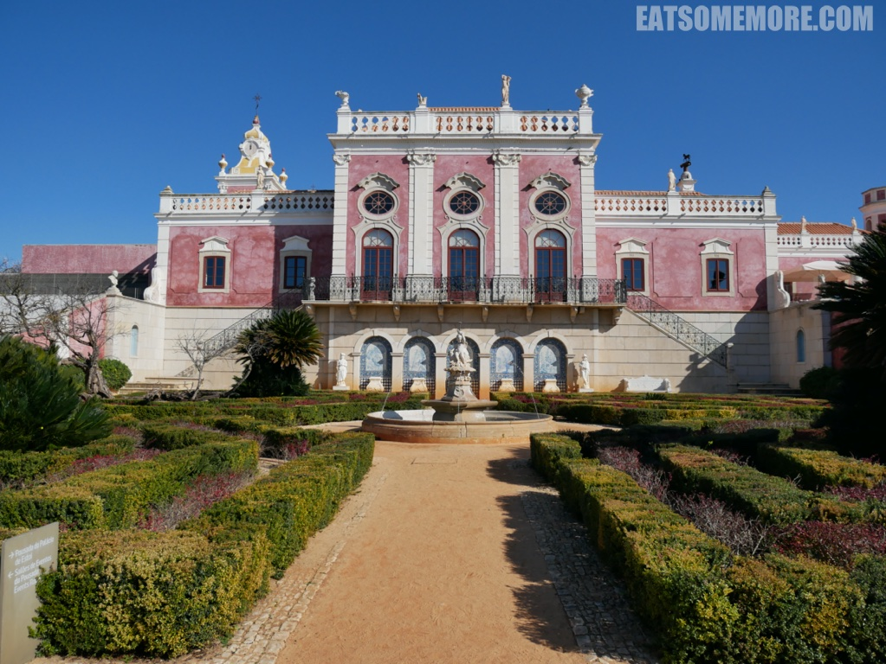

>不论是石像、栏杆还是水池看起来都非常和谐。

>内部的装饰，特别是石膏天花板被认为是阿尔加维地区最精致的。

>这里现在是一间奢华酒店。

>建筑的另一面是对称的青白色阶梯。

>这种颜色来自于白底青花的瓷砖。

>午餐时来到了当时是米其林一星的宝藏餐厅。所有的菜品都体现出了很高得水准，注重食材得原味。

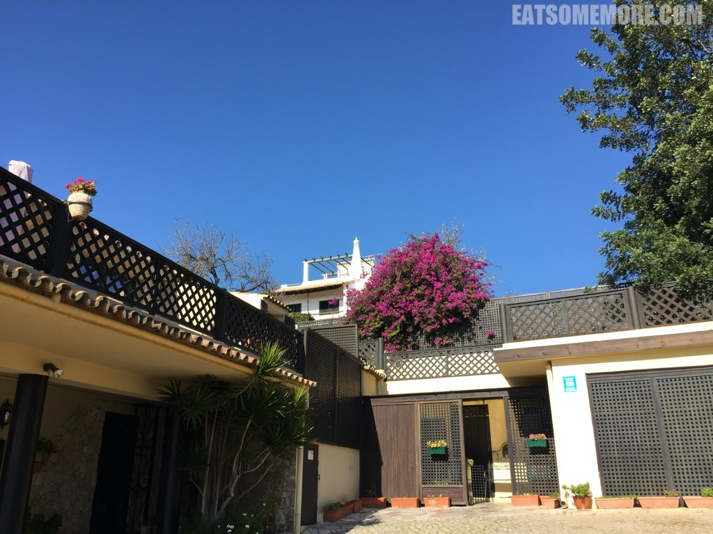

>餐厅的环境非常可爱。

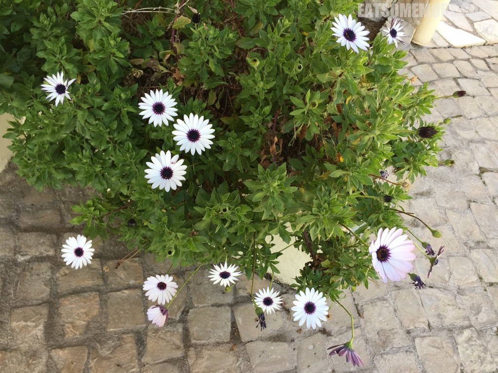

>餐厅在二层，宽敞舒适，并且可以眺望到乡村和远处的大海。

>餐厅的服务也很好，酒水和食物菜单分别有专门的人员负责。用餐的最后，我们还见到了餐厅的主厨。

>这里的餐前包是我吃过最好吃的面包卷，香甜松软。

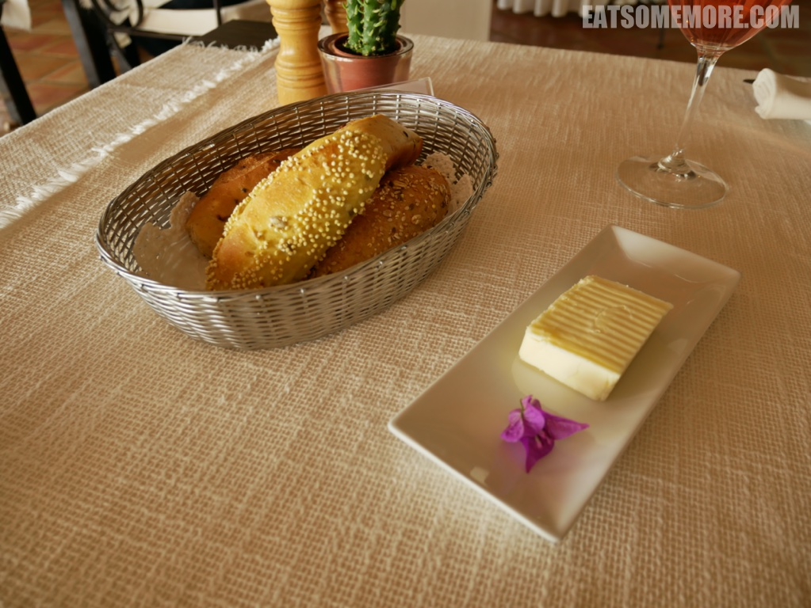

>大厨特赠甜菜马卡龙和花菜汤，一个入口酥松，一个回味清甜。

>生牛肉芝士沙拉，牛肉鲜香嫩滑，搭配芝士和食材，口感均衡。

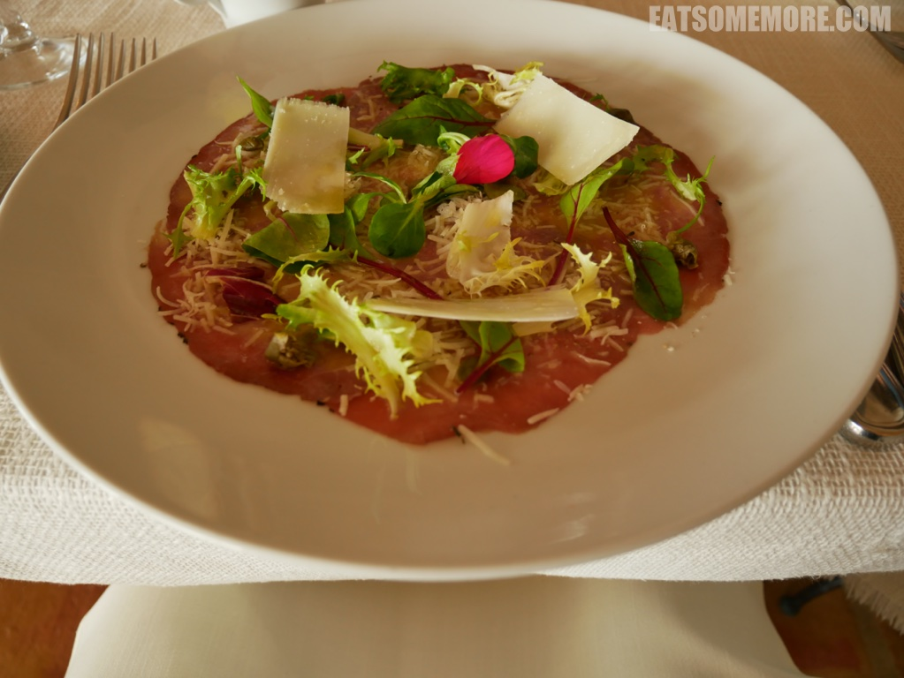

>四海八荒最好喝的奶油南瓜汤，甜而不腻，既浓且滑。

>酥炸小牛肉，皮脆肉嫩，咸香浓郁。

>香煎鳕鱼比较清淡。

>草莓啫喱雪糕，酸酸甜甜，清清凉凉。

>坚果脆饼香甜松脆。

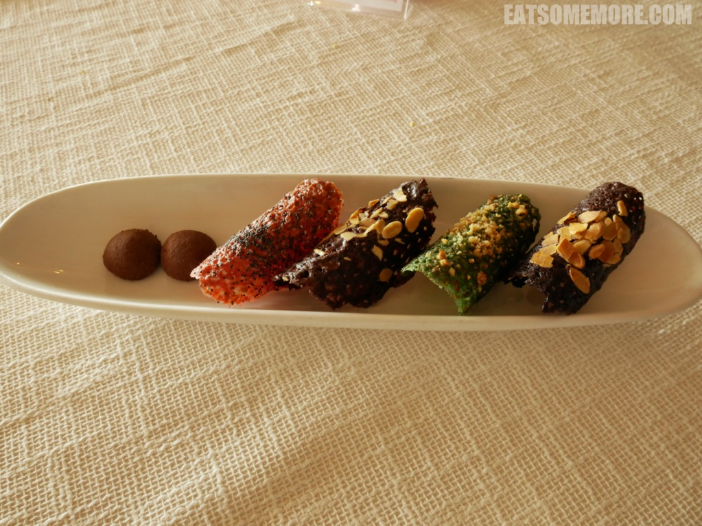

>阿尔加维地区有将近九十个蓝旗海滩，其评选标准非常严苛，包括水质、环境、教育、安全、服务和其他环境管理标准。

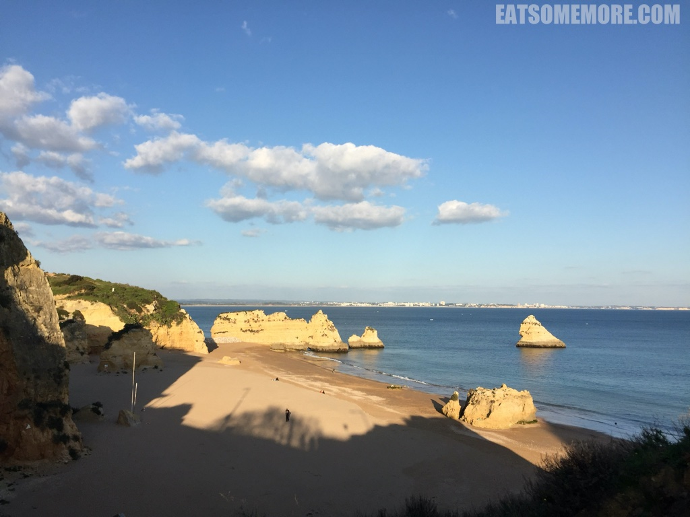

>海水纯净透明。

>石灰岩经过海水千百年的侵蚀，千姿百态。

>海水穿梭在这些岩洞之间，有的波涛汹涌，有的”闹中取静“。

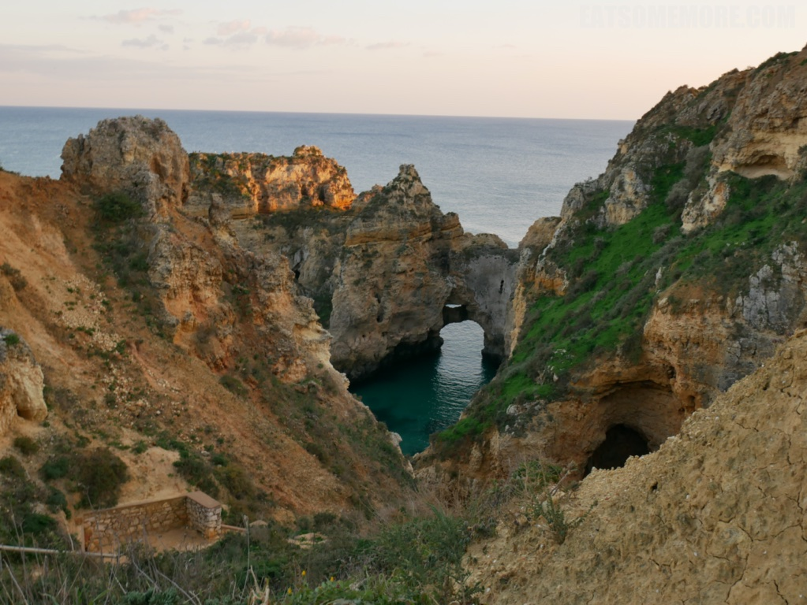

>无垠大西洋海平面上的金色落日。

>就连猫咪也被这万丈光芒迷住。

>日落后，我们来到非常受欢迎的古城拉古什。

>这天我们选择的是美味又接地气的米其林指南推荐餐厅 Artistas。

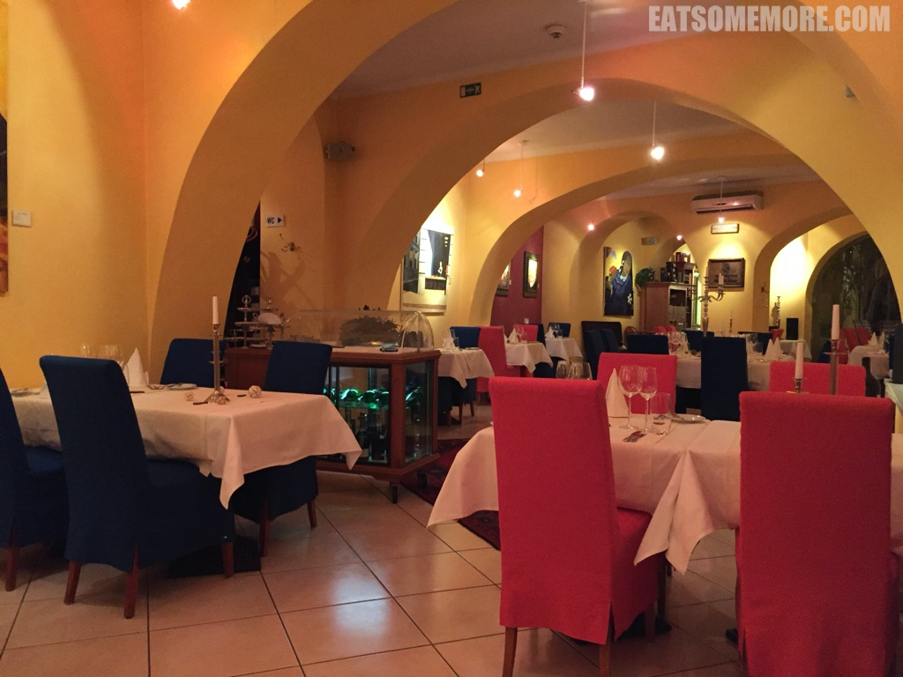

>餐厅整体环境很温馨，用色大胆，和墙上油画的风格非常契合。餐厅外面有一个可爱的院子，里面有一个正在使用当中的壁炉。

>餐前面包的特别之处是搭配了三种不同口味的黄油。

>浓汤和餐前小点都很精致。

>章鱼沙拉的油香和香料味恰到好处。

>粟米炖小牛肉咸香入味。

>覆盆子千层雪糕做得非常用心，还搭配了新鲜的草莓和毛酸浆，以及核桃。

>最后是主厨赠送的薄荷雪糕，格外清凉。

>临走时，餐厅还送了曲奇小饼干，非常贴心。

>是夜，宿阿尔加维假日酒店。来一杯水果鸡尾酒，是时候该休息啦。

>酒店就在海边，如此也收集了大西洋的辉煌日出。

>海边的石灰岩峭壁被朝阳映得红彤彤。

>清澈的波子汽水色的大海冲刷着松软的金色沙滩。

>深蓝浅蓝的海水在阳光下闪闪发光。

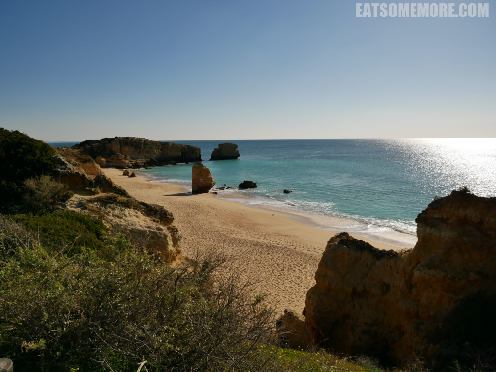

>惊涛拍岸，一石激起千层浪。

>沙滩上的一串串脚印，正引领我们去探索奇妙的发现。

>离大海越来越近的时候，不得不感叹海水和沙滩的干净程度超群。

>穿过岩石间小小的海湾，就要到达目的地。

>这是一个隐藏的沙滩石洞。

>阳光下金色的石灰岩正在拥抱天空。

>午餐时到达 Vilamoura 码头，天朗气清，云懒人闲的，好迷人。

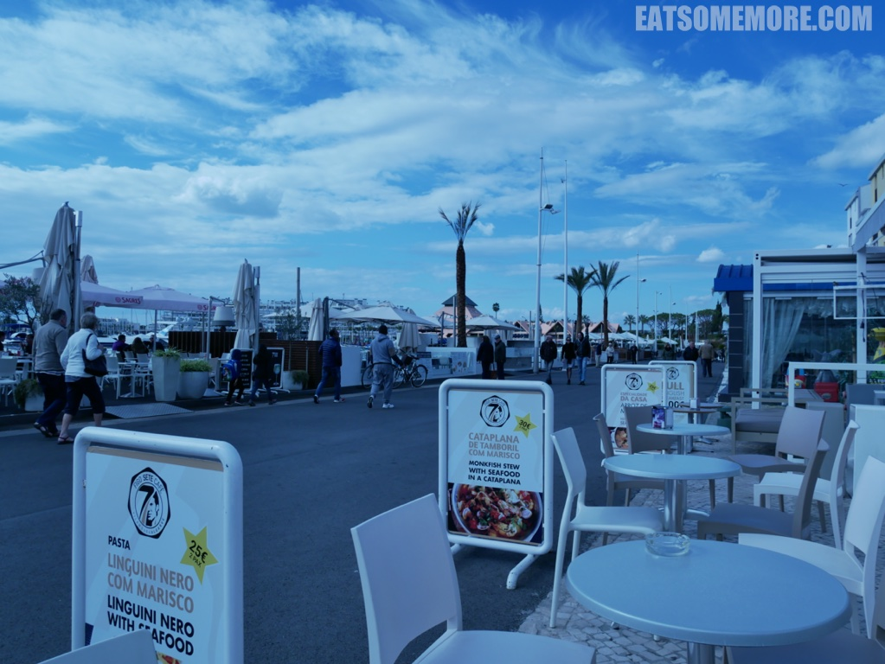

>午餐是葡萄牙海鲜泡饭，巴西里的清香、番茄的酸甜和虾子的鲜甜浸润着颗颗饱满的米粒。

>欢乐的时间短暂到我在回程的飞机上就已经开始盘算下次再来的计划了。期不期待？

![法鲁机场]](images/IMG_20170122_171945.jpg)
