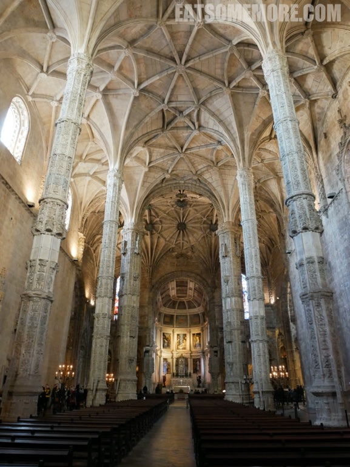

>一个偶然的机会让我来到了欧洲大陆最西端的葡萄牙，出乎意料地发现这里竟然这样的美丽又美味。

## 行程总览


## 里斯本

>来到葡萄牙的首站是里斯本，来到里斯本的首站是博物馆区——贝伦区。十六世纪初，海上强国葡萄牙著名的航海探险家达伽马从他历史性的航海旅程返回后，“幸运儿”曼纽尔一世国王下令始建哲罗姆派修道院。因此它也被称为是地理大发现财富的纪念碑。许多建筑大师参与建造了这座融合了航海元素的曼努埃尔哥特（Manueline）风格的修道院。这种奢华的风格又称葡萄牙哥特式。


>修道院内部的圣玛利亚教堂里耸立着修长的八棱柱。



>教堂一侧的花窗下摆放着管风琴。


>达伽马和许多其他名人都长眠于此。


>十九世纪初，受到自由革命的影响，所有的修道院和修女院都被关闭。哲罗姆派修道院被驱逐的修士为求生计，开始在修道院附近的制糖厂售卖根据修道院古老秘方制作的甜点——葡式蛋挞，竟一炮而红。直到今天都是人们趋之若鹜的排队美食。


>葡式蛋挞美味的秘诀在于酥脆的挞皮和香甜的蛋奶内馅。


>店员说，蛋挞洒上糖霜和肉桂粉会更美味，并贡献了以下杰作。


>下午茶后，我们要过一座人行天桥去看另一个历史古迹，贝伦塔。


>同样是曼纽尔一世下令建造的贝伦塔，是一座五层的、有锯齿状垛墙的防御工事，第三层突出的窗台里面是首长的房间。


>贝伦塔是航海家们探寻贸易之路的起点，也因此成为了葡萄牙大扩张时代的标志。


>夕阳西下，人在天涯。


>由于到的时间晚了一些，我们很遗憾地无法进入贝伦塔内部参观。


>因祸得福地看到了挨着贝伦塔的大西洋海上日落。


>太阳渐渐地消失在海平面，独留孤塔看沧桑。


>暮色昏昏，霞染千里。


>晚餐时，我们来到了好评如潮的老牌海鲜餐厅 Cervejaria Ramiro。


>黄油涂在烤面包片上渐渐融化，香气四溢。


>这里还提供葡萄牙特有的青葡萄酒，也叫青涩葡萄酒，因为它们通常在葡萄成熟的三到六个月之间上市。


>面包蟹水煮后拆解停当。一口蟹肉一口膏，满足味蕾好味道。


>香蒜欧芹黄油蛤蜊，天作之合的口味搭配。


>烤虎虾已经是肉肥膏满，然而竟被中间颜色更为鲜艳的猩红虾抢了风头。容我细细道来：
```
虾中翘楚色猩红，壳薄肉满慨当慷。
浅搁牛油恰添柴，柔软甘鲜自馨芳。
```


>晚上入住交通便利的里斯本丽笙酒店。


>酒店贴心地准备了水果和水。


>房间整洁大方。


>洗手间简洁素净，两个台盆的设计也非常实用。


