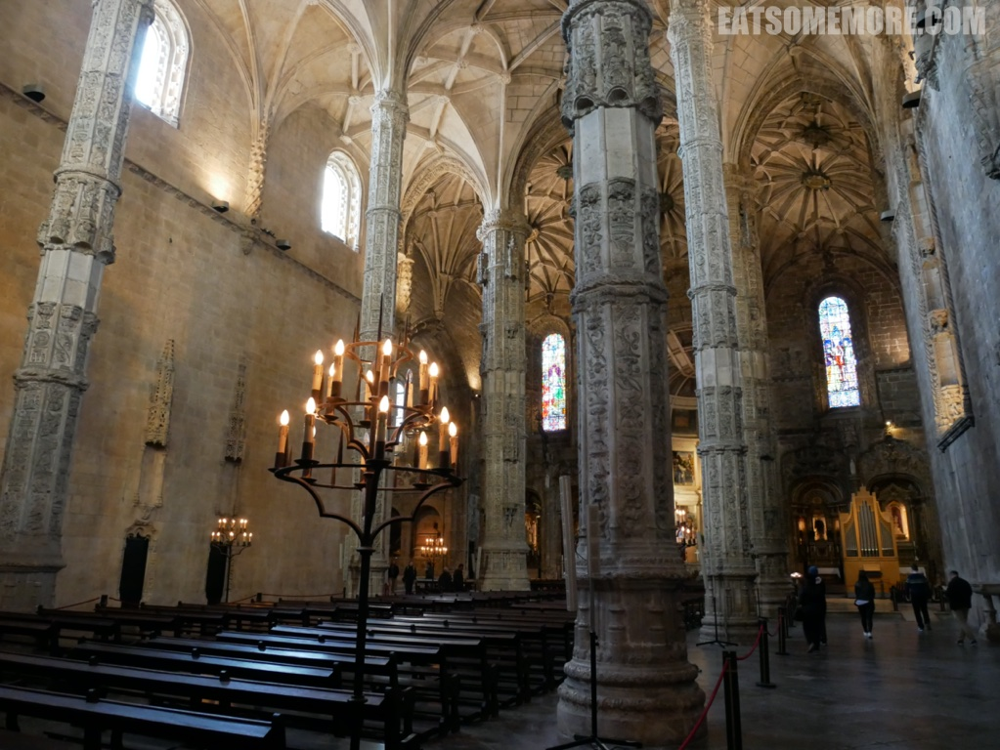

>

## 行程总览


## 里斯本

>哲罗姆派修道院，地理大发现带来的财富的纪念碑。曼努埃尔哥特（Manueline）有时称为葡萄牙哥特式晚期的集大成者，是葡萄牙文艺复兴和大航海时代（Age of Discoveries）时期起源于16世纪的奢华综合葡萄牙建筑风格。曼努埃尔（Manueline）的建筑融合了海洋元素，并展示了Vasco da Gama和PedroÁlvaresCabral航行中所带来的发现。葡萄牙著名航海探险家达伽马从他历史性的旅程回来后，由“幸运儿”曼纽尔一世大约在1501年下令始建。许多建筑大师参与建造。


>圣玛利亚教堂。修长的八棱柱


>



>达伽马和许多其他名人都长眠于此。


>


>葡式蛋挞-源自葡萄牙的小吃——蛋挞风靡全球，美味的秘诀在于酥脆的挞皮和香甜的蛋奶内馅。


>


>


>同样是曼纽尔一世下令建造的贝伦塔是一座五层的防御工事，第三层突出的窗台属于Governor's room。有锯齿状垛墙的城墙。


>是航海家们探寻贸易之路的起点，也因此成为了葡萄牙大扩张时代的标志。


>


>


>


>


>


>


>


>


>


>


>猩红虾
```
虾中翘楚色猩红，壳薄肉满慨当慷。
浅搁牛油恰添柴，柔软甘鲜自馨芳。
```


>


>


>


>


