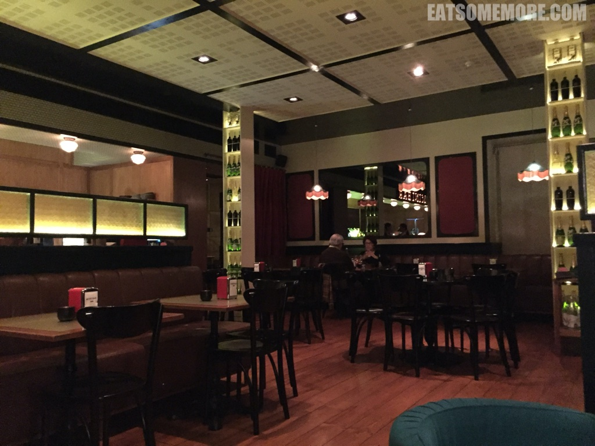

>在里斯本的第二天，得去城市中心逛逛。

## 行程总览


## 里斯本
>地铁出站的阶梯营造了一种饥饿的氛围。


>早餐能吃到地道现烤葡式蛋挞的机会，人生几何。从吧台可以看见蛋挞的制作过程。饼皮轻薄细密酥脆。美中不足的是馅料稍微甜了一些。


>早餐后来到贾梅士广场，与事先预约的里斯本半日游导游集合。


>广场上行人熙熙攘攘之间，也混进了一些一动不动又形神兼备的“人”。


>长着铆钉的建筑外立面也很特别。


>公元十四世纪，保证了葡萄牙独立的佩雷将军建立了哥特式的卡尔莫修道院。1755年11月1日，里斯本大地震摧毁了修道院的大部分建筑。修道院废墟如今成为了卡尔莫考古博物馆。


>博物馆位于希亚多区的一座小山丘上，可以远眺圣若热城堡山。


>商业广场东侧的里斯本历史中心庄严夺目。


>广场中央的雕像是骑着马的“改革者”国王若泽一世。


>在城市里不知名的犄角旮旯，高大的橙树下排列着两张长椅。


>在这里，咱们的导游自弹自唱着法朵，他说这是命途多舛的葡萄牙独特的悲恸曲调。


>他又打趣说歌曲《寂静之声》当中描写的“方石窄巷”说的是里斯本。


>不知道是不是种种困境激发了葡萄牙人的超凡想象力，在蓝色的墙面安上了色彩跳脱的空中盆栽。


>穿过许多巷弄后，来到了导游私藏的观景点。


>在这里不仅能看到数不胜数的橙色屋顶，还可以远望横跨塔霍河的悬索桥，4月25日大桥。这个名字来源于1974年4月25日发生的康乃馨革命，这天也被定为是葡萄牙的“自由日”。


>结束游览后，又到了觅食的时间。里斯本的主要街道上驶来了“当当”作响的黄色有轨电车。


>临街的小餐馆把门牌号作为他们的店名。


>菜单手写在一块木牌上。看似粗狂质朴，菜品却其实很精致。


>整个葡萄牙行程当中最叫我念念不忘的就是这道鹅肝土司。厚厚的鹅肝煎得香喷喷，洒上葱花和坚果碎，油香饱满，嫩滑多汁。


>章鱼沙拉里的章鱼腿口感弹牙，而吸盘部分是脆脆的。


>炖饭上放的是火腿包鳕鱼。


>烤茄子和胡萝卜配的是榛子酱。


>唯一有点失望的是炸沙丁鱼，因为它完全不脆，而且有些腥。


>午餐后在市区逛逛，来到了高四十五米的新哥特式圣朱斯塔升降机。


>在爬楼梯和吃雪糕之间，果断选择了后者。两种口味分别是椰子和甜蛋，都是手工制作的。椰子雪糕里有椰蓉，口感更丰富；而甜蛋雪糕里还有蛋黄，新奇又美味。


>看着夕阳下的里斯本，我好像有些能够理解出生于里斯本的伟大诗人费尔南多佩索阿 (Fernando Pessoa) 的感慨：
```
我什么也不是，
什么也成为不了，
什么也不想成为，
除此之外，我拥有这个世界所有的梦想。
```


>晚餐的时候来到了米其林指南推荐的 Mini Bar。竟然在还没开门的时候就排起队来。


>餐厅提供各种套餐，是由米其林星级大厨 José Avillez 制定的。



>菜品精致充满创意。右手边翠绿色的珠子是莱姆味的卡琵莉亚鸡尾酒糖。中间黄绿色的两团啫喱里包裹的是橄榄汤。


>谁能想到这块撒着盐的果肉是玛格丽塔味的。


>金箔费列罗是我最喜欢的巧克力。浓滑巧克力、香脆榛仁和松脆威化的结合怎么会这么无敌？


>鸡肉搭配牛油果泥和沙拉酱清新鲜活。


>酸柑上工整地各摆了一只处理得非常干净的鲜虾刺生，鲜甜的滋味随着食材在口中的乳化变得越来越浓郁。


>吞拿鱼和扇贝刺身塔塔被非常有创意地放在脆皮蛋筒里，甘甜鲜香。


>只在鸡蛋上洒满松露这样简单的搭配竟然非常惊艳。


>脆饼上是炖吞拿鱼。


>另一款吞拿鱼则被放在盐灯加热的石板上，生熟参半让口感更好、味道也更突出。


>盐灯石板烤扇贝，充满了氨基酸的味道。


>汉堡包也是认真的呢！肉汁饱满、油香四溢。


>炖牛尾香酥咸鲜。


>甜点分别有酸橙球和巧克力蛋筒。


>最后还有甜蜜柔软的椰丝棉花糖。整个用餐体验很愉快，为我们的里斯本之行画上了浓墨重彩的句号。


