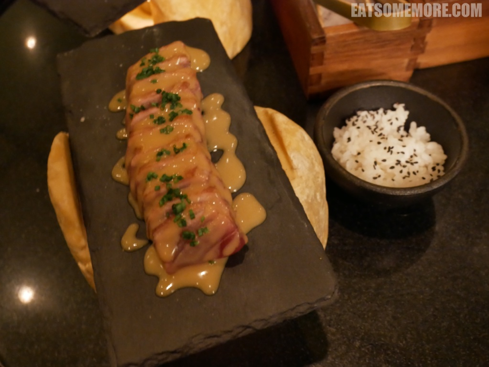

>在里斯本的第二天，得去城市中心逛逛。

## 行程总览


## 里斯本

>地铁出站的阶梯营造了一种饥饿的氛围。


>早餐能吃到地道现烤葡式蛋挞的机会，人生几何。从吧台可以看见蛋挞的制作过程。饼皮轻薄细密酥脆。美中不足的是馅料稍微甜了一些。


>早餐后来到贾梅士广场，与事先预约的里斯本半日游导游集合。


>广场上行人熙熙攘攘之间，也混进了一些一动不动又形神兼备的“人”。


>长着铆钉的建筑外立面也很特别。


>公元十四世纪，保证了葡萄牙独立的佩雷将军建立了哥特式的卡尔莫修道院。1755年11月1日，里斯本大地震摧毁了修道院的大部分建筑。修道院废墟如今成为了卡尔莫考古博物馆。


>博物馆位于希亚多区的一座小山丘上，可以远眺圣若热城堡山。


>商业广场东侧的里斯本历史中心庄严夺目。


>广场中央的雕像是骑着马的“改革者”国王若泽一世。


>在城市里不知名的犄角旮旯，高大的橙树下排列着两张长椅。


>在这里，咱们的导游自弹自唱着法朵，他说这是命途多舛的葡萄牙独特的悲恸曲调。


>他又打趣说歌曲《寂静之声》当中描写的“方石窄巷”说的是里斯本。


>不知道是不是种种困境激发了葡萄牙人的超凡想象力，在蓝色的墙面安上了色彩跳脱的空中盆栽。


>穿过许多巷弄后，来到了导游私藏的观景点。


>在这里不仅能看到数不胜数的橙色屋顶，还可以远望横跨塔霍河的悬索桥，4月25日大桥。这个名字来源于1974年4月25日发生的康乃馨革命，这天也被定为是葡萄牙的“自由日”。


>结束游览后，又到了觅食的时间。里斯本的主要街道上驶来了“当当”作响的黄色有轨电车。


>临街的小餐馆把门牌号作为他们的店名。


>菜单手写在一块木牌上。看似粗狂质朴，菜品却其实很精致。


>整个葡萄牙行程当中最叫我念念不忘的就是这道鹅肝土司。厚厚的鹅肝煎得香喷喷，洒上葱花和坚果碎，油香饱满，嫩滑多汁。


>章鱼沙拉里的章鱼腿口感弹牙，而吸盘部分是脆脆的。


>炖饭上放的是火腿包鳕鱼。


>烤茄子和胡萝卜配的是榛子酱。


>唯一有点失望的是炸沙丁鱼，因为它完全不脆，而且有些腥。


>


>Gelato of many flavour choices - The gelato is very nice. We had coconut and sweet egg flavours. The coconut flavour has bits in the gelato. I have never tried a sweet egg flavoured gelato. This one is really nice with egg yolk in the gelato.


>
```
"I am nothing.
I'll never be anything.
I couldn't want to be something.
Apart from that, I have in me all the dreams in the world."
by Fernando Pessoa
```


>


>Diners are in for a pleasant surprise as the dishes on the menu have been created by José Avillez – Michelin-Starred chef at the Belcanto restaurant. 米其林指南推荐


>卡琵莉亚是一种以卡沙夏为基酒调制而成的鸡尾酒，在巴西有着国民鸡尾酒的地位，巴西政府也曾为它立法订立法定酒谱。目前也是国际调酒师协会收录的正式鸡尾酒之一。一般而言卡琵莉亚的材料包含糖、莱姆还有卡沙夏。橄榄。


>玛格丽塔。


>金箔费列罗


>鸡肉


>虾


>吞拿鱼、扇贝


>鸡蛋松露


>炖吞拿鱼


>吞拿鱼



>扇贝


>汉堡


>牛尾


>酸橙球，巧克力蛋筒


>petit fours


