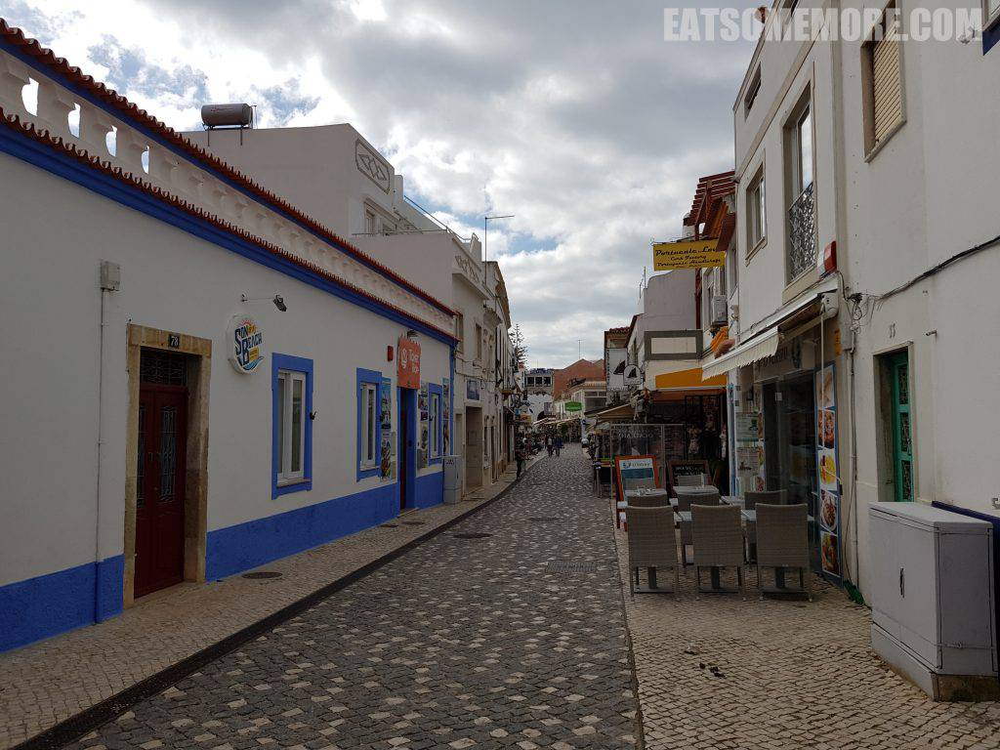
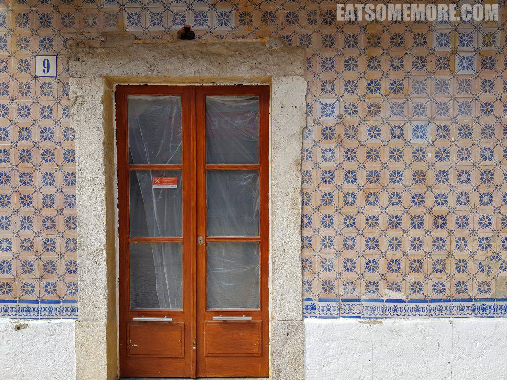
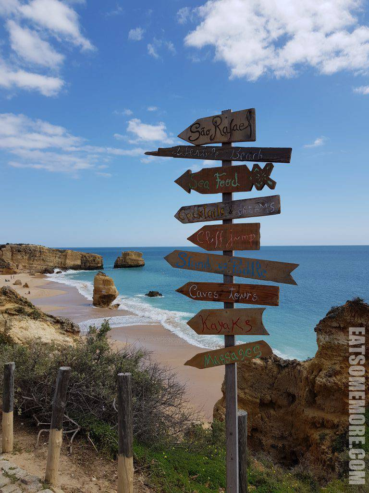
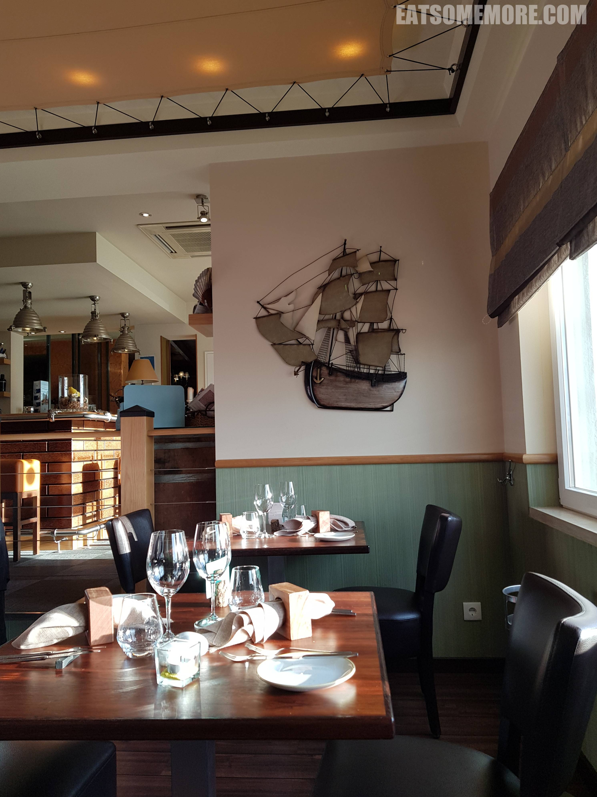
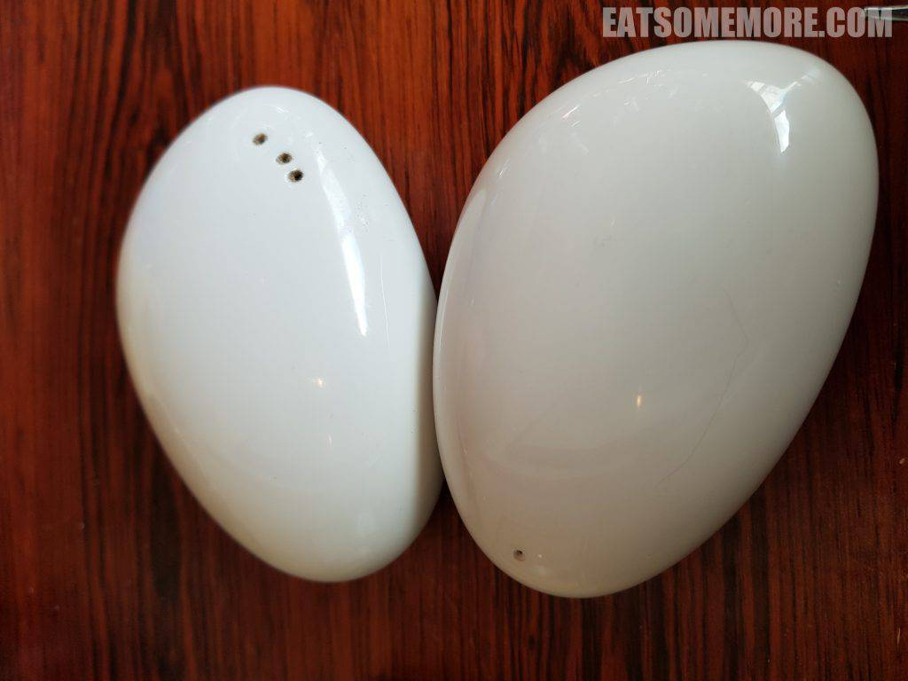
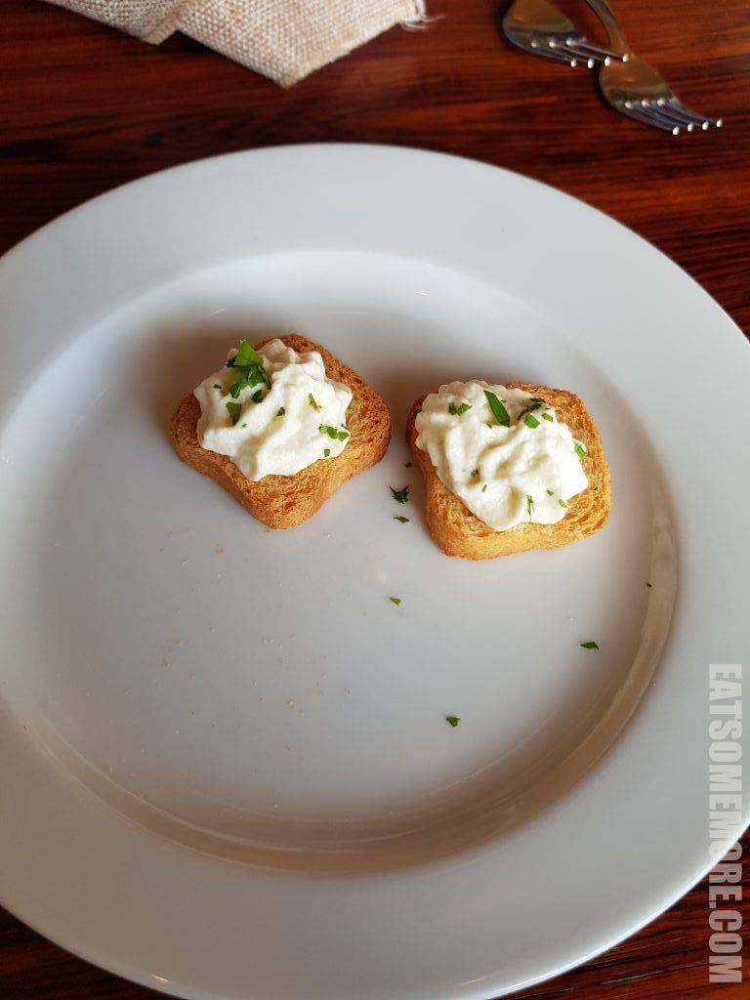
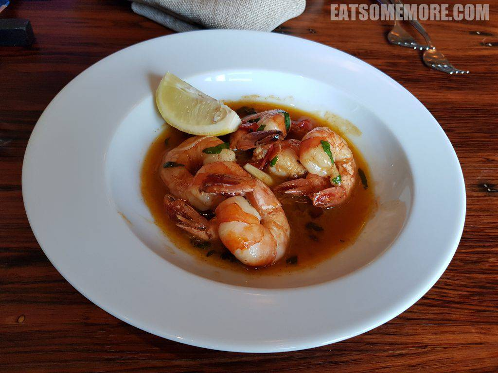

## 行程总览

## 阿尔布费拉 Albufeira

>书接上回，早餐后前往临近小镇阿尔布费拉(Albufeira)，有葡萄牙典型块石铺筑的街道，白墙橙瓦，商铺林立。

>彩绘瓷砖在墙面上的应用也很广泛。

>街道直通大海。阳光之下澄清的潮涨潮退之间，无数贝壳闪着晶莹的光、奏起清脆的乐声。

## 午餐 - Tres Palmeiras

>春夏的葡萄牙南部，空气中仿佛充满了柑橘的清甜香味。

>不同于邻国西班牙拿手的海鲜炖饭，葡萄牙流行的是别具一格的海鲜泡饭，配料包括安康鱼、虾蛄、海虾、青口、蛤蜊和鱿鱼，鲜味简直要溢出屏幕，再以蕃茄和巴西利调味，两个人能吃一锅！

## 蓝旗海滩 São Rafael Beach

>午餐后来到蓝旗海滩São Rafael Beach。天高云远，青蓝层叠，沙滑浪卷。

>近距离感受一下这透心蓝和汽水绿。阳光把沙滩、石头晒得闪着金光。

## 晚餐 - Omarinheiro

>海滩边的餐厅目测就很有“海味”。

>还有一位老船长，不禁要唱起《外婆的澎湖湾》。

>第一次使用鹅卵石造型的盐和胡椒。

>赠送的餐前小点，脱水小吐司沾奶油。

>番茄味的黄油大虾，又脆又弹又甜又鲜，一级新鲜，十分美味！

>油炸章鱼腿，面皮香脆，章鱼酥软。

>烤鸭拌面的鸭皮烤的焦香，鸭肉弹嫩，拌面里还加入了花生碎添香。

 啊，什么也没有做就过去了一天，舒坦。
