## 行程总览

## 午餐 - Sao Gabriel

>快乐的时光总是特别短暂，旅程来到了最后一天。离开酒店后，一路向东来到阿芒西尔(Almancil)，专程拜访一间米其林一星餐馆。一样的晴空万里，高塔白墙，花团锦簇。

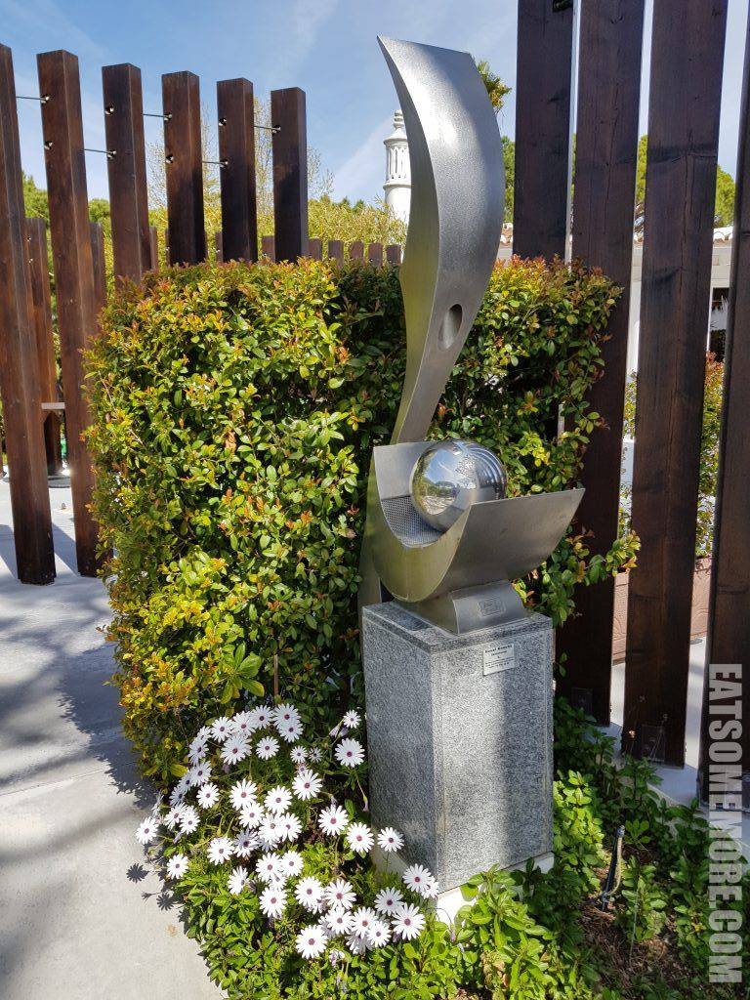

>院子里的老藤上开出了紫色的花，挂满了葡萄酒瓶的软木塞。

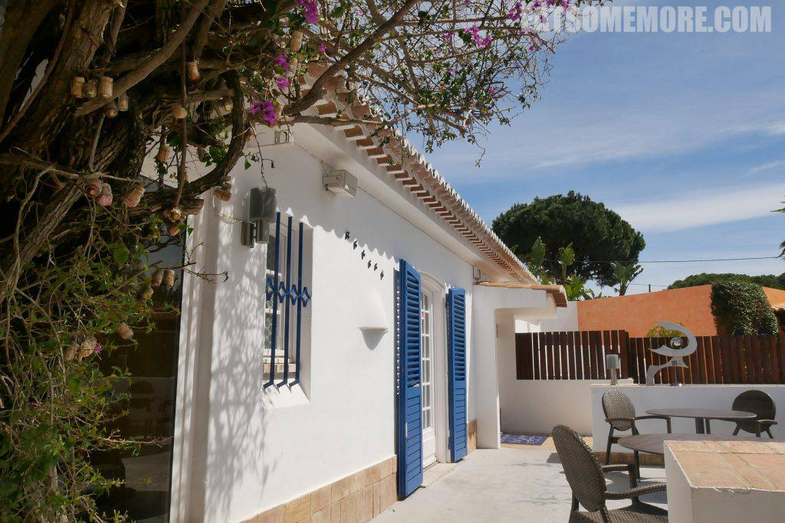

>窗明几净的内部空间。

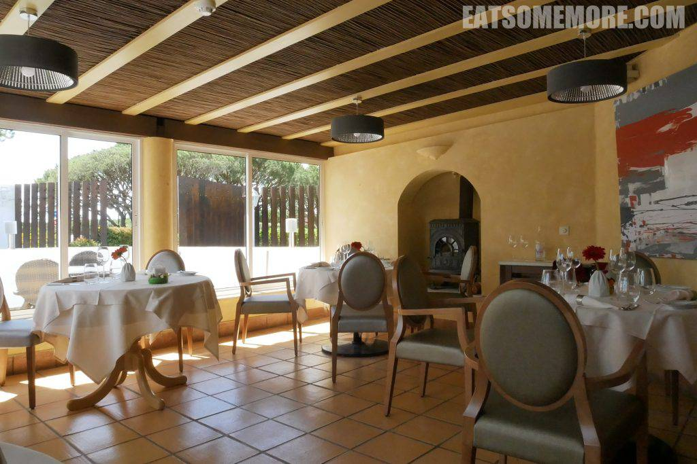

>复活节期间的特别摆设。优秀的我不禁做起了鸡兔同笼的题目。

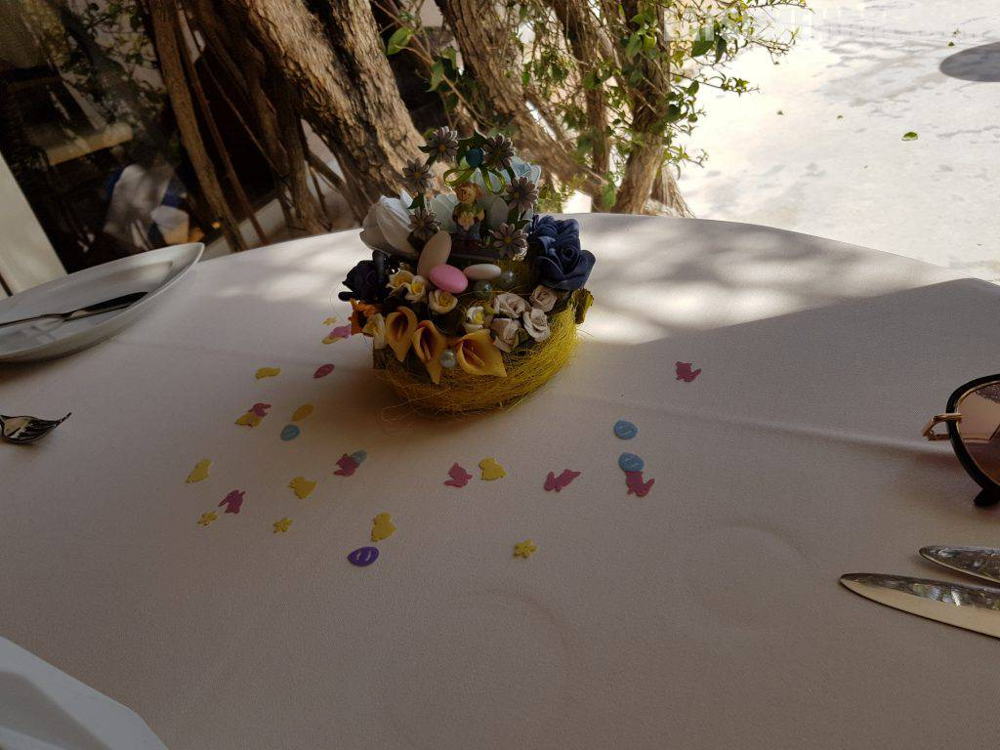

>餐前面包摆在软木塞做的盒子里。

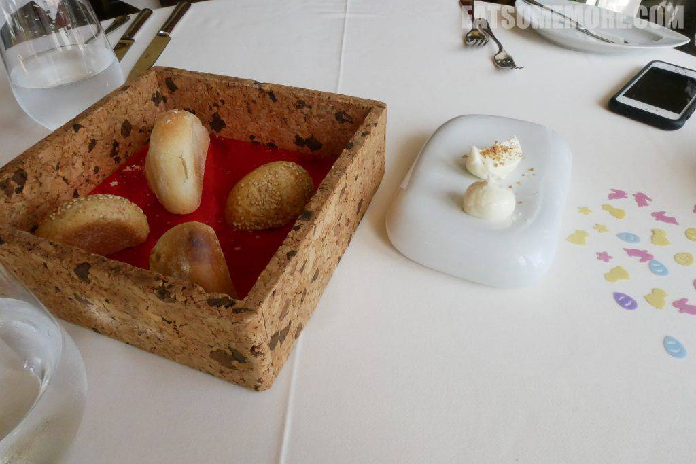

>餐前小点是酸奶油搭配稍稍煎过的微熏三文鱼。一种鱼，生熟两种口感，一触即发的饱满海鲜油脂，烟熏味较淡因而咸淡适中，搭配奶油口感更滑顺。

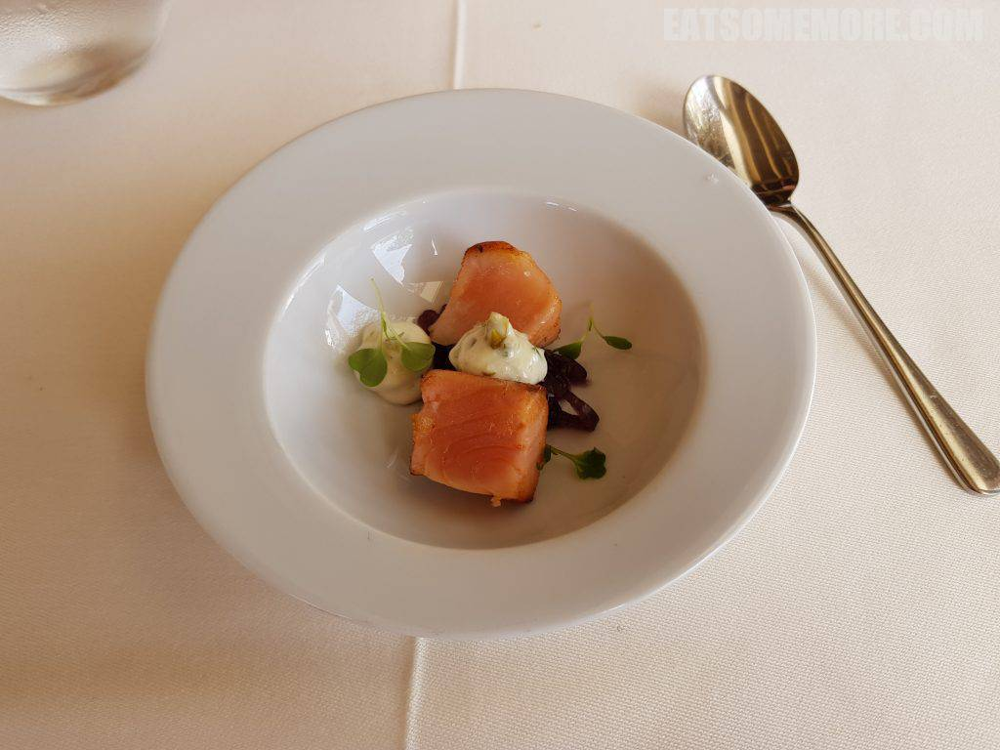

>香橙南瓜汤泡鸭肉意大利饺，香甜咸鲜、温暖浓稠。

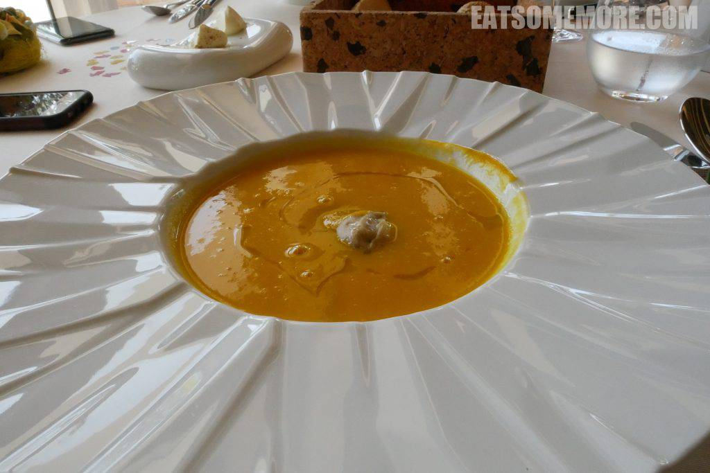

>奶油白酱小牛肉馅的意大利馄饨，搭配三种芝士，奶香浓郁。

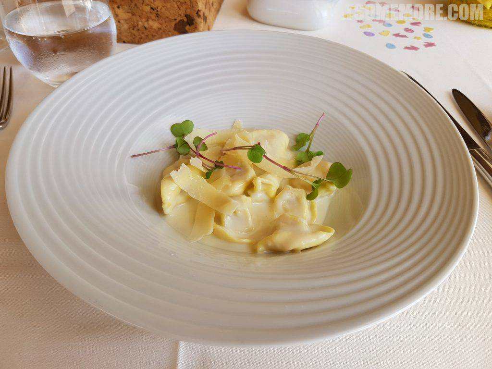

>鱿鱼馅儿的煎鲈鱼和柠檬味儿的土豆泥。鱿鱼饼的鲜味浓度极高，鲈鱼煎得软嫩，搭配在一起鲜美出了新高度。

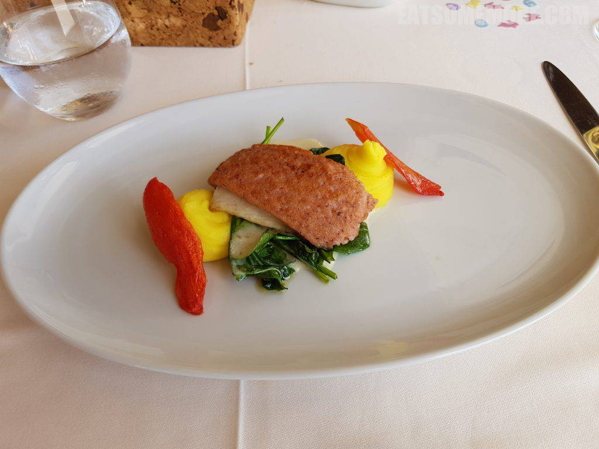

>炖伊比利亚猪颊佐瑞士薯饼，肉香馥郁、肉质软烂。

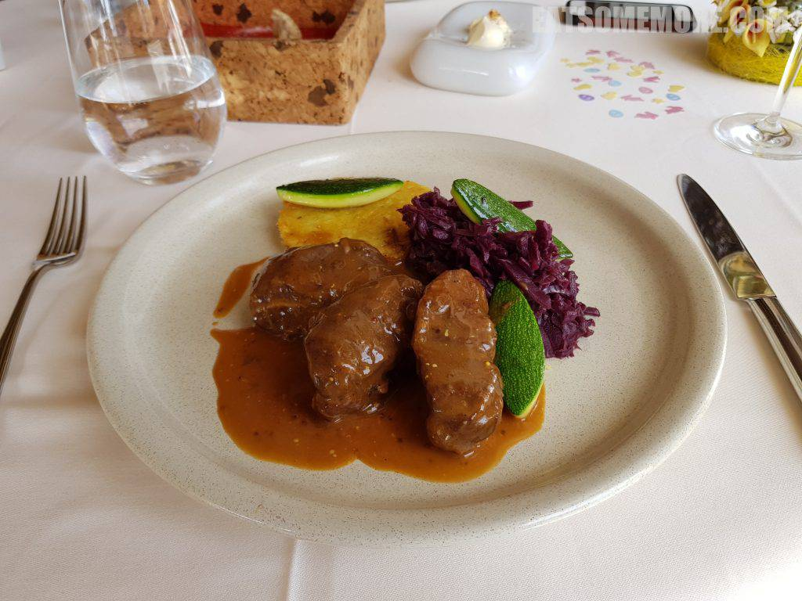

>传统烤羊肉有着羊肉独特的香气，油脂丰富，甘香鲜甜。

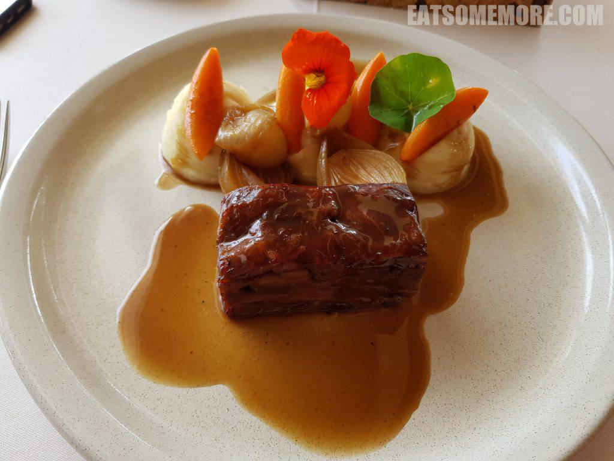

>香草白露华蛋糕，既香且甜、入口即溶，红莓冰激凌酸甜清新、解渴消暑。

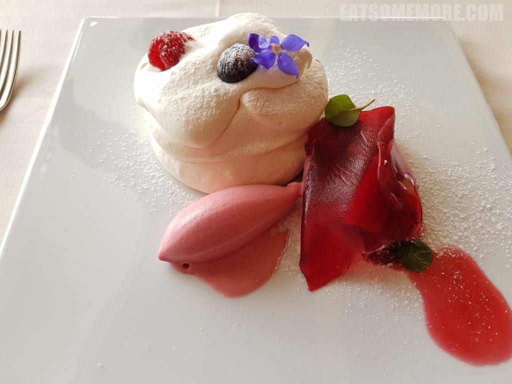

## Barreta海滩

>饭后来到葡萄牙最南部的Barreta海滩，伴着成行的棕榈树和零散的几叶扁舟，享受这次旅途里最后的悠闲时光。

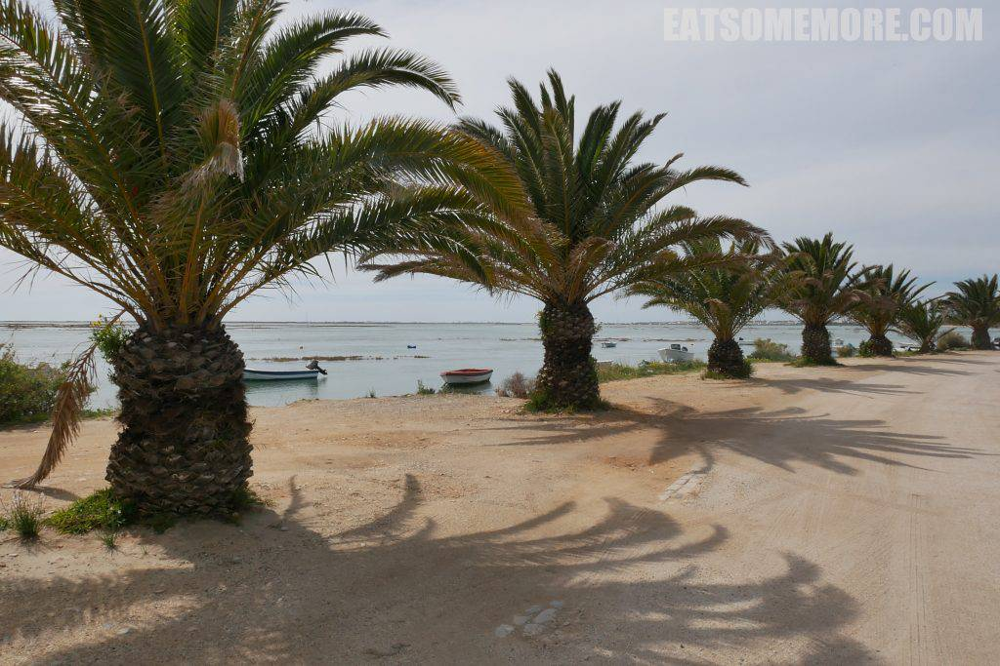

>离开前当然不能忘了分享旅途的所见所闻。葡萄牙的明信片以软木制成，印上了有当地特色的图画，可惜以下所有的明信片都没有顺利地到达目的地，所以各位看官还是亲自来体验吧！

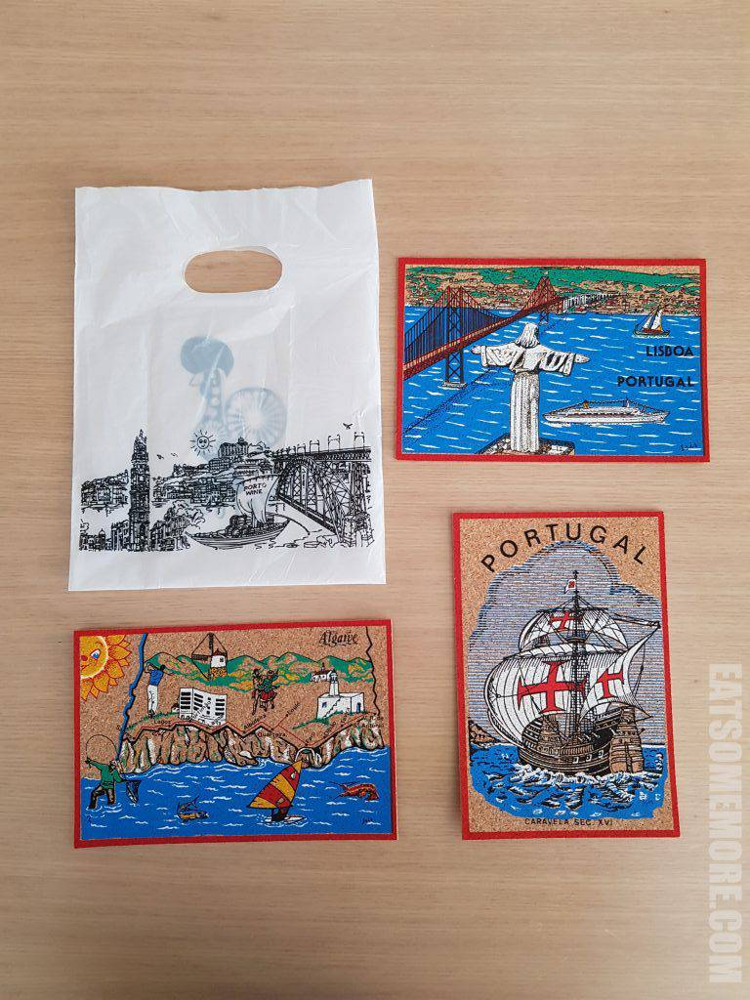
