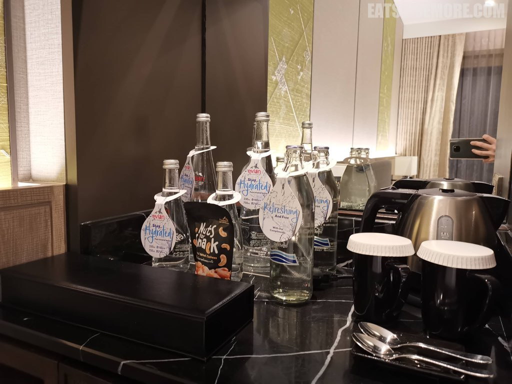
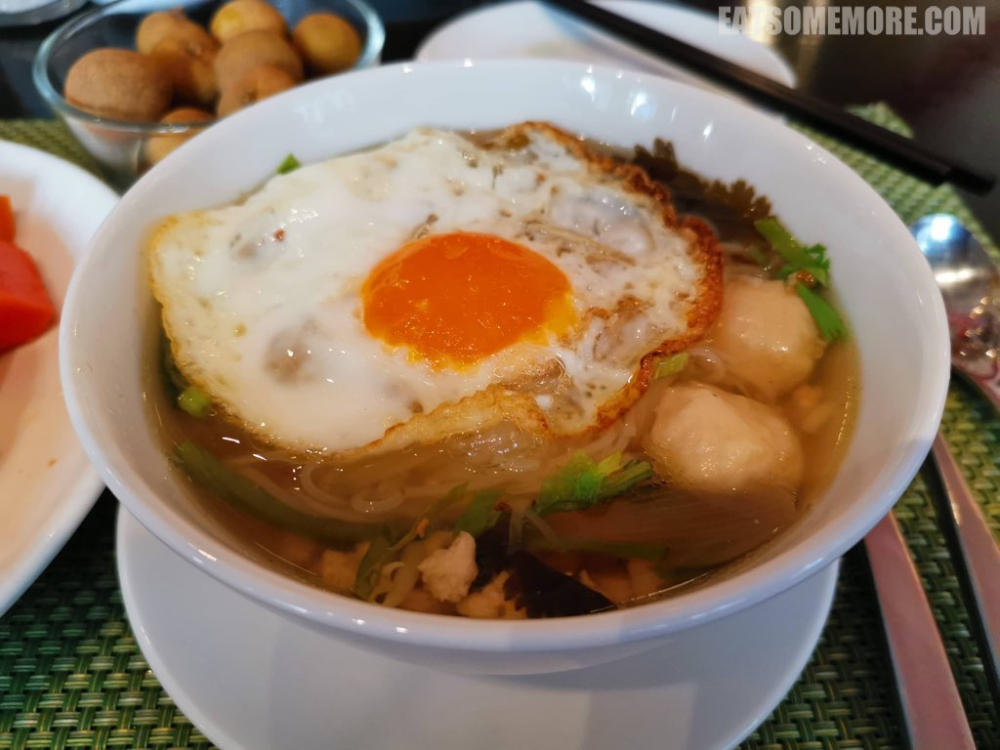
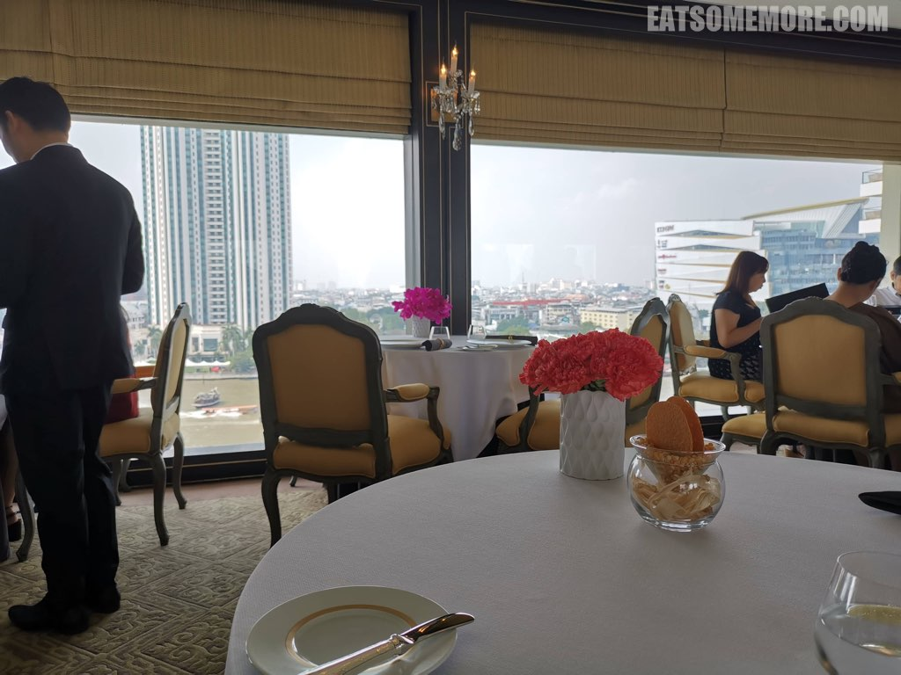
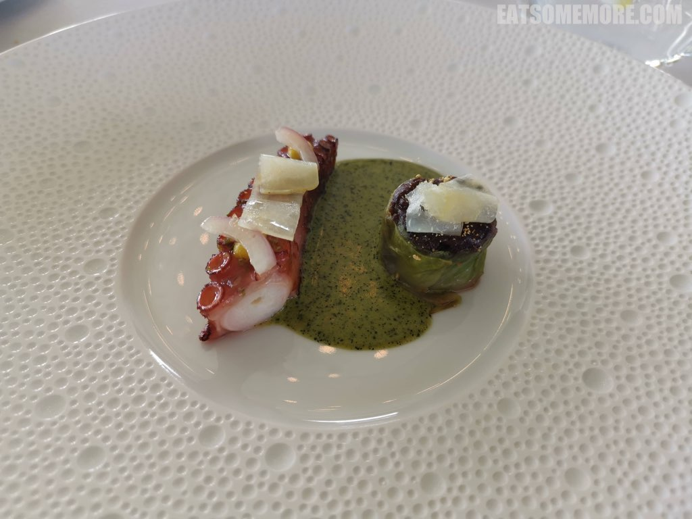
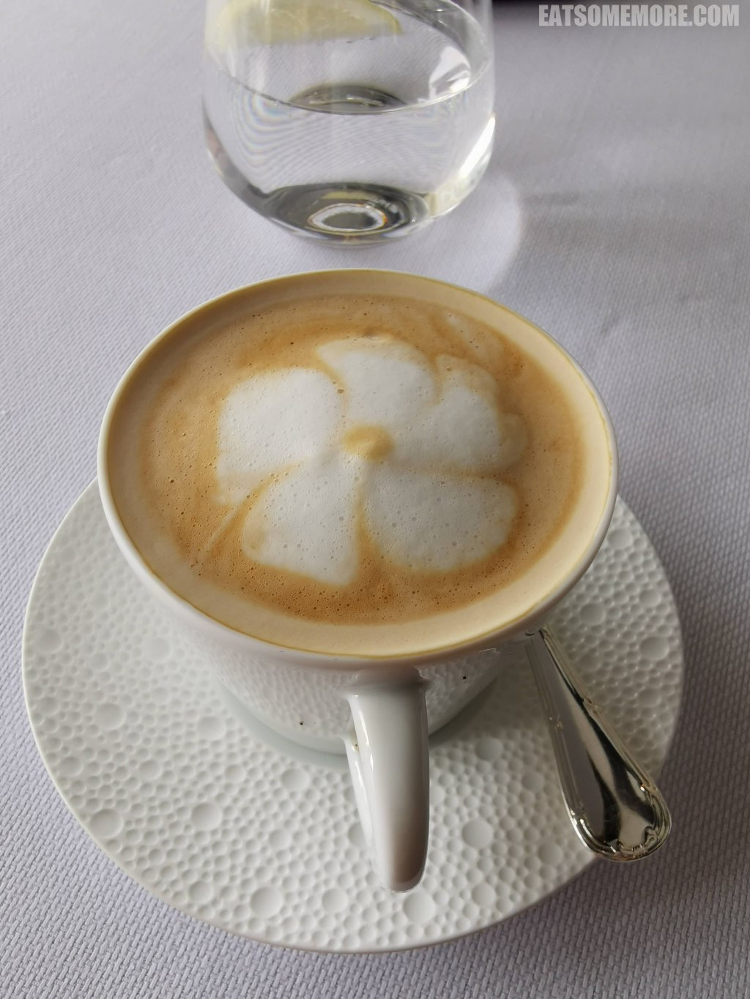
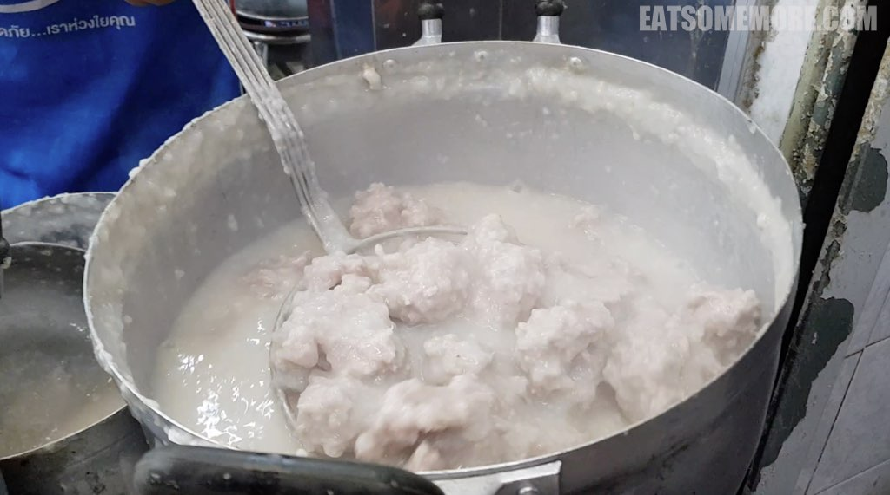

>  对于很多人来说，曼谷是很热门的冬季度假胜地，气候温暖干燥，活动丰富多彩。这些对于我来说本身就非常具有吸引力，直到网络上那些无穷无尽的泰国美食视频成为了促使我订下这趟旅程的最后一捆稻草。

## 行程总览

## 曼谷千禧希尔顿酒店

>漏夜抵达曼谷，搭乘酒店提供的接驳船，取道湄南河，乘着流光溢彩的夜色前往此行的住处。

>房间正对着船来船往的湄南河，利落宽敞大气。

>酒店贴心地提供了巧克力和马卡龙点心。

>黑森林蛋糕也是认真的黑巧克力海绵蛋糕夹着樱桃果酱，湿润松软香甜。

>房间里还有水吧，提供咖啡、茶和水。

>洗手间空间也很大，淋浴和浴缸完全分开。

>次日清晨的阳光揭开了五光十色的夜幕，展露出曼谷的天际线。

>希尔顿的早餐很少让人失望，这一间也是一样：品种繁多，不乏中西泰日风格的食物；食材新鲜，特别是各色水果。

>我最喜欢的要属现点现煮的米粉汤，汤头特别的鲜甜。

>久居英国的我好久没有吃到花香馥郁、果汁磅礴的桂圆，这回一偿宿愿了！

>酒店健身中心提供各种课程，包括瑜伽和普拉提。经过了缜密的思量和考虑，我还是出门玩去吧！

>出门的时候是白天，这才见到酒店门口开着紫色莲花的池塘。世界上好像有些花，只有天亮才开，入夜后又变回了花蕾的样子。多少人羡慕这样的“日出而作，日落而息”。

## Lhong 1919

>步行十分钟左右到达湄南河畔多功能复合型建筑群Lhong1919。

>一早什么都还没开门，不过优点是鲜有游人，乐得清净。

## The Jam Factory

>Lhong1919附近有一个文创中心，The Jam Factory。

>店没有开，但树上的花开了。

>曼谷四处都很干净，一早一晚常常能看见人们在打扫卫生。黄白相间的花猫蹲在落地窗的里面，吹着微风的我坐在枝叶繁茂的树下，耳畔是屋顶扫下落叶的沙沙声，怪不得文艺青年们喜欢这个地方呢！

## Le Normandie

>午饭时，我们搭船过河来到湄南河东岸文华东方酒店里的诺曼底人餐厅，是曼谷的五间米其林二星餐厅之一。

>酒店环境优雅舒适。

>窗外是湄南河和西岸的半岛酒店、文华东方公寓和购物中心。

>餐前有选择香槟和气泡酒的环节。我选择了花果香较为出众的玫瑰气泡酒。

>餐前小点心有三样。芝士脆饼薄而酥脆，鞑靼牛肉筒里生牛肉碎混合东南亚香料味迸发着鲜甜的肉汁，熟成鲭鱼缀以莳萝和柚子酱清新甘甜，蟹肉塔奶香浓郁。

>接下来服务生取来了一个看起来非常复杂的仪器，开始冷萃海藻蘑菇汁。

>提取出来的汤汁被缓缓地注入盘子，泡着红色、绿色、棕色的海藻和蘑菇碎，尝起来口感脆，口味鲜。

>接着来到了选择黄油和面包的环节。选择多种多样：黄油有法国传统的，加海藻的，加盐的和什么都不加的；面包有餐包、起酥包、小法棍和酸种包。我选了起酥包搭配海藻黄油。起酥包本身就很好吃，虽然是冷的，但贵在酥皮层层复层层，包裹着湿润有弹性的香甜味道，配上有着隐约蚝味的海藻黄油，更提鲜香。

>野生章鱼烤得酥软，吸盘的部位仍脆脆的，以少许橘子酱和蒜泥罗勒青酱调味，菊苣脆生清甜，紫甘蓝卷软烂入味。

>法国蓝青口煮得非常脆嫩。带着草本味的大头菜咖啡饺泡在青口酱当中，味道层次丰富。

>接着服务生换了木头勺子，上来的盘子里盛了温热绵密的香槟土豆酱，浮着鲟鱼子酱作咸鲜调味，沉着的一片片海胆被土豆酱的温度改变了本身的熟度。

>这一结合入口后慢慢地在嘴里化开并且释放出不同的味道，一开始甜甜的，再咸咸的，最后是清风拂面的极致鲜味。

>乳化黄油酱卢瓦河白梭吻鲈鱼，肉质鲜嫩细腻，鱼籽咸鲜，鱼皮炸得酥脆。

>油封羊颈肉，表皮香酥，肉质酥烂，土豆饼绵密。

>甜点可丽饼是现场制作的。

>现做的可丽饼搭配了酸酸甜甜的橘子果肉。

>香草冰激凌上插上了千层酥饼，果然是热带国家的甜品。

>最后的小四件是奶黄乳，椰丝球，覆盆子丹麦酥和棉花糖。

>拿铁上拉出了具有地方特色的鸡蛋花。

>离开的时候，餐厅还赠送了糕点和餐牌作为纪念。

## Health Land

>午餐后打车来到了颇受好评的按摩店Health Land。榻榻米式的房间提供空调、电视机和宽松的服装。泰式按摩有一小时或两小时的选择。两小时的按摩由脚到头，由于光线昏暗，并且和按摩师语言不通，一不小心就睡着了。不过醒来后，确实感到一身轻松。

## 河滨码头夜市

>傍晚的时候，我们搭船来到了河滨码头夜市。

>夜市里人来人往，熙熙攘攘，有摩天轮，也有钟楼。

>霓虹灯比满天繁星更热闹。

>旋转木马在夜色当中更加璀璨。

## Jok Prince

>回到美食集散地石龙军路，我们找到了好评如潮的猪肉粥店。

>大锅当中满满的都是肉丸。

>完全煮化了的粥里有猪肉丸、猪肝、猪肚、猪肠、猪心、猪腰、半熟鸡蛋和少量葱姜香菜。所有的内脏都清理得非常干净，包括猪肠的油脂也被全部清除，完全没有任何腥臭味。猪肉丸新鲜弹牙、肉鲜味美。这一碗看似简单的粥，不花苦功决计无法达到这样的完成度，是一吃难忘的好味道。更加期待明天啦！

