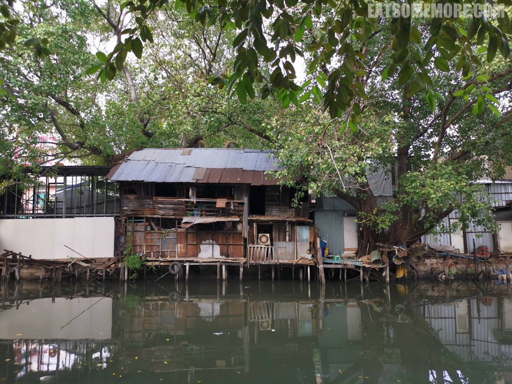
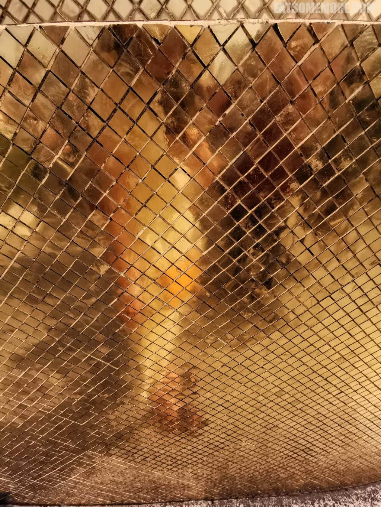

>  对于很多人来说，曼谷是很热门的冬季度假胜地，气候温暖干燥，活动丰富多彩。这些对于我来说本身就非常具有吸引力，直到网络上那些无穷无尽的泰国美食视频成为了促使我订下这趟旅程的最后一捆稻草。

## 行程总览

## 曼谷千禧希尔顿酒店

>漏夜抵达曼谷，搭乘酒店提供的接驳船，取道湄南河，乘着流光溢彩的夜色前往此行的住处。

>房间正对着船来船往的湄南河，利落宽敞大气。

>酒店贴心地提供了巧克力和马卡龙点心。

>黑森林蛋糕也是认真的黑巧克力海绵蛋糕夹着樱桃果酱，湿润松软香甜。

>房间里还有水吧，提供咖啡、茶和水。

## 大皇宫、玉佛寺

>洗手间空间也很大，淋浴和浴缸完全分开。

>次日清晨的阳光揭开了五光十色的夜幕，展露出曼谷的天际线。

>希尔顿的早餐很少让人失望，这一间也是一样：品种繁多，不乏中西泰日风格的食物；食材新鲜，特别是各色水果。

>我最喜欢的要属现点现煮的米粉汤，汤头特别的鲜甜。

>久居英国的我好久没有吃到花香馥郁、果汁磅礴的桂圆，这回一偿宿愿了！

>酒店健身中心提供各种课程，包括瑜伽和普拉提。经过了缜密的思量和考虑，我还是出门玩去吧！

>出门的时候是白天，这才见到酒店门口开着紫色莲花的池塘。世界上好像有些花，只有天亮才开，入夜后又变回了花蕾的样子。多少人羡慕这样的“日出而作，日落而息”。

## Methavalai Sorndaeng

>步行十分钟左右到达湄南河畔多功能复合型建筑群Lhong1919。

>一早什么都还没开门，不过优点是鲜有游人，乐得清净。

## Chatuchak

>Lhong1919附近有一个文创中心，The Jam Factory。

>店没有开，但树上的花开了。

>曼谷四处都很干净，一早一晚常常能看见人们在打扫卫生。黄白相间的花猫蹲在落地窗的里面，吹着微风的我坐在枝叶繁茂的树下，耳畔是屋顶扫下落叶的沙沙声，怪不得文艺青年们喜欢这个地方呢！

## Baan Phadthai

>午饭时，我们搭船过河来到湄南河东岸文华东方酒店里的诺曼底人餐厅，是曼谷的五间米其林二星餐厅之一。

>酒店环境优雅舒适。

>窗外是湄南河和西岸的半岛酒店、文华东方公寓和购物中心。

>餐前有选择香槟和气泡酒的环节。我选择了花果香较为出众的玫瑰气泡酒。

