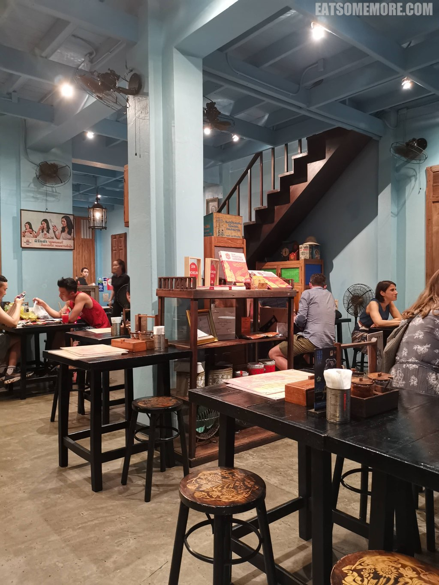

>住在希尔顿总是很期盼“明天”的来临，因为就又可以去看看早餐有什么新的选择。

## 行程总览

## 曼谷千禧希尔顿酒店

>这一天我发现的新品种是粤式早茶点心，虾饺、萝卜糕、叉烧包和西米露。嗯，实话实说，确实还是广州的好吃啊！

>为了避开景点人潮，我们早早地来到了餐厅，恰好遇上一抹灿烂朝霞。

>早餐后乘坐酒店接驳船前往Saphan Taksin码头。

>湄南河上的船形形色色。

>除了金碧辉煌的大酒店和大商场，偶有三两民居立于水上，很有烟火气。

>街道显得整齐又干净，电线几乎都平行，楼房颜色统一，窗户和遮阳篷也非常一致。

路上一所烟火鼎盛的神社，贴心地提供了泰英双语的参拜须知。

## 大皇宫、玉佛寺

>从Saphan Taksin乘船到达大皇宫站。下船后远远地就看见白墙白塔，庄严非常。

>洋红色的兰花掩映着远处大皇宫的金顶、铜顶、琉璃顶。

>走进大皇宫，雕梁画栋、飞檐翘角的密度固然令人叹为观止，然而游客的摩肩擦踵程度更是叫身为中国游客的我也感到震惊。

>节基皇朝一世决定迁都湄南河东岸，并于1782年起按照大城皇宫蓝图兴建了这座皇宫，包括为国王举行宗教仪式的玉佛寺。

>大雄宝殿是重檐庑殿的样式，庄重肃穆。

>由整块翡翠雕琢而成的玉佛，就被供奉在大雄宝殿当中，并且按照一年三季由国王亲自主持更换锦衣。由于玉佛寺内部摩肩接踵并且禁止拍摄，以下图片来自玉佛寺官网。

>据说玉佛寺的走廊共有178幅壁画，都是第一世皇时代的作品。

>金色的乐达纳舍利塔内有一座供奉佛陀舍利的小塔。

>铜塑的小象栩栩如生，墙也华美，柱也辉煌。

>甚至在精美华丽的窗台下，还摆好了莲池。

>大皇宫有七对鎏金神兽，有半猴半狮、半天使半狮、半神半鸟、半人半鸟、半神半狮、和半妖半鸟。

>在这里还有一座精美的吴哥窟模型。

>金色的马赛克好像镜子一样。

>除了晶莹炫目的马赛克，粉彩瓷转美得更加含蓄婉转。

>维多利亚风格的节基殿是大皇宫里规模最大的皇殿，有三个泰式传统方形尖顶。据闻正座顶层安奉王族灵骨，二层是泰皇接见国宾的地方，下层则是御林军总部。

>兜率殿的四层重檐呈“十”字形，中间的方形尖顶则有七层重檐，是国王、王后和太后等人举行一些重要典礼的地方。

## Methavalai Sorndaeng

>这间米其林一星泰式料理餐厅复古典雅。驻唱女歌手时不时会带来几首粤语金曲。

>蕾丝桌布让我好像走进了小时候的粤语长片。

>食物一上桌，又好看又实在。手工铜餐具在一众风靡大多高级餐厅的银餐具当中，有种清流即视感。首推大河虾冬阴功汤，辣度温和，鲜味突出，酸甜适中。牛肉绿咖喱味道的层次丰富，辛香鲜甜，牛肉酥烂、筋瘦相间。虾酱炒饭还搭配了多种小菜，包括蛋皮丝、黄瓜片、虾干等等。

>通菜爱好者的通菜特写，主要体现的是东南亚通菜主要吃梗的特点。

>芋圆糖水，甜度适中，芋圆软糯，我心悦之。

## 乍都乍周末市场［Chatuchak］

>午餐后来到了曼谷北部的乍都乍周末市场。商品琳琅满目，人头攒动，谁能控制住他们即将购物的小手呢。

>除了衣服、裤子、首饰、居家用品，乍都乍周末市场的食物选择也多种多样。其中的榴莲专门店成功地吸引了我的注意。

>除了榴莲，他家的榴莲雪糕也很值得推荐，香甜的榴莲味十足。

## Baan Phadthai

>再次回到美食集散地石龙军路，这回我们找到了好评如潮的泰式炒粿条店。

>百香果冰红茶装在搪瓷杯里插着竹吸管，酸甜解暑。

>烤鸡泰式炒粿条的配菜有干净新鲜没有尾巴的豆芽菜和花生碎。烤鸡脆嫩多汁。不过最棒的当属粿条，咸香弹牙、锅气十足。

>泰式蟹肉炒粿条就没有那么推荐，因为蟹肉碎的味道在炒粿条里面非常可惜地石沉大海了。嗯，明天吃什么呢？

