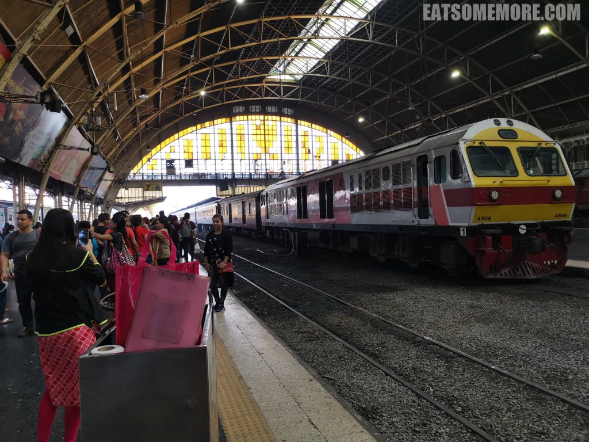
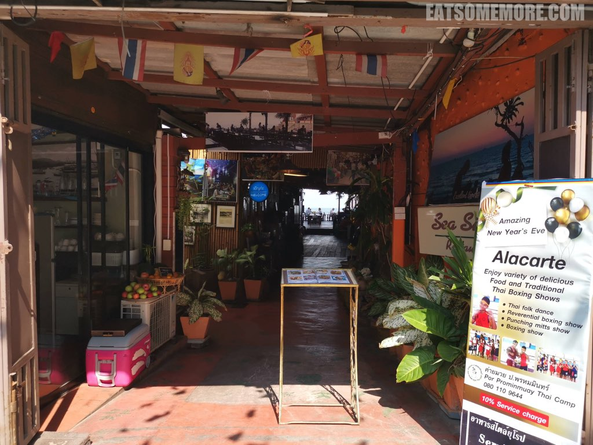
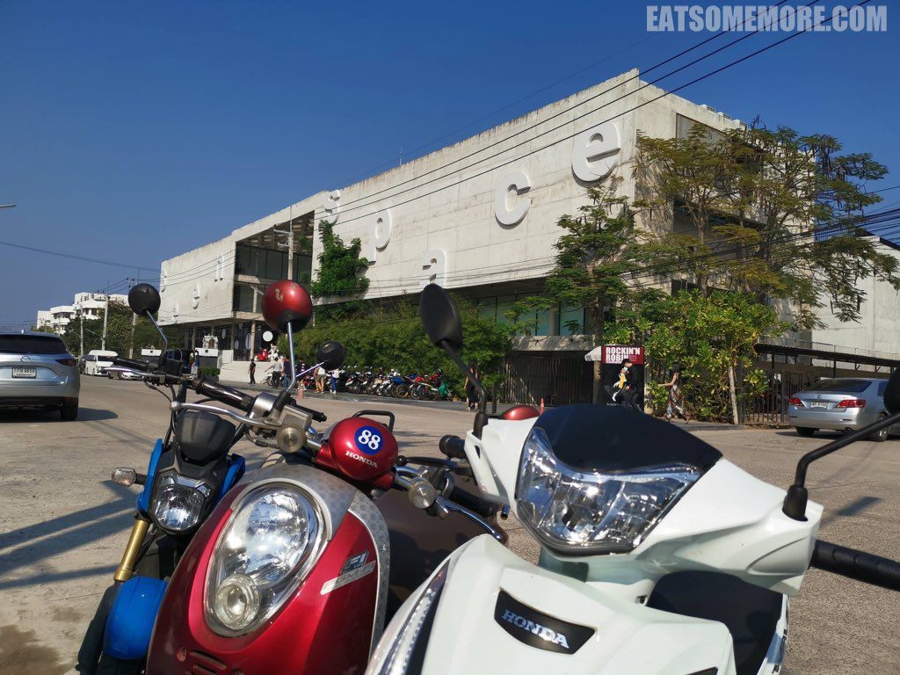
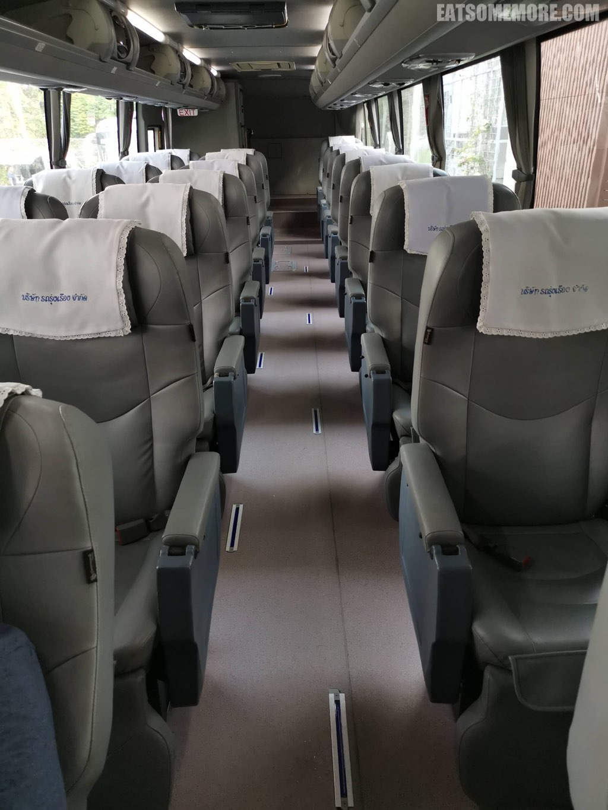

>出走曼谷的一天来到了不管是泰国人还是外国人、皇室贵族还是普通百姓都喜欢的华欣。周润发主演的电影《安娜与国王》也曾在华欣取景。

## 行程总览

## 曼谷千禧希尔顿酒店

>在希尔顿的第三次早餐，我已经基本放弃了其它的花样，转而专心致力于升级美味的米粉汤。除了基本的汤底、米粉、肉燥外，我自助加码了油封鸭胸片、炒鸡块、肉丸、芝麻炸小鱼、通菜和煎鸡蛋，太澎拜了！

## 曼谷火车站

>早餐后打车来到了曼谷火车站。去华欣的火车票十分抢手，前一天去的时候只买到了第二天的车票。来到站台上，工作人员正在清洗车辆。走在轨道上似乎也是稀松平常的事。

>前去华欣的快车需要三个多小时，二等座位跟飞机的经济舱差不多，还提供一份午餐，有蒜香鸡和咖喱鸡配白饭。咖喱鸡有些老也比较辣，但酱的味道真的层次丰富、下饭可口；蒜香鸡没有那么老，且蒜香浓郁。东南亚人真乃香料高手呢！

## 华欣火车站

>摇摇晃晃不知不觉就到了华欣火车站。车站的钟声铛铛铛铛几下，火车就悠悠地开走了。

>由柚木所见的朱红与鹅黄相间的皇室候车室尖顶重檐，和华欣的站牌一起，成了游人们热衷拍照打卡的地方。

## 华欣海滩

>火车站前的大道一直通向海滩。

>水清沙白，游人络绎，白驹竟也不忙着过隙了。

>鸡蛋花下小少年，踏着白浪走过沙滩，是多少人的童年回忆呢？

>到了海滩当然要拍一些腿长靠科技的照片啦。

>据说二十世纪初时，华欣还是无人知晓的小渔村。当时的皇室贵族在狩猎时发现了这里，并逐渐成为了度假胜地。

## 华欣

>蓝天下彩旗飘飘，是种很有年代感的色彩碰撞。

>餐厅们纷纷在海边设了桌椅。

>从海滩出来看到这张巨大的泰皇像和它背后的时钟，就说明已经到达了华欣夜市所在的地方。时间尚早，夜市未开，但是这里有一路向北的双条车。

>华欣红色的路牌衬着嫩绿的树，是非常青春的画面，乘着浪涛的帆船即刻就要起航。

>泰皇拉玛七世建的避暑别墅忘忧宫外有拿着枪的警卫守卫，当天并没有开放，真是可惜。

## Seenspace

>再往北就来到了购物中心Seenspace。

>这座玻璃房子里是风靡网络的网红咖啡厅。

>其实面朝大海、风格清新的餐厅也很美。

>我们最后选择的是Seenspace标志性泳池边的餐厅。坐下后才发现他们提供的菜单不仅仅是一家餐厅的，选择多样。

>草帽、墨镜、泳池、大海，就是妥妥的度假感觉。

>12月里穿着短袖，挨着泳池吹着海风，太惬意了。

>菠萝汁和西瓜汁摆在青色的泳池前颜值爆表，味道却不大记得起来了。

>照烧鸡肉套餐里有炒杂菜、腌菜、味噌汤和白饭。

>铁板带子拌着蟹腿菇、青红椒和花椒。嗯，食材的新鲜程度存疑，不推荐。

>离开的时候在出租车服务中心叫了车去汽车站，然后发现这里的出租车也是双条车的形式。

## 华欣汽车站

>由于买不到回曼谷的火车票，我们只好搭乘前往曼谷机场的汽车回去。虽然相较火车，汽车的班次要多很多，但是还是没有想到这辆车只有我们两名乘客。座位不仅宽敞，打开后“牙医椅”式的设计让四个小时的车程更加舒适。旅程过半了，又期待新的一天，又有一些舍不得了呢。

