>出走曼谷的一天来到了不管是泰国人还是外国人、皇室贵族还是普通百姓都喜欢的华欣。周润发主演的电影《安娜与国王》也曾在华欣取景。

## 行程总览

## 曼谷千禧希尔顿酒店

>在希尔顿的第三次早餐，我已经基本放弃了其它的花样，转而专心致力于升级美味的米粉汤。除了基本的汤底、米粉、肉燥外，我自助加码了油封鸭胸片、炒鸡块、肉丸、芝麻炸小鱼、通菜和煎鸡蛋，太澎拜了！

## Saneh Jaan

>早餐后打车来到了曼谷火车站。去华欣的火车票十分抢手，前一天去的时候只买到了第二天的车票。来到站台上，工作人员正在清洗车辆。走在轨道上似乎也是稀松平常的事。

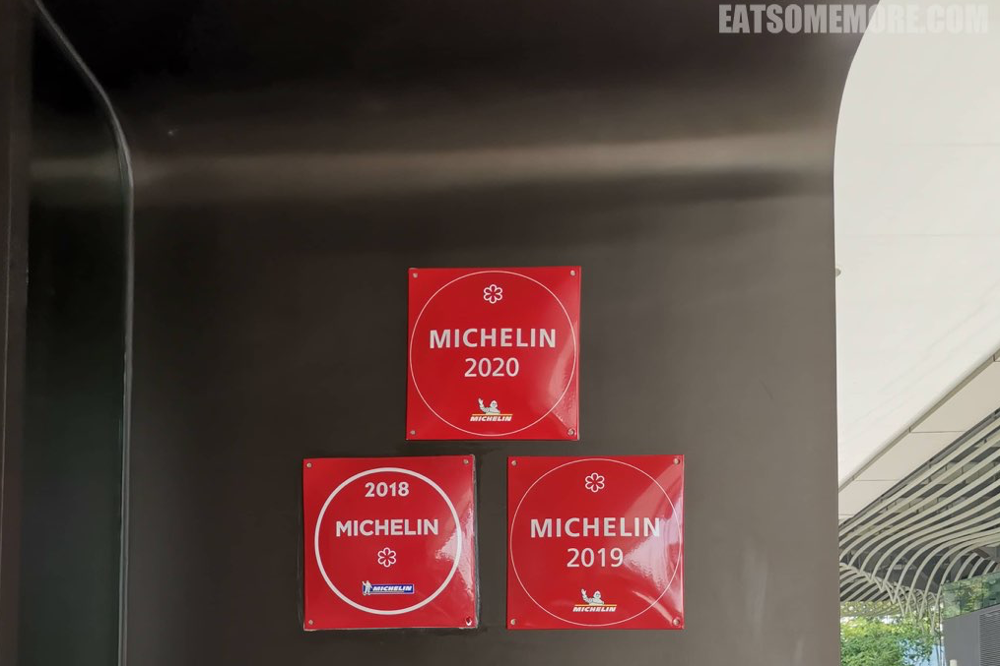

>前去华欣的快车需要三个多小时，二等座位跟飞机的经济舱差不多，还提供一份午餐，有蒜香鸡和咖喱鸡配白饭。咖喱鸡有些老也比较辣，但酱的味道真的层次丰富、下饭可口；蒜香鸡没有那么老，且蒜香浓郁。东南亚人真乃香料高手呢！

>早餐后打车来到了曼谷火车站。去华欣的火车票十分抢手，前一天去的时候只买到了第二天的车票。来到站台上，工作人员正在清洗车辆。走在轨道上似乎也是稀松平常的事。

>前去华欣的快车需要三个多小时，二等座位跟飞机的经济舱差不多，还提供一份午餐，有蒜香鸡和咖喱鸡配白饭。咖喱鸡有些老也比较辣，但酱的味道真的层次丰富、下饭可口；蒜香鸡没有那么老，且蒜香浓郁。东南亚人真乃香料高手呢！
>早餐后打车来到了曼谷火车站。去华欣的火车票十分抢手，前一天去的时候只买到了第二天的车票。来到站台上，工作人员正在清洗车辆。走在轨道上似乎也是稀松平常的事。

>前去华欣的快车需要三个多小时，二等座位跟飞机的经济舱差不多，还提供一份午餐，有蒜香鸡和咖喱鸡配白饭。咖喱鸡有些老也比较辣，但酱的味道真的层次丰富、下饭可口；蒜香鸡没有那么老，且蒜香浓郁。东南亚人真乃香料高手呢！
>早餐后打车来到了曼谷火车站。去华欣的火车票十分抢手，前一天去的时候只买到了第二天的车票。来到站台上，工作人员正在清洗车辆。走在轨道上似乎也是稀松平常的事。

>前去华欣的快车需要三个多小时，二等座位跟飞机的经济舱差不多，还提供一份午餐，有蒜香鸡和咖喱鸡配白饭。咖喱鸡有些老也比较辣，但酱的味道真的层次丰富、下饭可口；蒜香鸡没有那么老，且蒜香浓郁。东南亚人真乃香料高手呢！

>前去华欣的快车需要三个多小时，二等座位跟飞机的经济舱差不多，还提供一份午餐，有蒜香鸡和咖喱鸡配白饭。咖喱鸡有些老也比较辣，但酱的味道真的层次丰富、下饭可口；蒜香鸡没有那么老，且蒜香浓郁。东南亚人真乃香料高手呢！

>前去华欣的快车需要三个多小时，二等座位跟飞机的经济舱差不多，还提供一份午餐，有蒜香鸡和咖喱鸡配白饭。咖喱鸡有些老也比较辣，但酱的味道真的层次丰富、下饭可口；蒜香鸡没有那么老，且蒜香浓郁。东南亚人真乃香料高手呢！

## 暹罗购物商圈

>摇摇晃晃不知不觉就到了华欣火车站。车站的钟声铛铛铛铛几下，火车就悠悠地开走了。

>由柚木所见的朱红与鹅黄相间的皇室候车室尖顶重檐，和华欣的站牌一起，成了游人们热衷拍照打卡的地方。

>摇摇晃晃不知不觉就到了华欣火车站。车站的钟声铛铛铛铛几下，火车就悠悠地开走了。

>由柚木所见的朱红与鹅黄相间的皇室候车室尖顶重檐，和华欣的站牌一起，成了游人们热衷拍照打卡的地方。

>摇摇晃晃不知不觉就到了华欣火车站。车站的钟声铛铛铛铛几下，火车就悠悠地开走了。

>由柚木所见的朱红与鹅黄相间的皇室候车室尖顶重檐，和华欣的站牌一起，成了游人们热衷拍照打卡的地方。

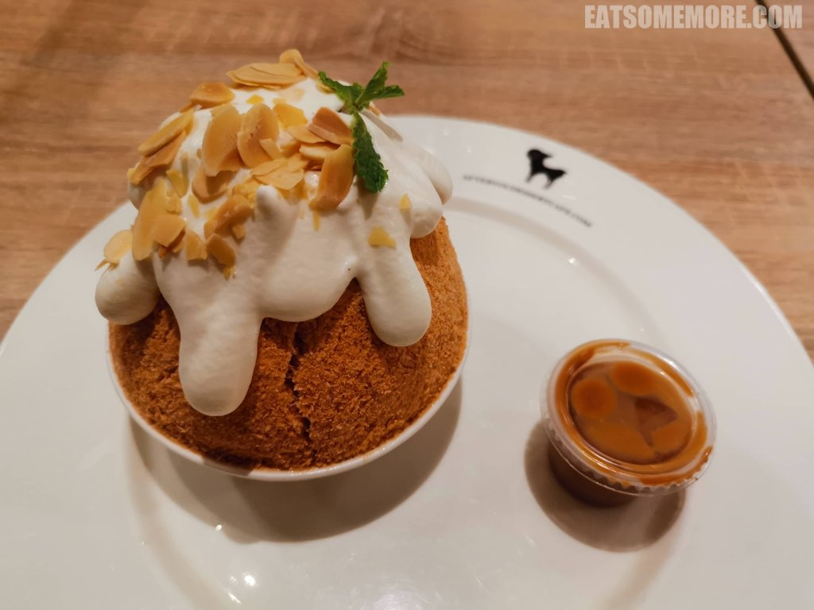

>摇摇晃晃不知不觉就到了华欣火车站。车站的钟声铛铛铛铛几下，火车就悠悠地开走了。

>由柚木所见的朱红与鹅黄相间的皇室候车室尖顶重檐，和华欣的站牌一起，成了游人们热衷拍照打卡的地方。

>摇摇晃晃不知不觉就到了华欣火车站。车站的钟声铛铛铛铛几下，火车就悠悠地开走了。

>由柚木所见的朱红与鹅黄相间的皇室候车室尖顶重檐，和华欣的站牌一起，成了游人们热衷拍照打卡的地方。

## 曼谷千禧希尔顿酒店

>在希尔顿的第三次早餐，我已经基本放弃了其它的花样，转而专心致力于升级美味的米粉汤。除了基本的汤底、米粉、肉燥外，我自助加码了油封鸭胸片、炒鸡块、肉丸、芝麻炸小鱼、通菜和煎鸡蛋，太澎拜了！

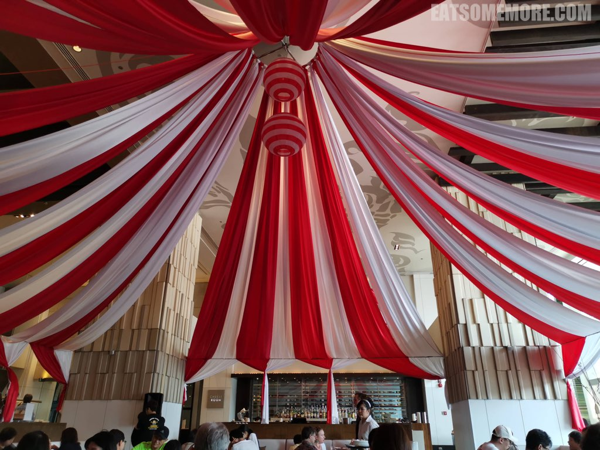

>在希尔顿的第三次早餐，我已经基本放弃了其它的花样，转而专心致力于升级美味的米粉汤。除了基本的汤底、米粉、肉燥外，我自助加码了油封鸭胸片、炒鸡块、肉丸、芝麻炸小鱼、通菜和煎鸡蛋，太澎拜了！

>在希尔顿的第三次早餐，我已经基本放弃了其它的花样，转而专心致力于升级美味的米粉汤。除了基本的汤底、米粉、肉燥外，我自助加码了油封鸭胸片、炒鸡块、肉丸、芝麻炸小鱼、通菜和煎鸡蛋，太澎拜了！

## Iconsiam

>火车站前的大道一直通向海滩。

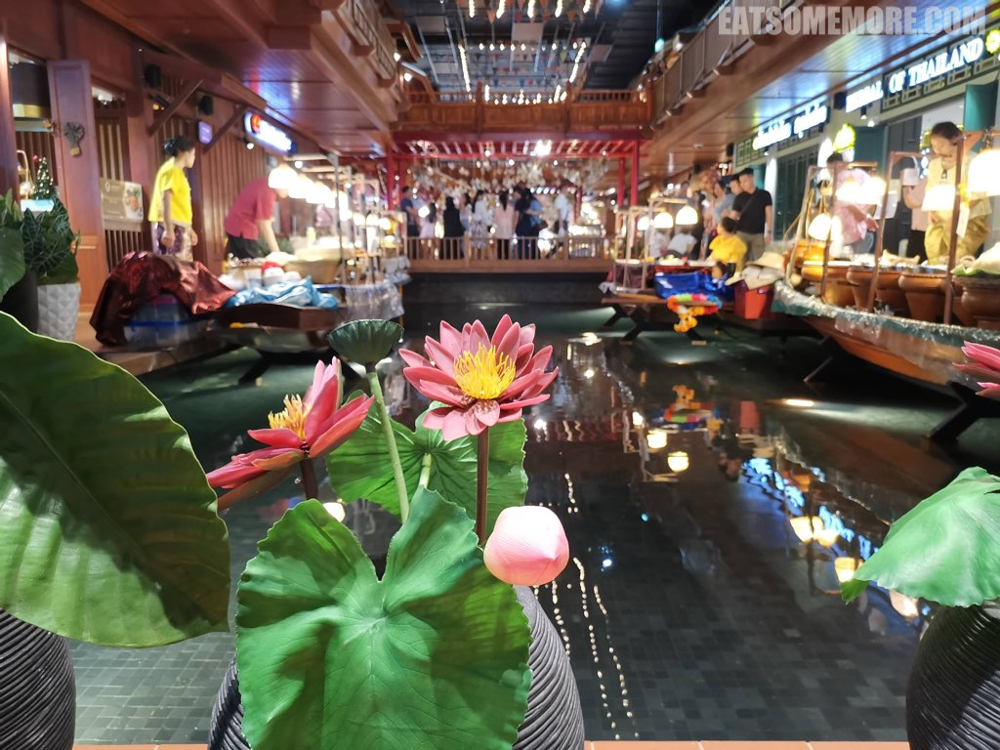

>水清沙白，游人络绎，白驹竟也不忙着过隙了。

>鸡蛋花下小少年，踏着白浪走过沙滩，是多少人的童年回忆呢？

>据说二十世纪初时，华欣还是无人知晓的小渔村。当时的皇室贵族在狩猎时发现了这里，并逐渐成为了度假胜地。

>火车站前的大道一直通向海滩。

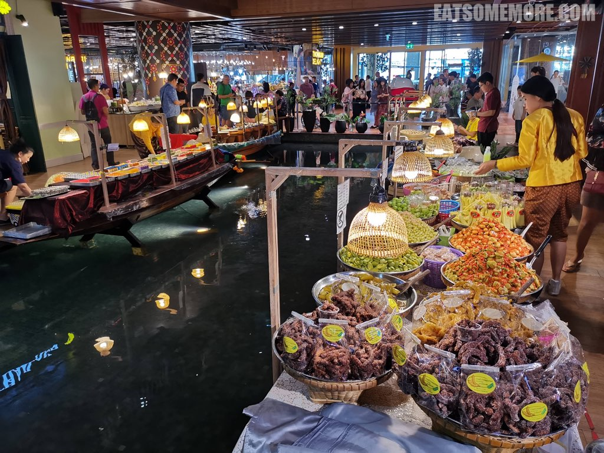

>水清沙白，游人络绎，白驹竟也不忙着过隙了。

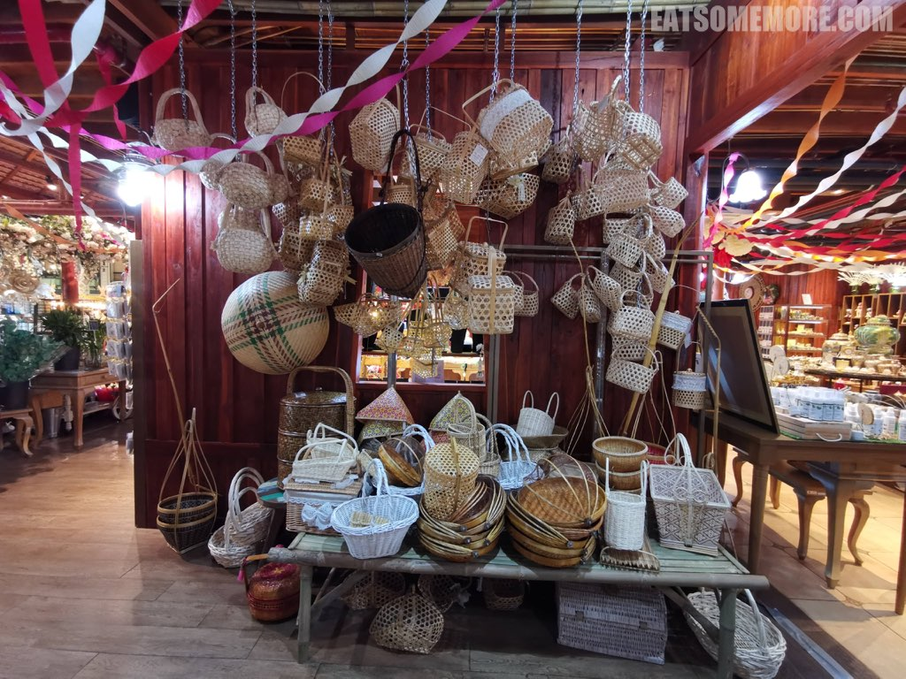

>鸡蛋花下小少年，踏着白浪走过沙滩，是多少人的童年回忆呢？

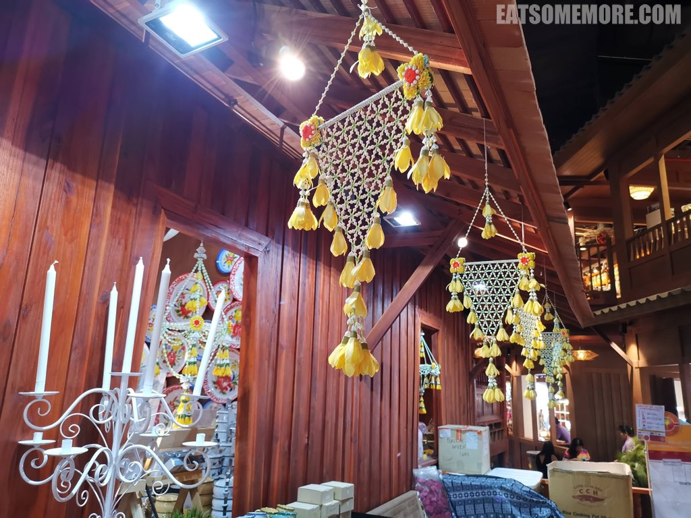

>据说二十世纪初时，华欣还是无人知晓的小渔村。当时的皇室贵族在狩猎时发现了这里，并逐渐成为了度假胜地。

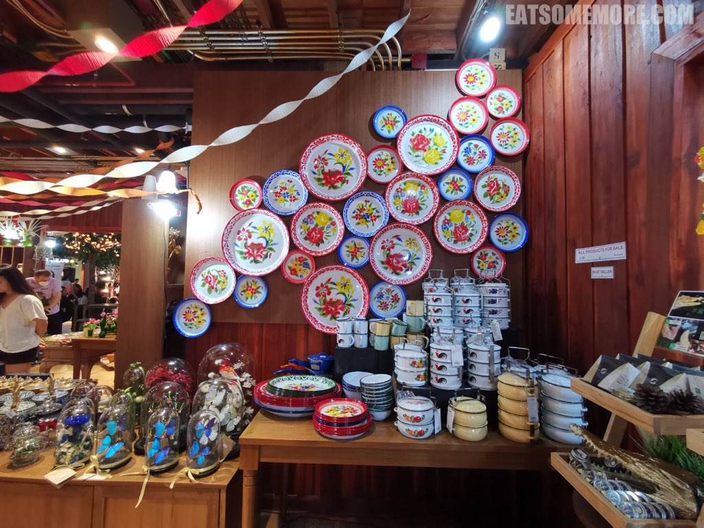

>火车站前的大道一直通向海滩。

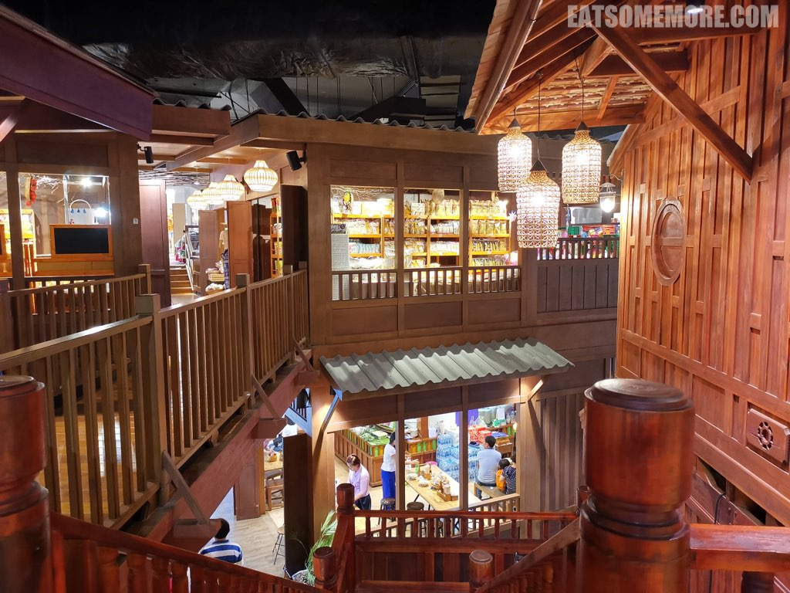

>水清沙白，游人络绎，白驹竟也不忙着过隙了。

>鸡蛋花下小少年，踏着白浪走过沙滩，是多少人的童年回忆呢？

>据说二十世纪初时，华欣还是无人知晓的小渔村。当时的皇室贵族在狩猎时发现了这里，并逐渐成为了度假胜地。

>火车站前的大道一直通向海滩。

>水清沙白，游人络绎，白驹竟也不忙着过隙了。

>鸡蛋花下小少年，踏着白浪走过沙滩，是多少人的童年回忆呢？

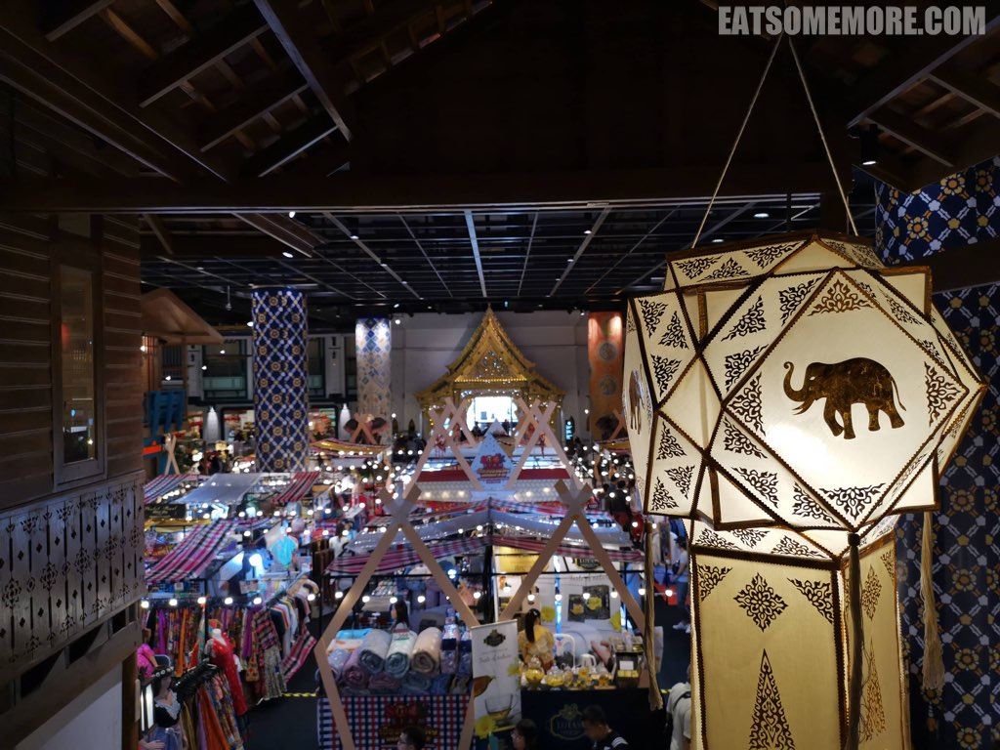

>据说二十世纪初时，华欣还是无人知晓的小渔村。当时的皇室贵族在狩猎时发现了这里，并逐渐成为了度假胜地。

>火车站前的大道一直通向海滩。

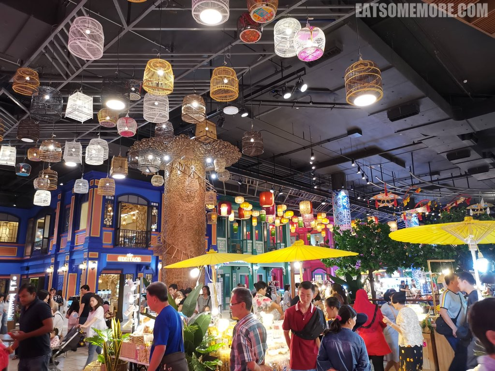

>水清沙白，游人络绎，白驹竟也不忙着过隙了。

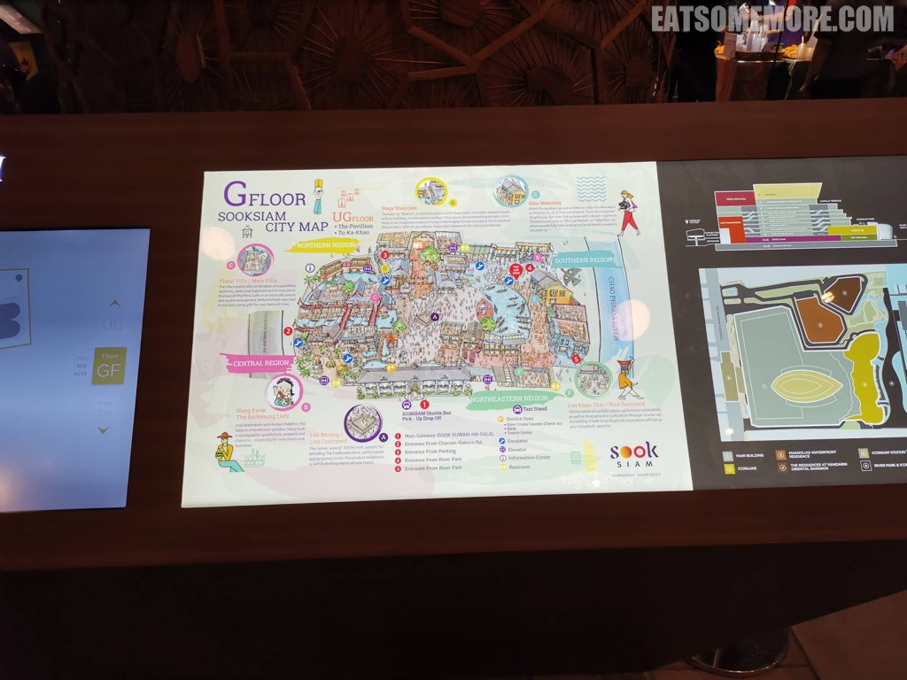

>鸡蛋花下小少年，踏着白浪走过沙滩，是多少人的童年回忆呢？

>据说二十世纪初时，华欣还是无人知晓的小渔村。当时的皇室贵族在狩猎时发现了这里，并逐渐成为了度假胜地。

## Let's Relax

>蓝天下彩旗飘飘，是种很有年代感的色彩碰撞。

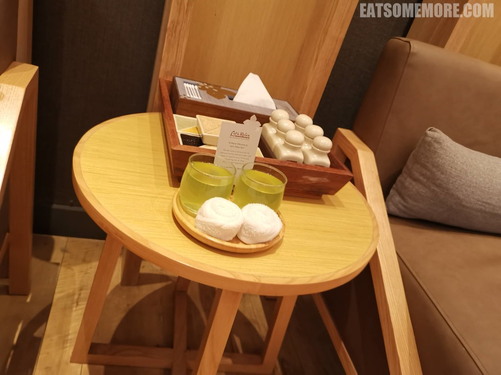

>餐厅们纷纷在海边设了桌椅。

>从海滩出来看到这张巨大的泰皇像和它背后的时钟，就说明已经到达了华欣夜市所在的地方。时间尚早，夜市未开，但是这里有一路向北的双条车。

