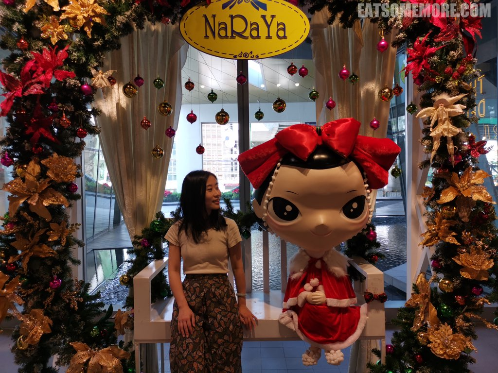

>大家都说曼谷好，我一来也觉得这儿好得不得了，可是旅行的最后一天还是不可避免的到来了。曼谷的好不仅在于它有25度的12月，繁忙却很干净的湄南河，接地气和文艺风格无缝切换，历史与现代共存，美食美景不胜枚举；更在于其鲜明本土风格与迷人异国风情毫无违和的融合感，可能这就是乐不思蜀、欲罢不能的感觉吧。

## 行程总览

## 曼谷千禧希尔顿酒店

>除夕夜的希尔顿餐厅，从挑高的屋顶上挂满了红白绶带。

>入口处做了大马戏的装饰。

>早餐后回房间收拾行李，再看一眼可爱的湄南河，就要跟酒店说再见啦。

## Iconsiam

>在希尔顿酒店旁大约步行五分钟的距离就到了2018年底才开幕的购物中心Iconsiam。

>快来看米奇米妮说萨瓦迪卡！

>入口处的娜莱雅娃娃是以该品牌创始人的童年形象，曼谷水门区的华裔女孩为原型创作的。她头上的大蝴蝶结原是像邻居借用的，而如今却作为她的品牌商标出现在她所有的产品上。下图的另一个重点是想和大家分享前几天在乍都乍市场购入的花裤子，面料轻薄柔软透气。

>Iconsiam的底层是暹罗市集，简直是游客的福音，因为这里集中了泰国各个地区的市集和典型建筑。

>复古的吊脚楼有着木栏栅。

>更炫酷的是室内的水上市场。

>市集处处张灯结彩。

>各种装饰又绚丽又有特色。

>灯笼上印着大象的图案。

>手编竹篮式样繁多。

>鲜花做的装饰品像风铃一样挂在屋檐下。

>各式搪瓷用具摆在一起竟有一种特别的美感。

>紧闭的窗户上画着三猫扑蝶。

>木质的回廊和楼梯像是穿越时空的通道。

>各种造型的香皂非常逼真。

>坐在自行车后座的模特儿好有烟火气。

>从楼上可以更好地观察水上市集。

>在泰国传统特色的水上市集的另一边，有一棵巨大的圣诞树。

## Let's Relax

>在曼谷最后的安排是Let's Relax的温泉和腿脚按摩套餐。这一家是泰国全国连锁的按摩店，但是只有位于格兰德中心点酒店的五楼这一间分店提供日式传统温泉。温泉区域分男汤、女汤和公共的休息区。女汤当中又有室内和室外的温泉，有几种不同的泉池，其中最有特色的是从日本下吕运来的泉水。老规矩，温泉内禁止摄影，所以大家要么自行想象，要么赶紧亲自去泡。这一间的按摩需要提前预约，非常火爆。我们提前一周致电还是无缘泰式全身按摩，只能约到腿部和脚部的按摩。按摩前，服务人员会端上湿毛巾和清香微甜生津止渴的班兰叶汁。喝饮料的时候，服务人员会拿来拖鞋，并保管（或者更准确地说保养）换下来的鞋子。之所以说保养，是因为后来离开时还回来的鞋子变得好干净。

>话说回来，喝完饮料，按摩师傅首先带我们去清洗了腿脚，接着就在宜人的香氛和音乐当中开始了一个小时的按摩，完全是游玩了一周的游客的燃眉需求。按摩结束后，服务人员还奉上了大麦茶和芒果糯米饭。新鲜芒果香味馥郁口感软糯酸甜多汁，包裹着带着一点点咸味和花生碎的弹韧糯米饭，竟是我从没见识过的美味爆发力，怪不得是泰国不得不尝的名小吃，也为这次的泰国之行画上了完美的甜蜜句点。一定要再见哦！

