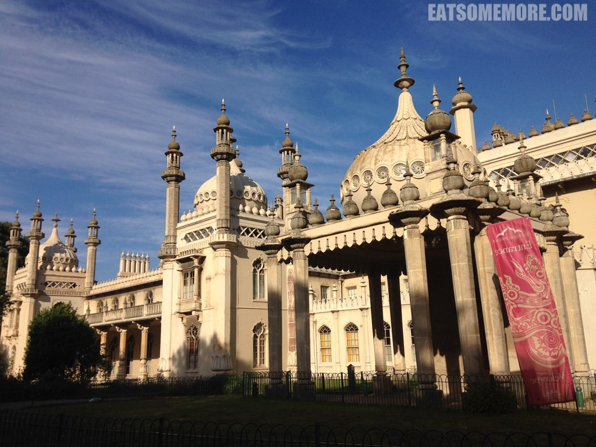

> 布莱顿在英国是鼎鼎大名的海滩，夏天来英国绝对不容错过。但第一次慕名而去探访布莱顿海滩，我的心情是崩溃的。我们很难称它为沙滩，因为它的确不是沙滩，更确切地说，应当算是石滩。石头从鹌鹑蛋到鸡蛋大小不等。但是换个角度想，这就是来英国一定要去布莱顿的原因啊，因为在别的地方没有这样特别的海滩。我亲身体验了一下在鹅卵石子的石滩上躺了一会，有一种睡在指压板上的感觉。不知道奔跑吧兄弟有没有兴趣来这里撕名牌。 

> 布莱顿当然远远不至于此。这里还有色彩斑斓的集市，充满想象力和文艺气息。

> 这里有风格独特的皇家穹顶宫，美轮美奂。这是19世纪摄政王，后来的英国国王乔治四世的海边隐居地。1786年他租下一间农舍。1815年—1822年，建筑师约翰纳西重新设计宫殿，今天看见的就是他的作品。外观受到印度莫卧儿王朝伊斯兰建筑风格的强烈影响。富于幻想的内部设计，基本上出自费雷德里克格雷斯和罗伯特琼斯，内部装饰和摆设则充满中国情调。

> 这里有鲜甜肥美的海鲜，想一想就流口水。

> 这里有巨大清新的冰淇淋。炎炎夏日来一口黄瓜味的冰淇淋，整个世界都变得好美好！这里还有不输伦敦大饭店的司空饼。这个司空饼上桌的时候还是温热的，经典搭配奶油香而不腻、草莓酱清新香甜。

[点击就看布莱顿吃什么](/posts/categories/%E7%BE%8E%E9%A3%9F?pagetype=uk-food&tags=英国,布莱顿&extags=)

[点击就看布莱顿玩什么](/posts/categories/攻略?pagetype=uk-play&tags=英国,布莱顿&extags=)

[点击就看全部上述内容](/posts?tags=%E4%BC%A6%E6%95%A6)