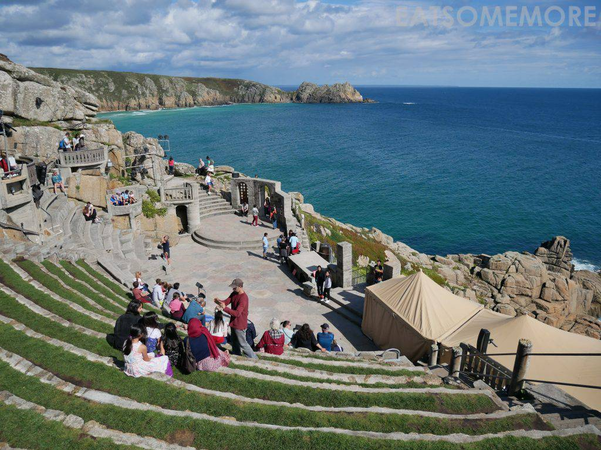
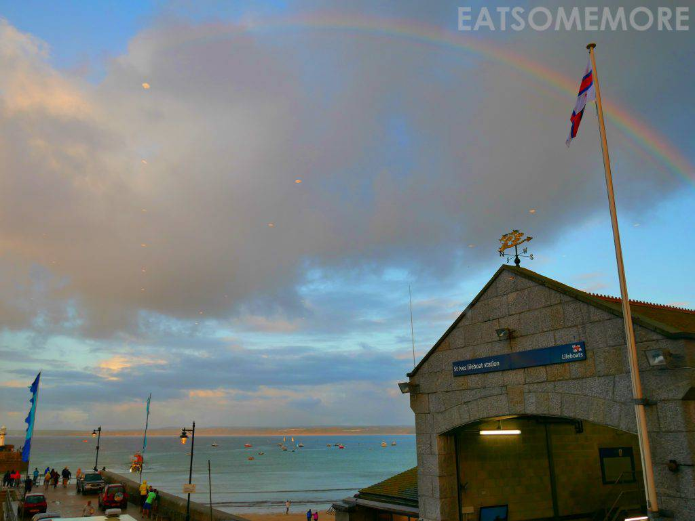
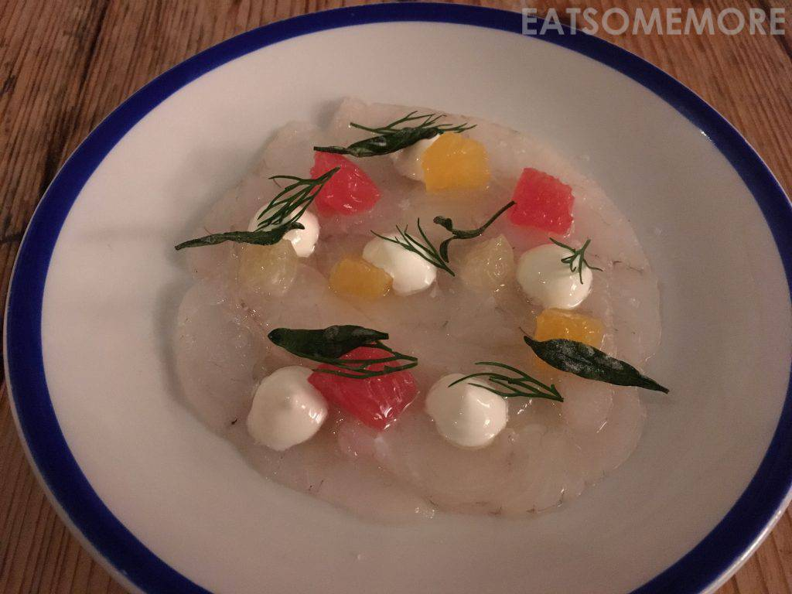
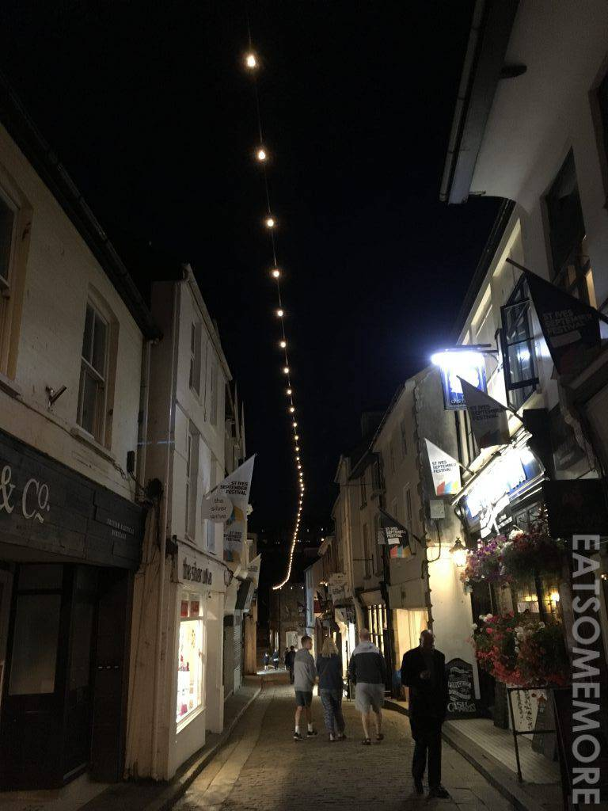
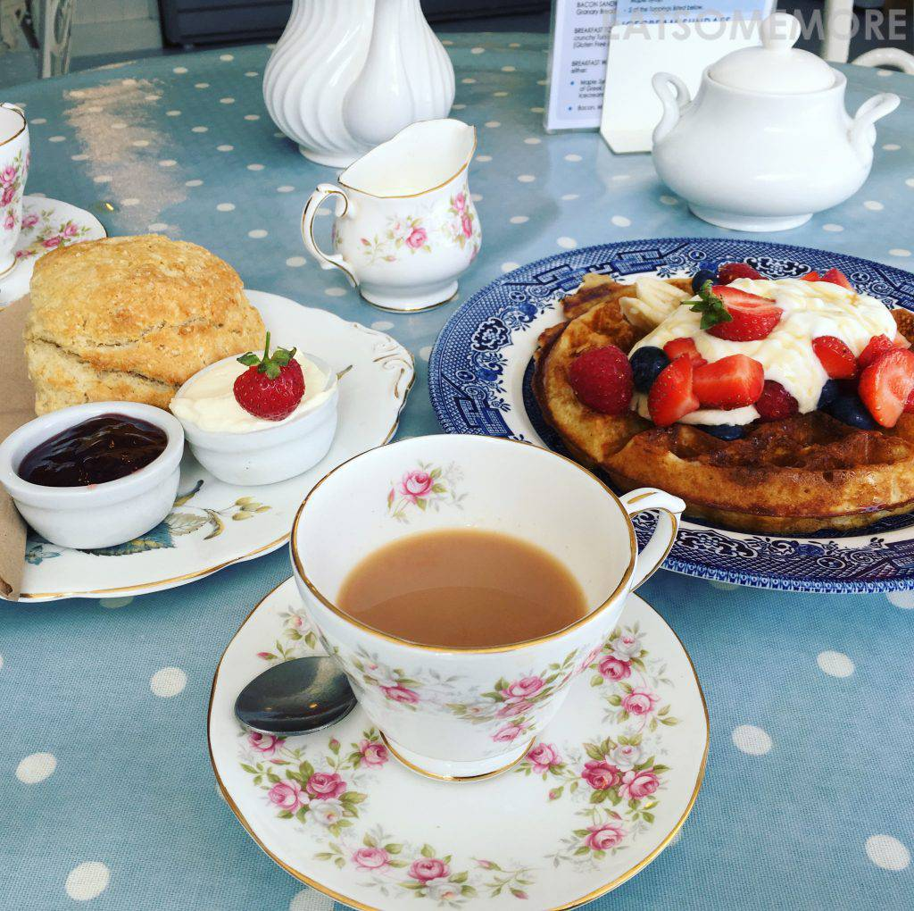

>对康沃的赞誉听过千万遍，虽路遥且远，而心驰往之。那年仲夏，一切刚好，毅然启程。野心勃勃地盘算好要自驾环康沃一周，一路向西南尔后东返，去看那些壮美奇妙的地方，例如天赋美貌的海滩，又或者是遗世独立的悬崖剧场。

>在正好的时光，满心欢喜地遇上葡萄佳酿船万里，七彩虹桥跃海旗。

>大自然馈赠的渔获，被制作成创意满满、惊喜连连的海鲜大餐，带来属于康沃澎湃汹涌的鲜味，连米其林的味蕾也俘获。

>走在入夜后静谧又迷人的小镇，看灯光点点指引着人们回家的路。

>当夜晚过去白昼来临时，康沃又展现出可爱温馨的一面。两壶早餐茶、一对司康饼、再添个杂莓酸奶华夫，是全面触动眼耳鼻舌身意的色声香味触法，也是满满的元气和能量。非常高兴与康沃一场相遇，不虚此行。

[点击就看康沃吃什么](/posts/categories/%E7%BE%8E%E9%A3%9F?pagetype=uk-food&tags=英国,康沃&extags=)

[点击就看康沃玩什么](/posts/categories/攻略?pagetype=uk-play&tags=英国,康沃&extags=)

[点击就看康沃住哪里](/posts/categories/预定?pagetype=uk-play&tags=英国,康沃&extags=)

[点击就看全部上述内容](/posts?tags=康沃)