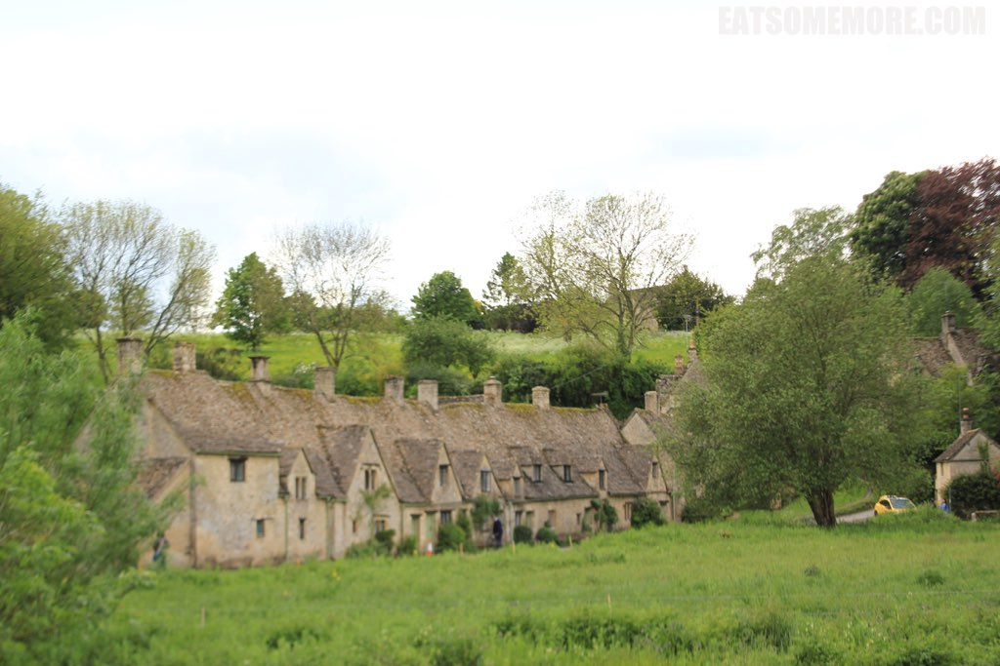
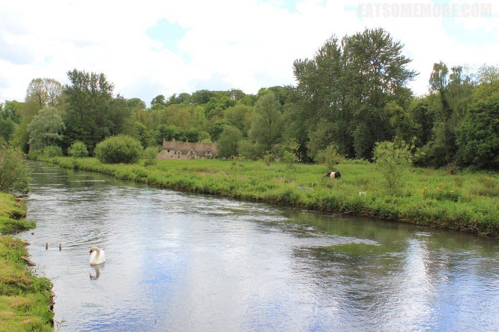

> 英国乡村之美固然有其质朴和贴近自然之处，而我现在才发现到它的更胜之处在于时间在它身上留下的痕迹之微小，叫人惊叹又羡慕不已。蔻茨婺淄是我杜撰的名字，原本是Cotswolds，传说中的英国最美村庄，美得不要不要的，看来看去也没有什么中文翻译能表达出这样的美，所以就不知天高地厚地自己杜撰了一个，见笑。豆蔻是乔木，茨宇乃茅屋，婺淄皆为水名，倒是有几分衬得起这个英伦小镇流水潺潺、茅屋处处、花开点点、绿荫葱葱的田园风光。 



> 既然连名字都杜撰了，七言打油诗自然也是已经准备好了的。

```
石头屋子瓦砾顶，三三两两缀乡间。
英村春光最可贵，绿叶成荫映溪泉。
繁花似锦掩人家，石拱桥下水清浅。
天鹅奶牛共比邻，追猫逗狗享清闲。
```



> 旅行提示：英国的乡村地区更适合自驾旅行，不论是时间安排还是景点选择都会自由非常多。而公共交通在平日还算方便，但是周末和公共假期的时候巴士班次就会很少，甚至根本没有了。因此，为了避免时间太紧赶不上班车，可以考虑在两班车之间预留了比较多的时间，然后选择了一些风景较秀丽的小镇转车。当中的时间可以在周围观光一下，到了时间就回去搭车去下一个小镇。自驾的朋友们也要注意有一些古典小镇对机动车辆的经行有所限制。不论如何，出行前都要先做好功课。


[点击就看蔻茨婺淄玩什么](/posts/categories/攻略?pagetype=uk-play&tags=英国,蔻茨婺淄(Cotswolds)&extags=)
