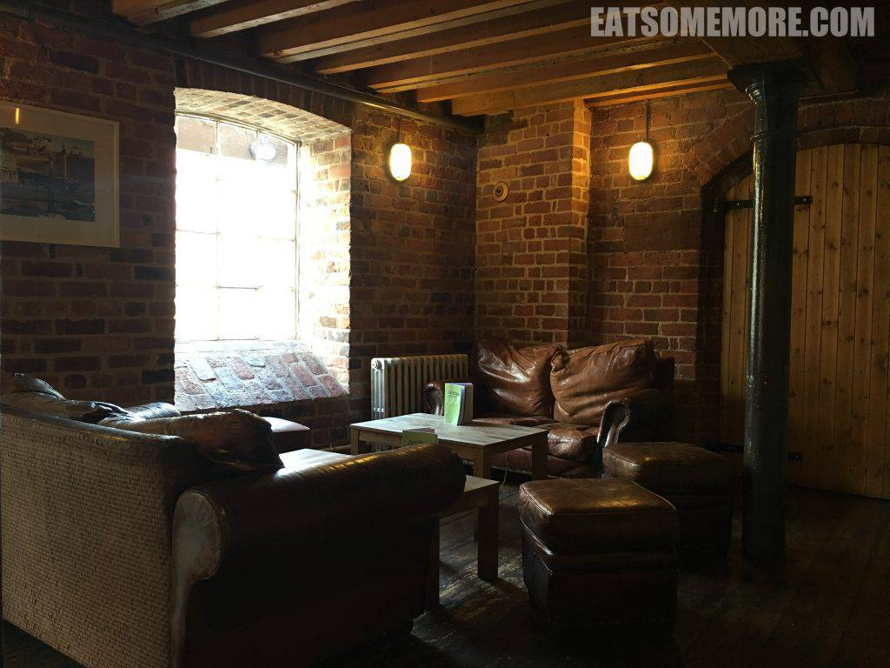

>在雨后天青的切斯特小镇，有一间沿河的小餐馆。餐厅砖墙梁柱外露，棕色的皮沙发很有复古的感觉。

>彩椒牛柳三明治简直是中国菜的口味。新奇的是白甘筍薯片又脆又薄的同时，保留了蔬菜本身的甜和独特的香味。

>自制巧克力蛋糕有点硬，有点甜，不推荐。

网站：https://www.artichokechester.co.uk/

地址：The Steam Mill, Steam Mill Street, Canal Quarter, Chester, CH3 5AN