>餐前面包蘸橄榄油。

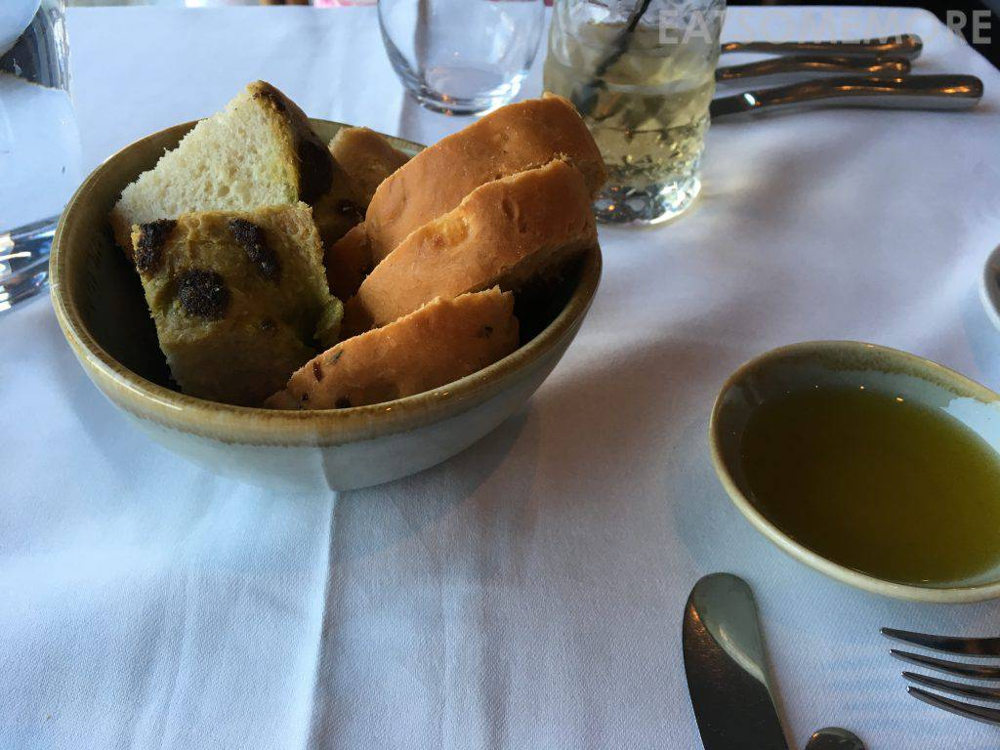

>嗯……已经想不起来这是什么汤，也想不起来味道怎样，由此应知也很一般吧。

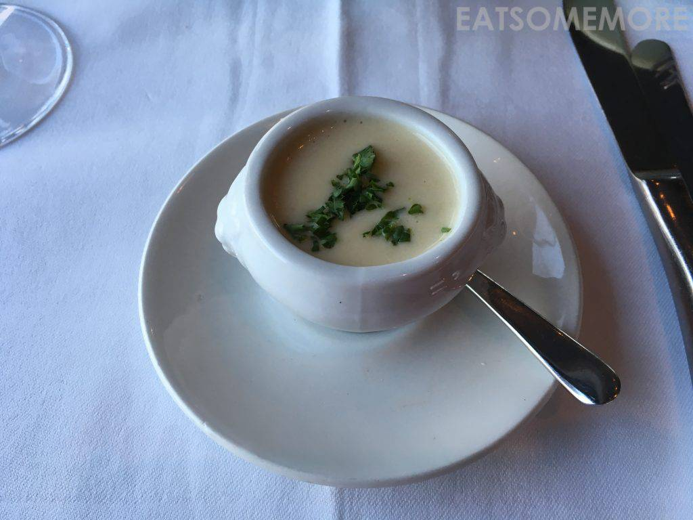

>羊奶酪沙拉，又腥又冷又油腻。

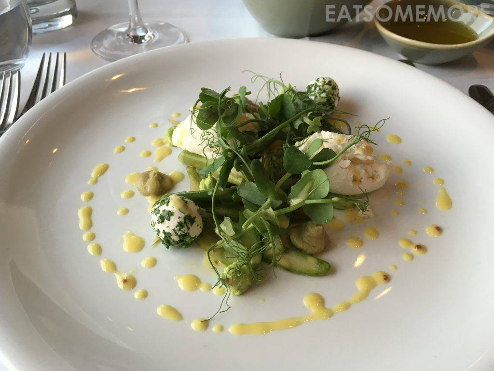

>点了一条煎鳕鱼，却被配菜炖墨鱼深深吸引。这炖墨鱼的滋味好像红烧肉，酥糯又弹牙、香甜又咸鲜，搭配酸甜多汁的番茄，清爽解腻只留好味道！

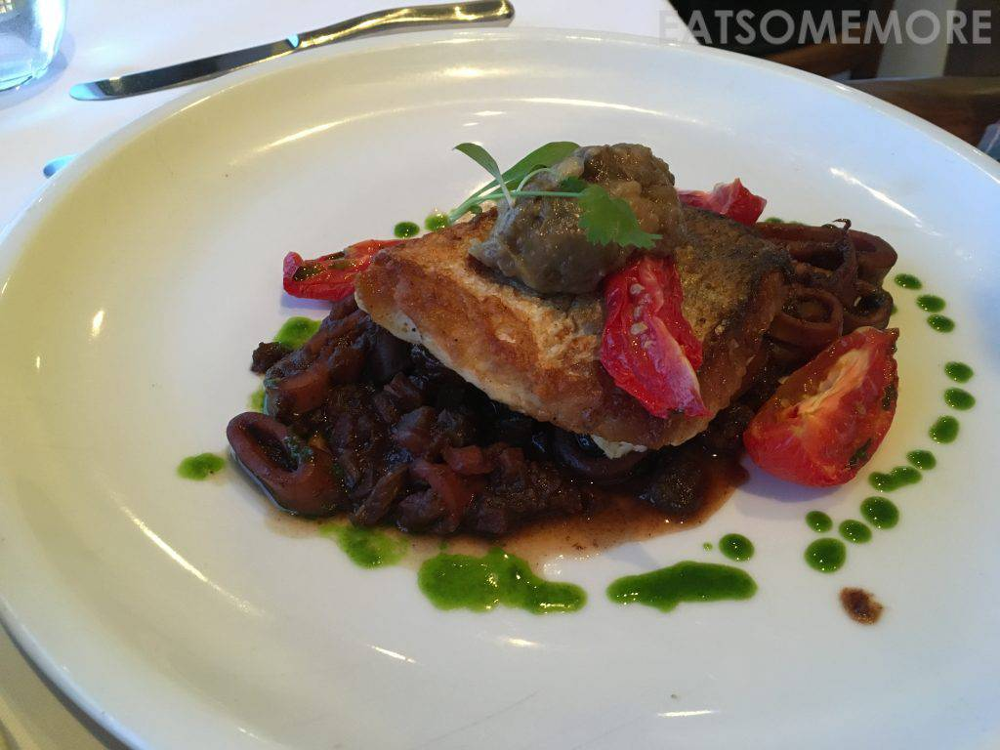

>在吃这碗面的时候，我还不知道第二天竟能吃上一碗比这好吃百倍的蟹肉扁意面。差强人意者便不多谈，且看下文。

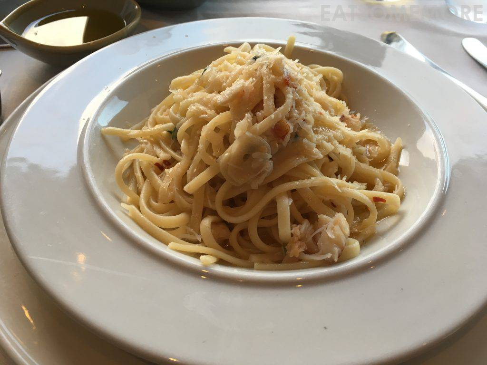

>虽然食物的口味良莠不齐，但餐厅突出的优点在于毗邻圣艾夫斯港口，景色确实不俗。从黄昏到傍晚的过度，简直一刻也不舍得眨眼。

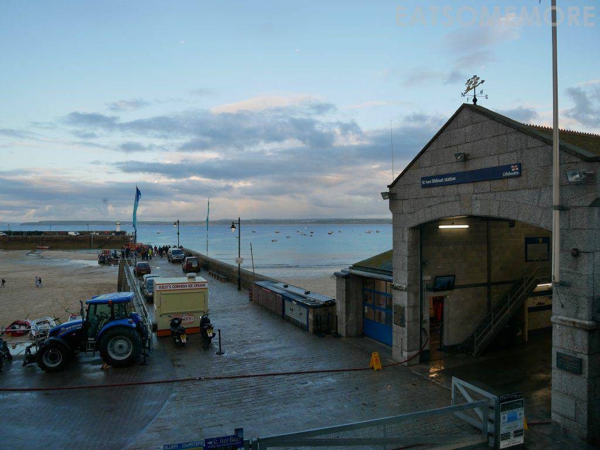

>一时是乘风破浪会有时，直挂云帆济沧海。

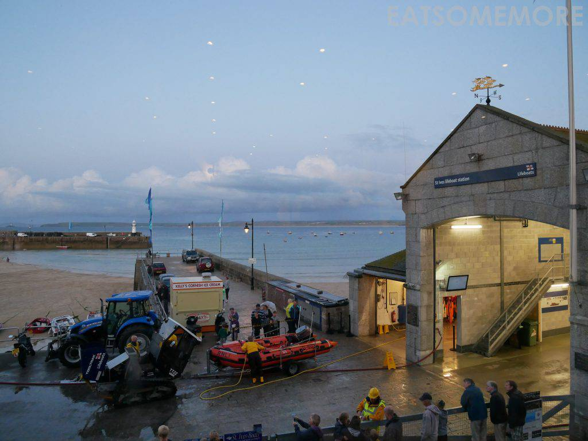

>须臾间又成了过尽千帆皆不是，斜晖脉脉水悠悠。

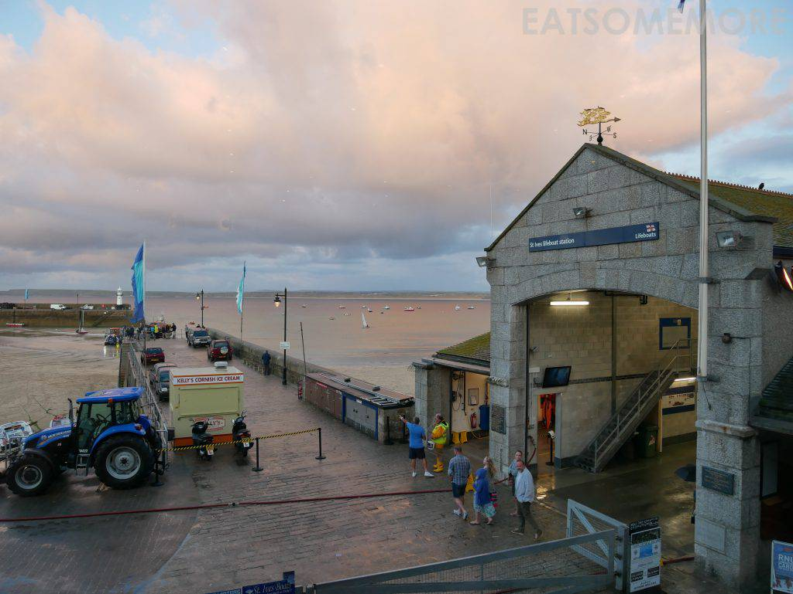

>待天色渐晚，恰是春潮带雨晚来急，野渡无人舟自横。

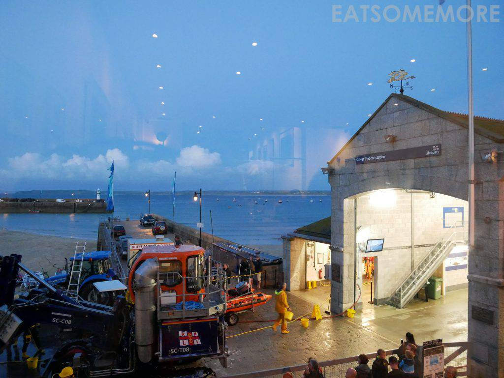

>举杯间，“酒泊康沃”万里船。

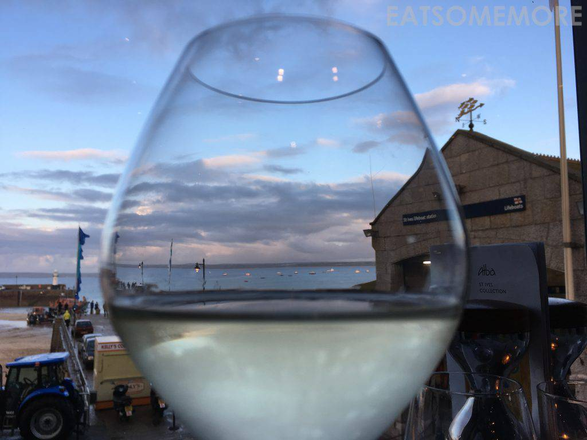

>更妙的是，黄昏海边的天空竟出现了一抹彩虹。

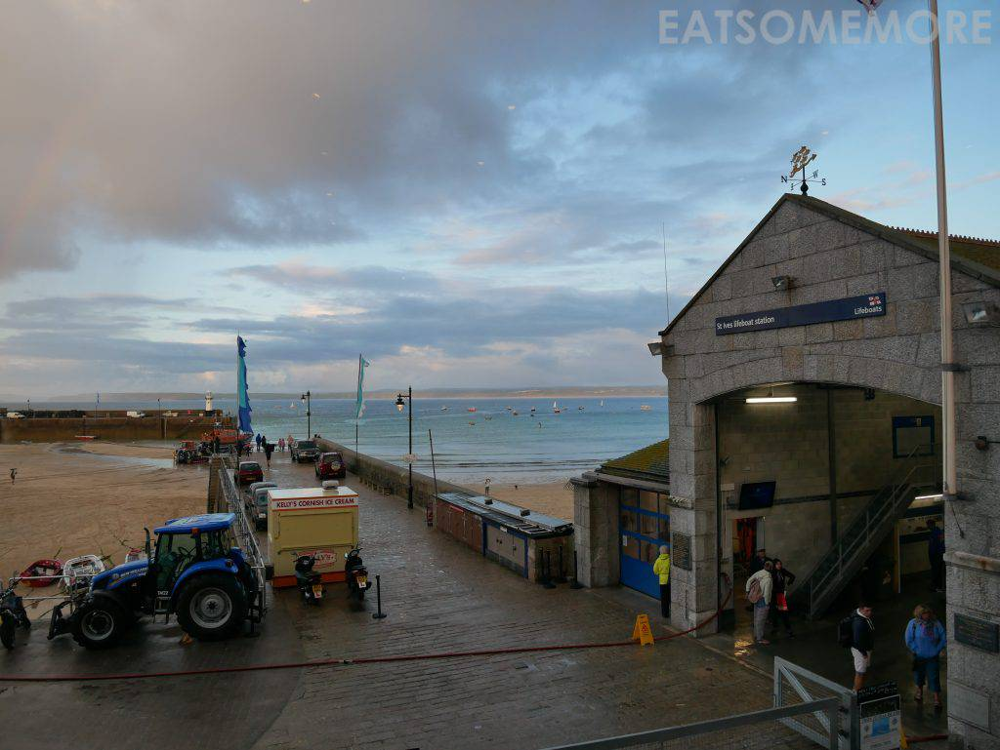

>好像来自大西洋的暖心问候。

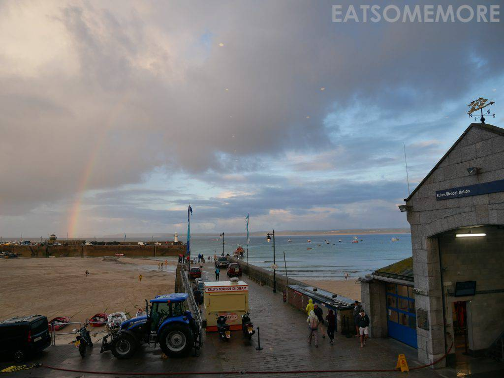

>远道而来的虹，好看得不真实。

地址：Old Lifeboat House, Wharf Rd, St Ives, Cornwall TR26 1LF

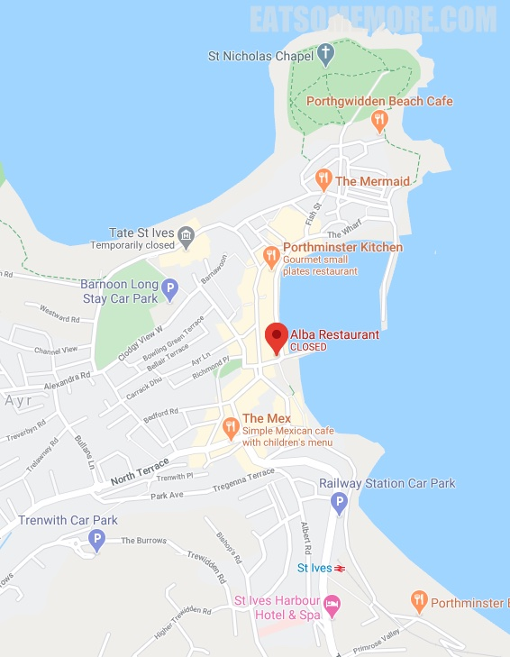