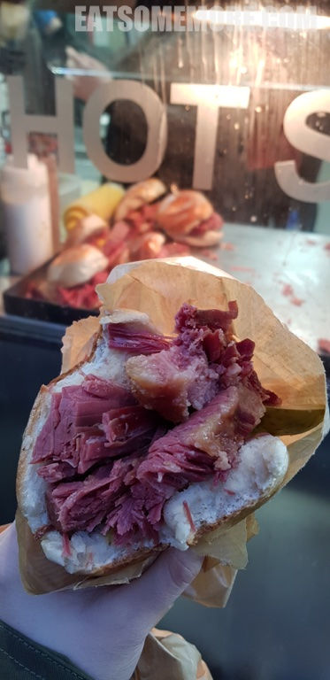
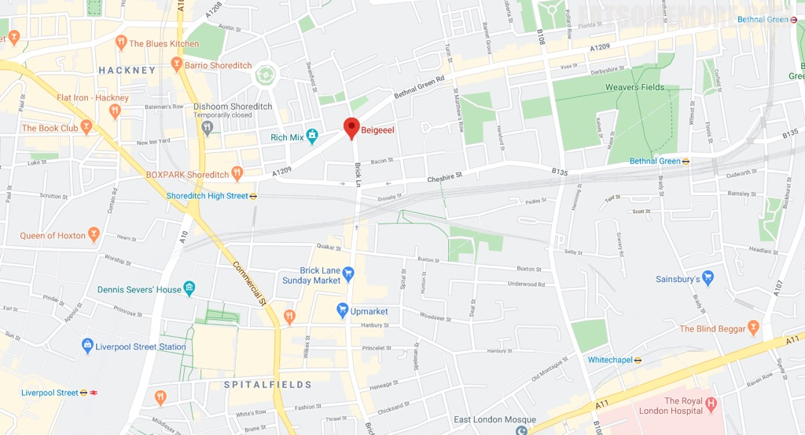

>砖巷市场Brick Lane Market is a London market centred on Brick Lane, in Tower Hamlets in east London. It is located at the northern end of Brick Lane and in the heart of east London's Bangladeshi community. It operates every Sunday from around 9 a.m. to 5 p.m. The market sells a diverse range of items, from antique books to eight-track cartridge decks, and for many years it hosted a stall selling nothing but rusty cog wheels. The market has always been popular with and much photographed by art students, and bargain hunters from across London value it greatly.

按照《韦氏词典》，“贝果”一词源于意第绪语“beygl”的音译。这个词来自中古高地德语“böugel”，意为“环”。同一个词在在古高地德语中写作“bouc”，古英语中写作“bēag”（环）或“būgan”（弯曲、弓形）。 根据《韦氏新世界大学词典》，“贝果”的另一个词源是奥地利德语中的“beugel，指一种牛角面包。与现在德语中的“bügel”相似，意思是马镫或环。贝果的前身，波兰传统食物“布勃利克” 在英国伦敦，贝果从19世纪中叶起就被销售，称为“beigel”。面包师常把它们穿在一米长的垂直长杆上，放在橱窗里展示。由发酵了的面团，捏成圆环，在沸水煮过才放进烤箱，形成了充满嚼劲的内部和色泽深厚而松脆的外壳。

咸牛肉

地址：159 Brick Ln, Shoreditch, London, E1 6SB

