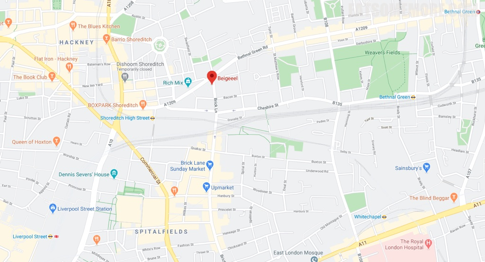

>伦敦的名市场之一，是位于伦敦东部的砖巷市场(Brick Lane Market)，曾今的五金市场，如今很受文艺青年的喜爱，也有古着、古籍、磁带和古董相机等等。市场当中吸引我一再到访的是一间看着不大起眼却闻名遐迩的贝果铺子The Beigel Shop。这个单词的原意就是“环”，据悉是一种波兰传统食品，使用发酵后的面团做成圆环状，煮过后再烤。这间铺子现烤的贝果的外皮松脆，内里空气感与嚼劲兼具，并提供多种可选的馅料。我最最最推荐的当然要数咸牛肉贝果！腌渍过的咸牛肉肥瘦相间，烧得软嫩，油脂甘香，瘦肉咸鲜，搭配一点英式黄芥末酱，解腻提味，还想再仔细品品的时候，就已经吃完啦！

地址：159 Brick Ln, Shoreditch, London, E1 6SB

