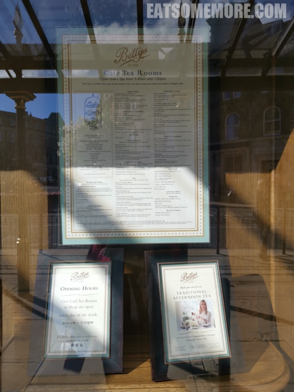
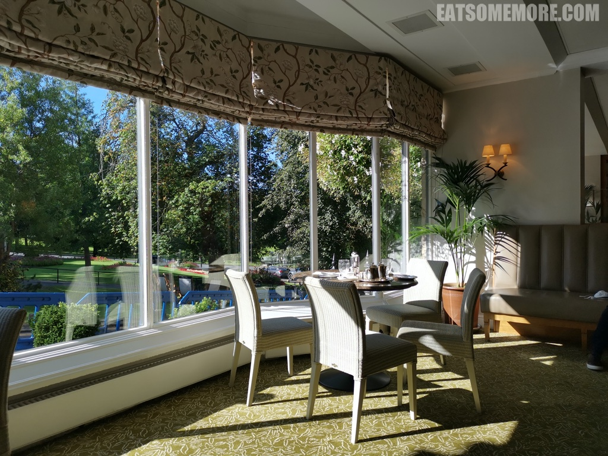
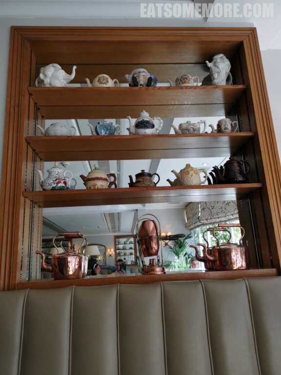
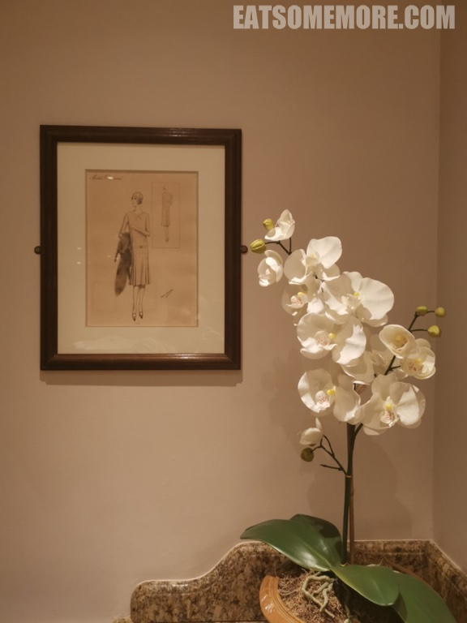

>哈罗盖特贝蒂的茶室创建于1919年，可以称得上是一间百年网红店。

>早上来这里阳光正好，明亮的窗户正对着蒙彼利埃山的绿地。

>座位背靠着一整柜各式各样的茶具。

>洗手间挂的素描画好像在窃窃地讲述着盖茨比时代的故事。

>银制的茶具有着月亮一样的光泽。

>注册了商标的“胖恶棍”司康饼有一个手掌那么大，上面摆着杏仁和樱桃干，不过这个面有些黏牙齿，我不太懂得欣赏。

>相较之下，葡萄干司康饼倒是优越许多，温热松软，又有弹性。

>搭配带有清香酸甜草莓粒的果酱和香滑的奶油，这滋味太甜蜜，非常推荐。

网站：[https://www.bettys.co.uk/cafe-tea-rooms/our-locations/bettys-harrogate](https://www.bettys.co.uk/cafe-tea-rooms/our-locations/bettys-harrogate)

地址：1 Parliament Street, Harrogate HG1 2QU

