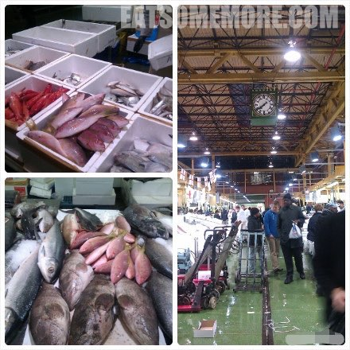
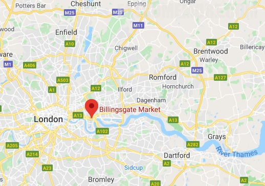

---
title: "伦敦海鲜批发市场餐厅 Billingsgate Cafe"
author: "九姨"
date: "2020-05-03"
categories: "美食"
tags: "英国,英格兰,推荐,海鲜,伦敦"
coverImage: "images/billingsgate_cafe_2.jpg"
---

>比邻阁（Billingsgate）市场是英国最大的海鲜市场。周二至周六每个早上天还没亮的时候就有源源不断的海鲜从海港和海外运来。

>来到这里，除了采买新鲜海产外，最不能错过的当属市场餐厅的扇贝贝果。在等待制作的间隙，嘬一口英式热奶茶，醒胃提神又暖心。贝果在铁板上稍稍烤过后更加松软，涂上香喷喷的黄油，再填满现煎咸香培根和大颗甜糯鲜嫩的扇贝，一口就服气，早起没脾气！它不仅是超纲早餐，更是从北大西洋而来的暖风，凝结了英格兰东南平原上空的水汽，滴落在肯特的青青草地。一言以蔽之，一时无两矣。

网站：[https://www.cityoflondon.gov.uk/business/wholesale-food-markets/billingsgate](https://www.cityoflondon.gov.uk/business/wholesale-food-markets/billingsgate)

地址：Billingsgate Market, Trafalgar Way, Poplar, London E14 5ST

