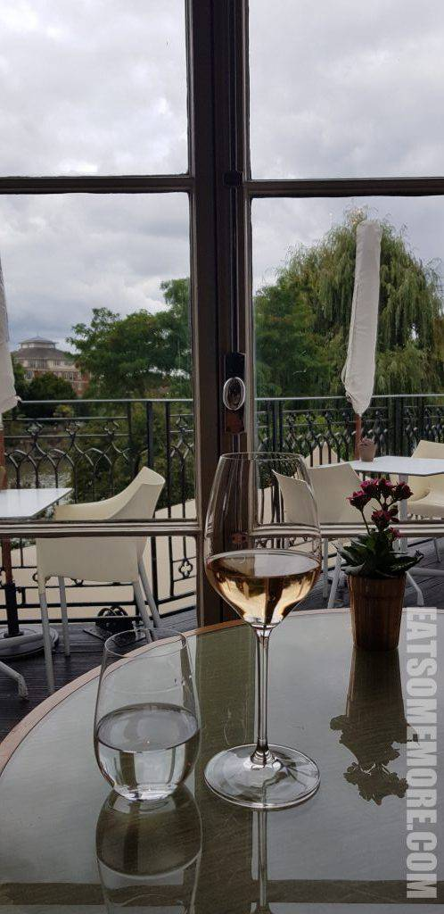
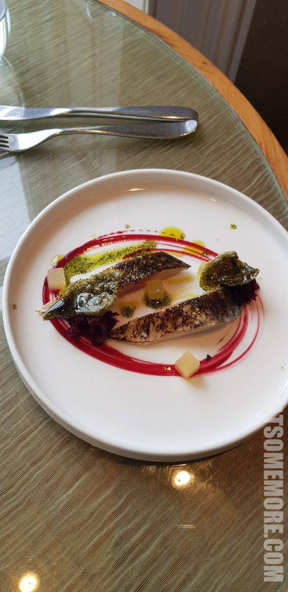
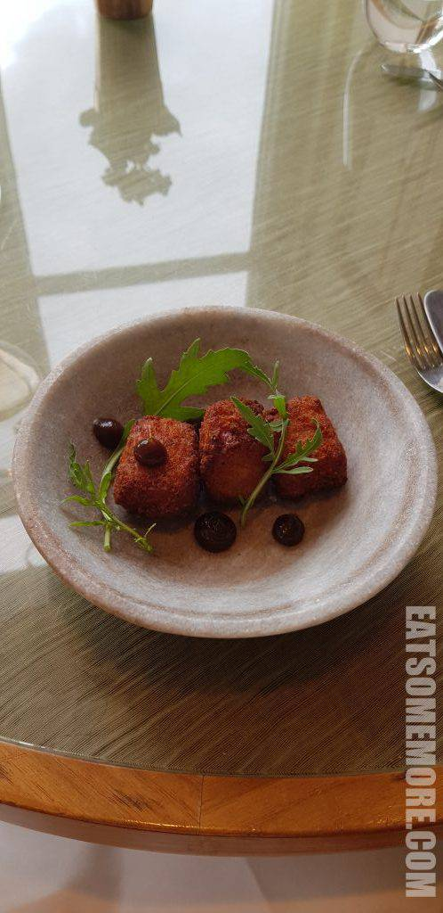
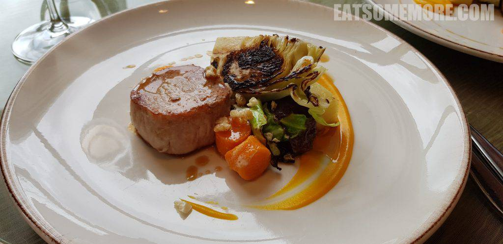
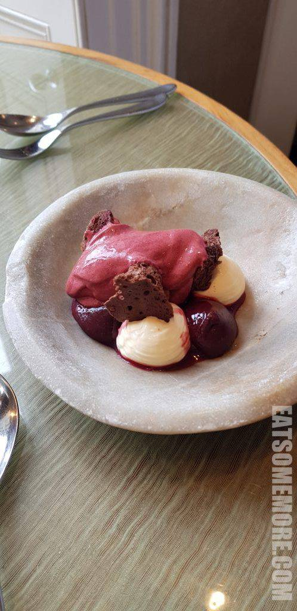
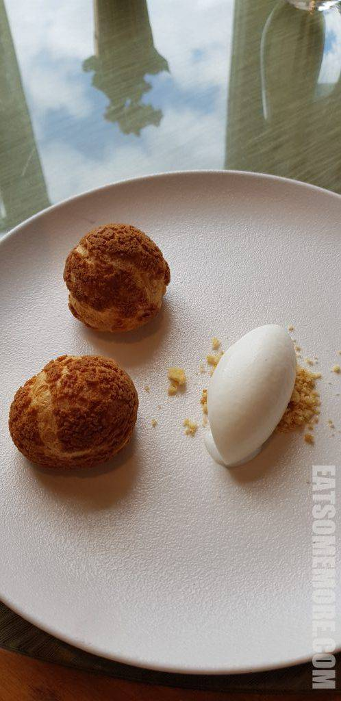

沿着里士满公园附近的一条静谧小道步行不远，就能到达连续四年获得猫途鹰Tripadvisor网站卓越奖的Bingham餐厅。窗外杨柳青青，泰晤士河流水潺潺，没有想到在这个地段还有这样恬静的餐馆。

更没有想到第一道菜就非常令人惊艳。第一次吃到那么滑嫩多汁的马鲛鱼，用苹果腌渍过，肉鲜皮脆，搭配海藻油和渍甜菜，有种鲜得上头的滋味。

炸咸肉“酥”类拔“脆”，点上焦糖苹果酱和芝麻菜，香而不腻，更上层楼！

香煎猪里脊和蜂蜜焗猪颊。一个表现的是猪肉原本香甜的肉汁和柔软而筋道的肉质，另一个则是酱香浓郁、肥瘦相间、软糯酥烂。

黑莓三层乳脂松糕，混合了黑莓酱、巧克力酱、奶油和脱水海绵蛋糕。

热带水果泡芙，外皮烤得酥脆，内馅酸中带甜，搭配酸奶冰淇淋，是很清爽的夏日甜点。

网站：https://www.binghamriverhouse.com/

地址：61 - 63 Petersham Road, Richmond Upon Thames, Surrey TW10 6UT