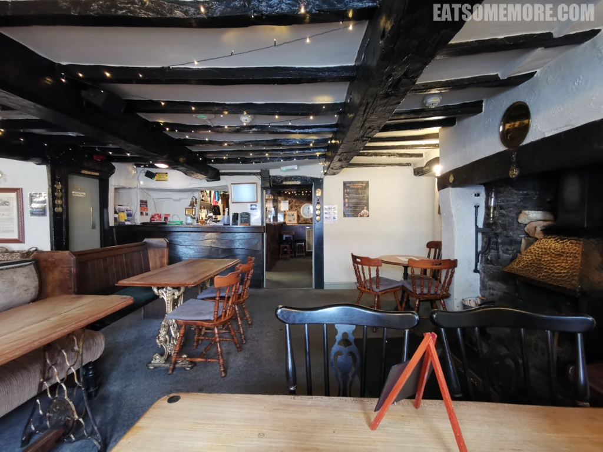
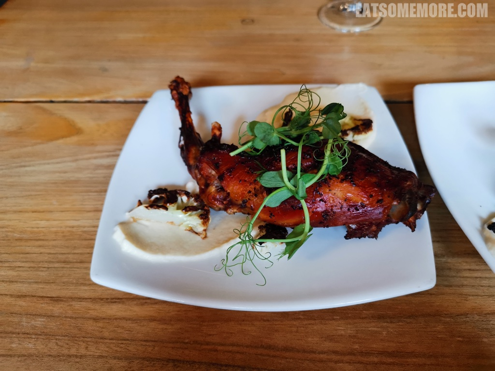
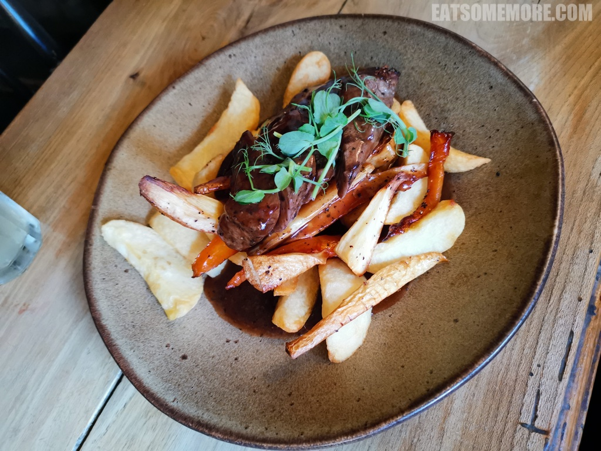
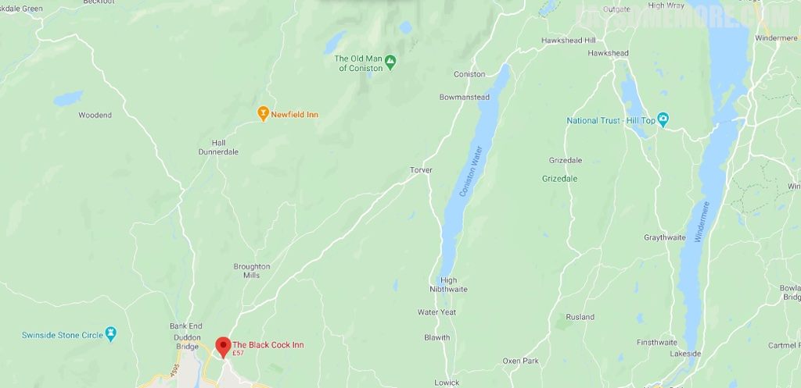

>在湖区的西南门户 Broughton-in-Furness 有一间非常有人情味的小酒馆。服务人员和来用餐的食客仿佛都互相认识，在中国的话可能就是一间热门的街坊店。

>这里毗邻通往爱尔兰海的莫克姆湾，也许因此烟熏花菜酱上金黄的香煎带子才格外的柔嫩弹牙、鲜甜多汁。

>油封兔腿香味独特，但是火候稍微过了一些。如图所示，烤花菜也稍微有些焦。

>8盎司半熟的野生鹿腿排肉弹汁鲜，搭配去腥解腻的红醋栗酱，清新香酥的蜜烤时蔬，和带有微微葱香的爱尔兰土豆泥，非常过瘾。

>油炸哈罗米干酪，料实材真，集油香与奶香于一身，汇嚼劲和咸鲜在一体。

网站：[https://www.theblackcockinnbroughton.co.uk/](https://www.theblackcockinnbroughton.co.uk/)

地址：Prince's St, Broughton-in-Furness LA20 6HQ

