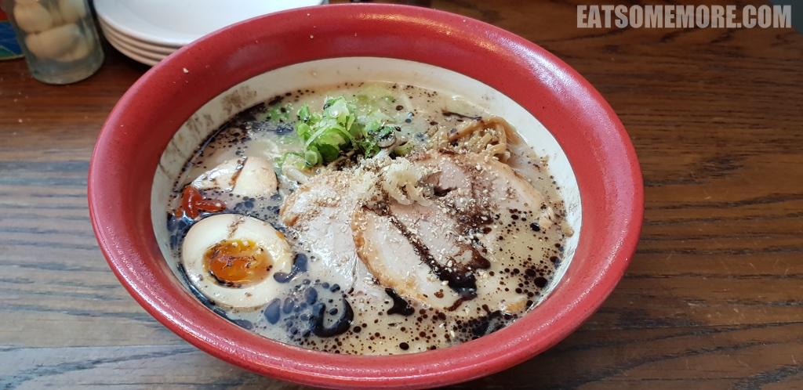

---
title: "伦敦日式拉面店 Bone Daddies"
author: "九姨"
date: "2021-01-17"
categories: "美食"
tags: "英国,英格兰,推荐,伦敦"
coverImage: "images/20190814_172946.jpg"
---

>Bone Daddies是伦敦的连锁日式拉面店。煲了二十小时的猪骨汤呈现出诱人的奶白色。叉烧肉、溏心蛋、笋丝和葱花各就各位。

>撒上芝麻碎，给软硬适中的面条增加香味，是慰藉心灵的拉面没错啦。

网站：[https://www.bonedaddies.com/](https://www.bonedaddies.com/)

地址：Nova Development, 9 Sir Milton Square, London SW1 5DJ

