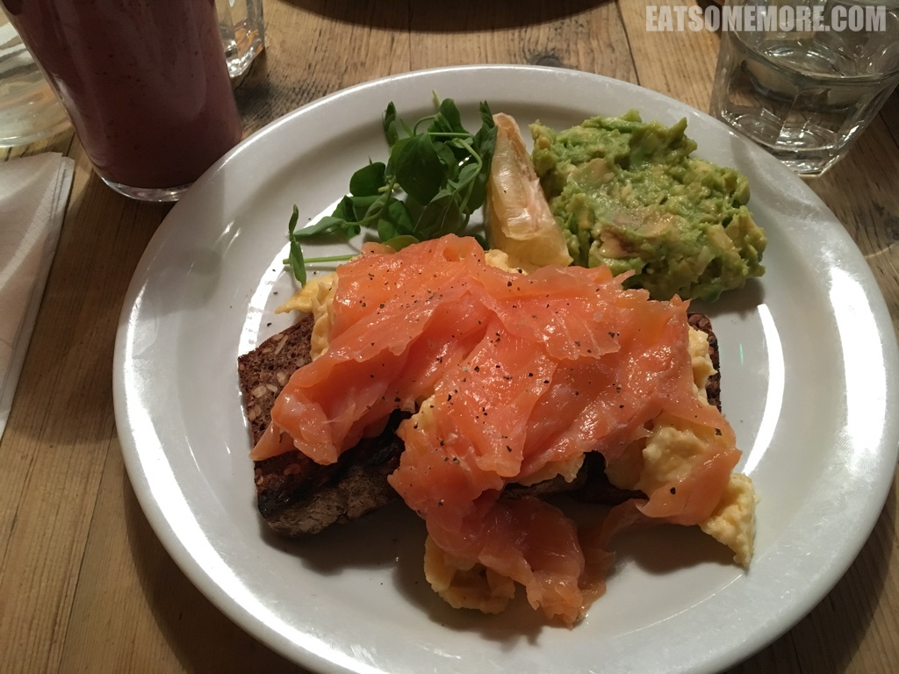

>对于劳动人民来说，周末的一大享受就是来一顿丰盛的早午餐。早午餐品目丰富，常见的有班尼迪克蛋、多士、松饼等等。早餐俱乐部 The Breakfast Club 是伦敦颇受欢迎的连锁早午餐店。市区 Soho 的这一间店，更是从早上九点就开始排队。而这里食物确实让人觉得这队排得值。杂粮面包上码着炒蛋、黑椒烟熏三文鱼，搭配牛油果泥和豌豆嫩苗，咸鲜香甜。

>炸鸡华夫饼看似平平无奇，实则惊艳味蕾。炸鸡表面酥脆而带有迷迭香气，内里肉质松软柔嫩又饱有肉汁，洒上烤过的柠檬汁消解油腻，佐以新鲜的豌豆嫩苗调剂口味，搭配烤得松软且沾过肉汁和黄油的华夫饼，感觉口内有乾坤、周末更美妙！

网站：[https://thebreakfastclubcafes.com/](https://thebreakfastclubcafes.com/)

地址：33 D’Arblay Street, W1F 8EU

