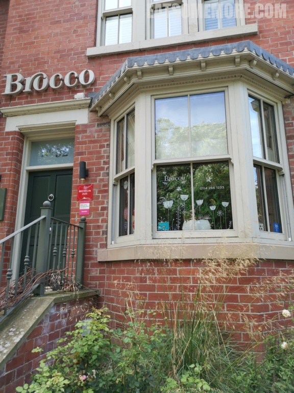
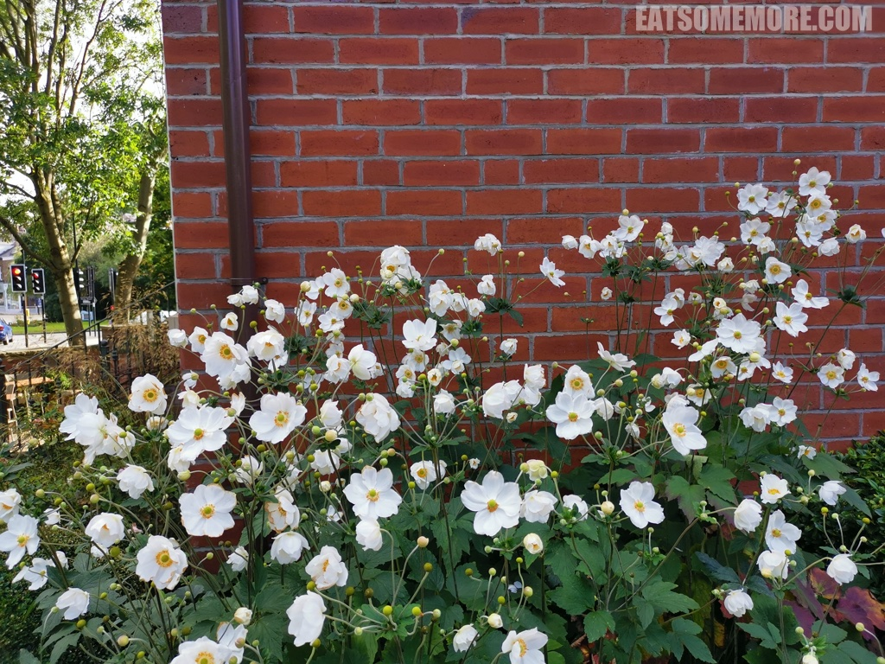
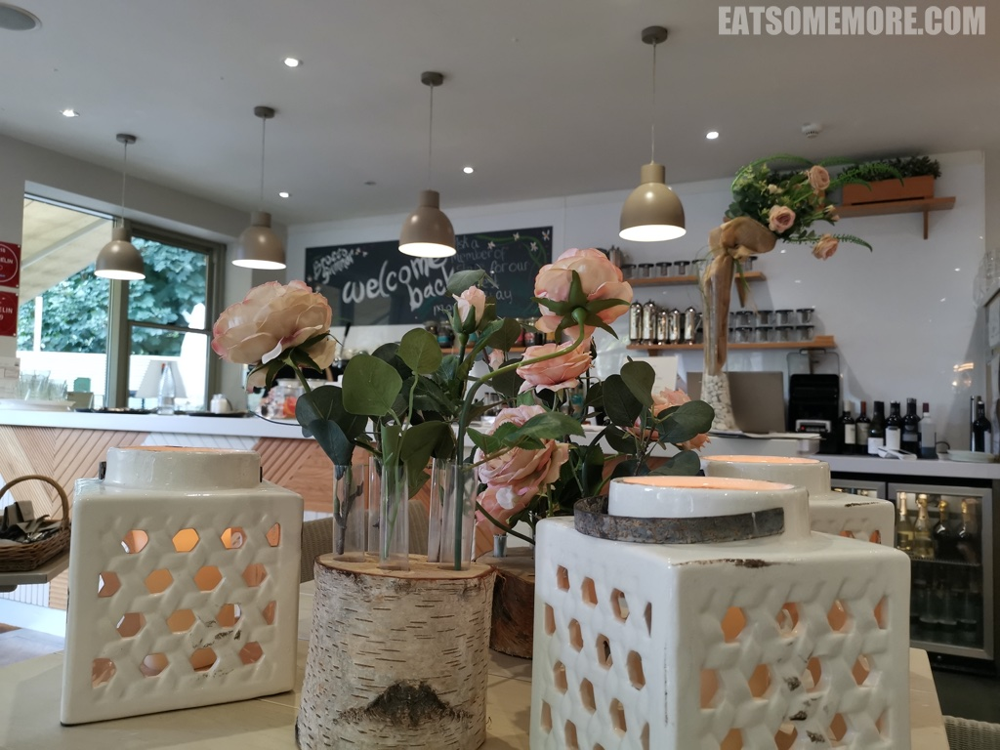
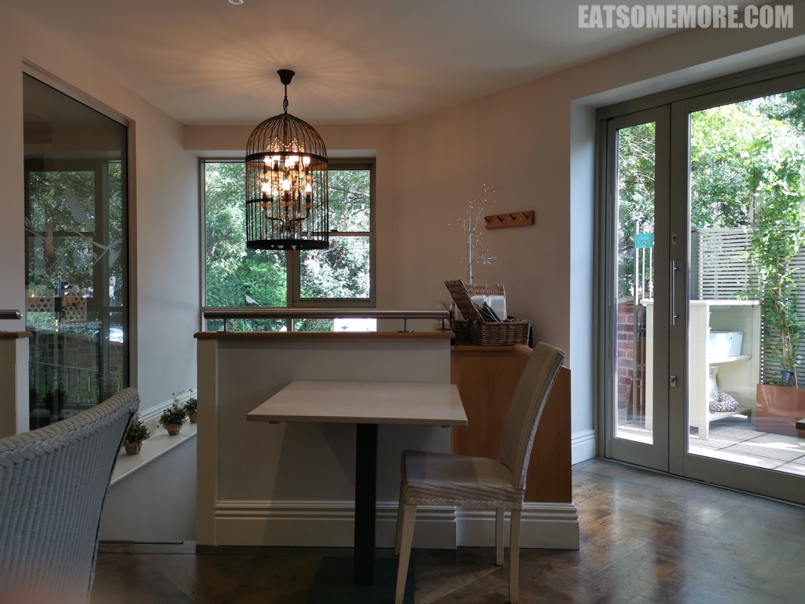
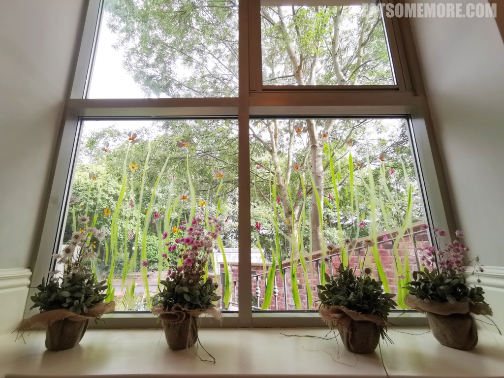
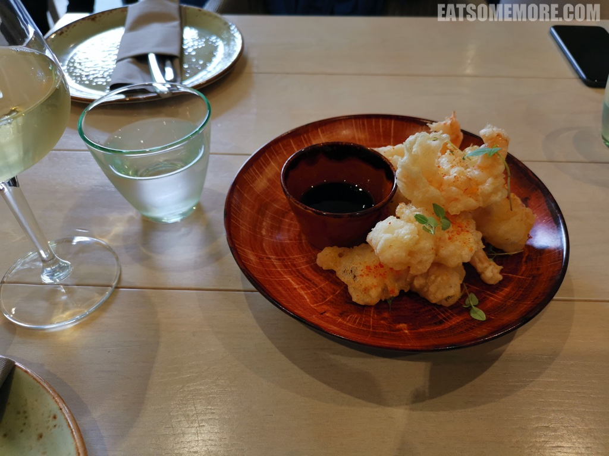
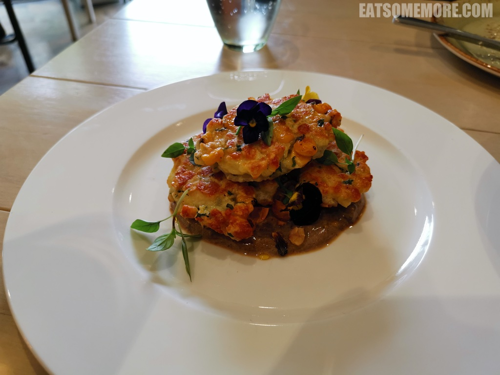
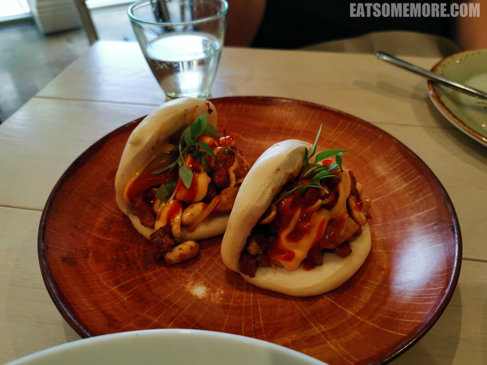
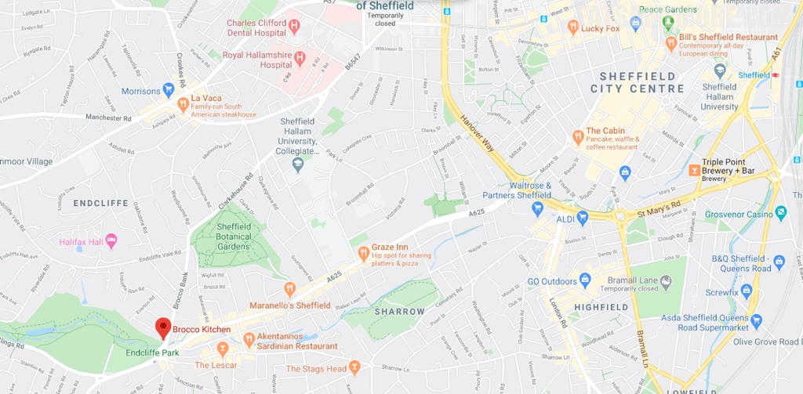

>谢菲尔德西南角这幢看似不起眼的红砖小楼，不仅受到米其林指南的推荐，更是2020年度猫途鹰网站的“旅行者之选”餐厅。

>八月尾的银莲花开得正好，在红色砖墙的衬托下显得格外脱俗。

>餐吧内部的陈设一派清新的风格。

>鸟笼状的吊灯，像是出现在电影里的画面。

>窗户上的兰草和窗台上的小雏菊，生机勃勃。

>书归正传，快来看看食物吧！𩽾𩾌鱼块和虾仁天妇罗，食材新鲜，肉质弹嫩，表皮酥脆，搭配日式酱油强力提鲜。

>鲜花哈罗米干酪玉米薯仔饼不仅颜值一流，味道也是综合了油香、奶酪香、黑蒜香、榛果香和玉米的清甜，独特又美味。

>三颗饱满鲜甜的香煎扇贝上撒了些煎得焦香的意式培根粒，半掩于慕斯状的【爱心形】青豆酱下，荤素搭配、海陆咸集、创意突出。

>泡菜猪肉包的面皮暄软香甜，泡菜微辣爽口，猪肉粒虽然烤得偏硬了一些但香味还是很突出，是拉差蛋黄酱和整粒的花生提升并丰富了包子的整体风味。

网站：[https://www.brocco.co.uk/kitchen/](https://www.brocco.co.uk/kitchen/)

地址：92 BROCCO BANK, SHEFFIELD S11 8RS

