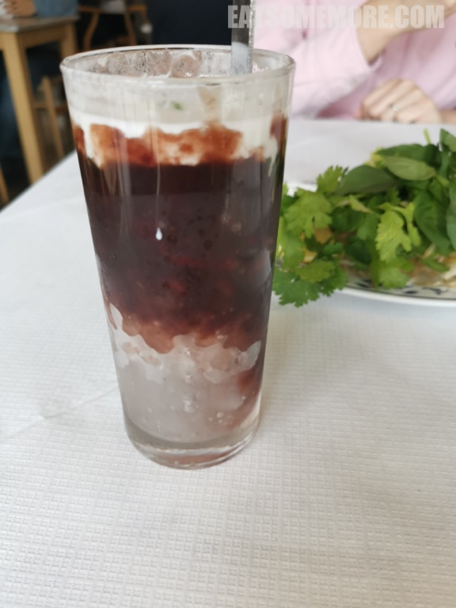
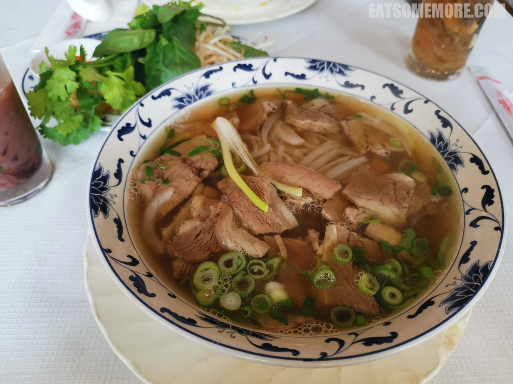
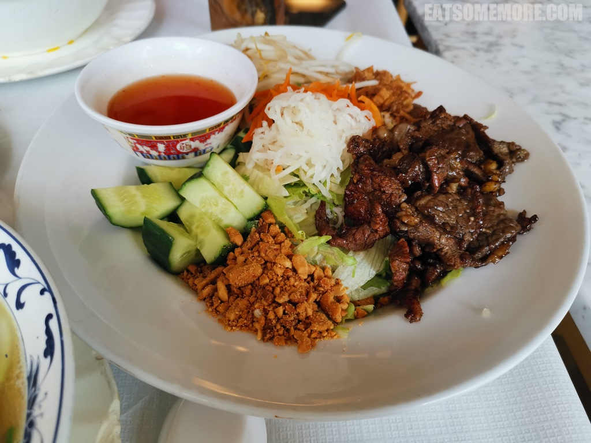

---
title: "伦敦越南餐厅 Cafe East"
author: "九姨"
date: "2023-11-05"
categories: "美食"
tags: "英国,英格兰,推荐,伦敦"
coverImage: "images/IMG_20200831_114348.jpg"
---

>三色冰饮的三色分别是红色甜蜜的腰豆沙，绿色清新的斑斓啫喱，和白色清甜的椰子汁，放在现打的沙冰上，清热解暑。

>中式传统清补凉里面有新鲜龙眼肉、去核红枣干、莲子、海苔和啫喱，香甜滋补。

>我每次的必点菜品就是炖牛肉河粉，炖得酥软肥瘦相间的牛肉篇和宽粉浸泡在看似清澈、实则味道浓郁的高汤当中。趁着河粉刚刚上桌，尝了汤头后就得赶紧往里面加香菜、豆芽、柠檬草和青柠汁，让味道变得更加清爽香甜。

>甜炒牛肉干捞粉，拌着黄瓜块、腌红白萝卜、豆芽、炸红葱头和烤花生粒，淋上甜辣鱼露，搅拌均匀后食用，清新爽口。

>椰汁眉豆糯米布丁，。

网站：[http://www.cafeeastpho.co.uk/](http://www.cafeeastpho.co.uk/)

地址：100 REDRIFF RD, SURREY QUAYS LEISURE PARK SE16 7LH

