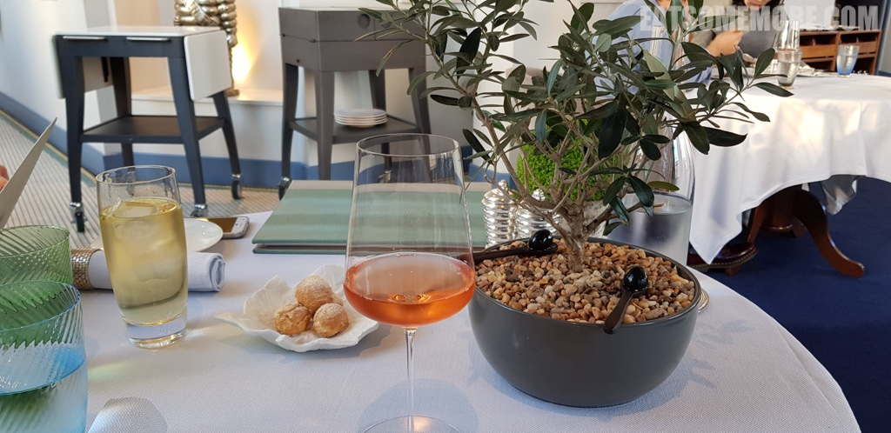
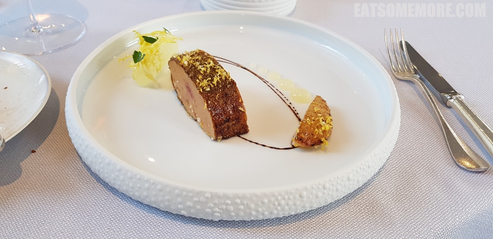
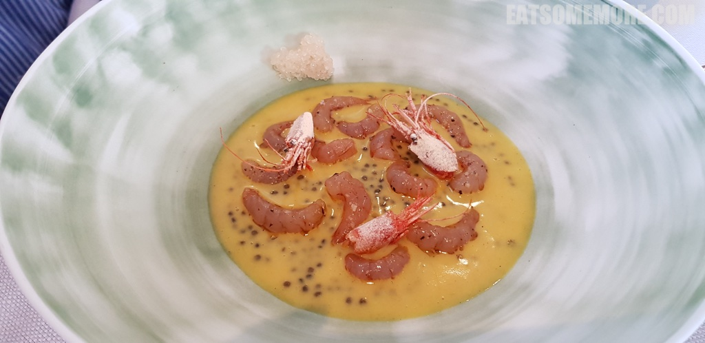
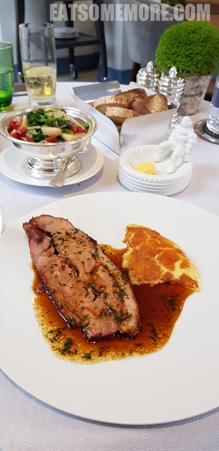
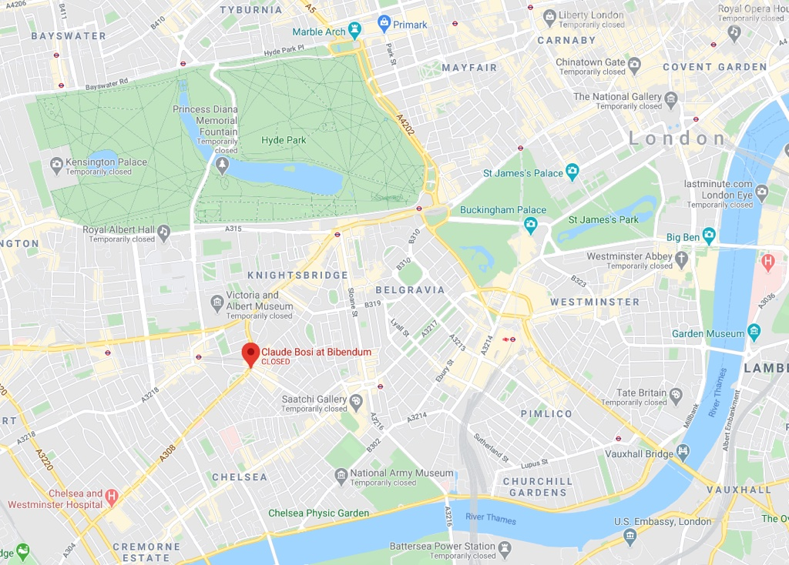

---
title: "伦敦米其林二星餐厅 Claude Bosi at Bibendum"
author: "九姨"
date: "2020-05-17"
categories: "美食"
tags: "英国,英格兰,推荐,米其林,伦敦"
coverImage: "images/20181228_134617.jpg"
---

>伦敦切尔西欣欣向荣的繁华街区当中有一幢米其林楼，楼里有一间米其林二星餐厅。

>餐前小点芝士球风味浓郁。盆栽橄榄树下还隐藏着两粒看着是橄榄，味道也是橄榄，但是却不是橄榄本人的分子料理。

>米其林小人儿把守着黄油，而我此刻全然记不起这颗炖蛋的味道。

>香煎鹅肝丰腴肥美，是教我无法拒绝的罪恶美味。更妙的是边上一小块汲满了柚子味道的梨，清甜爽口。

>双色鱼子酱黄油烟熏红虾海味浓浓。除了常见的黑色鲟鱼籽酱，这道菜里还搭配了白色的白斑狗鱼籽。为这一场海味imax拍掌叫好。

>主菜是烤得正好的牛肉搭配水煮时蔬。土豆泥出现了炖蛋的质感。

网站：[https://claudebosi.com/](https://claudebosi.com/)

地址：Michelin House, 81 Fulham Rd, Chelsea, London SW3 6RD

