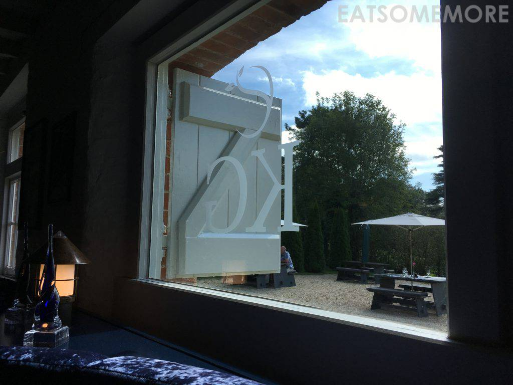
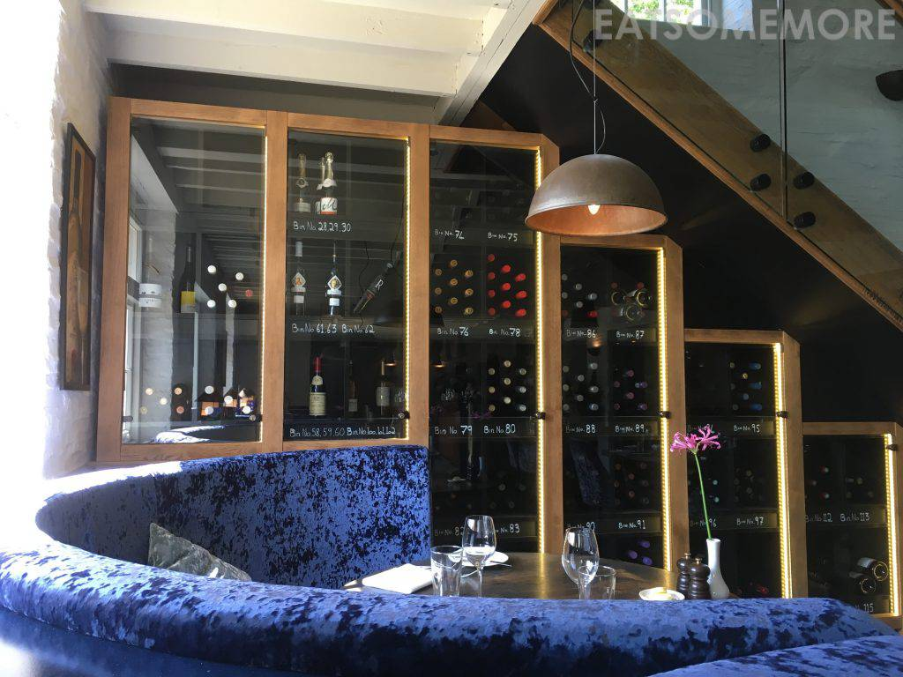
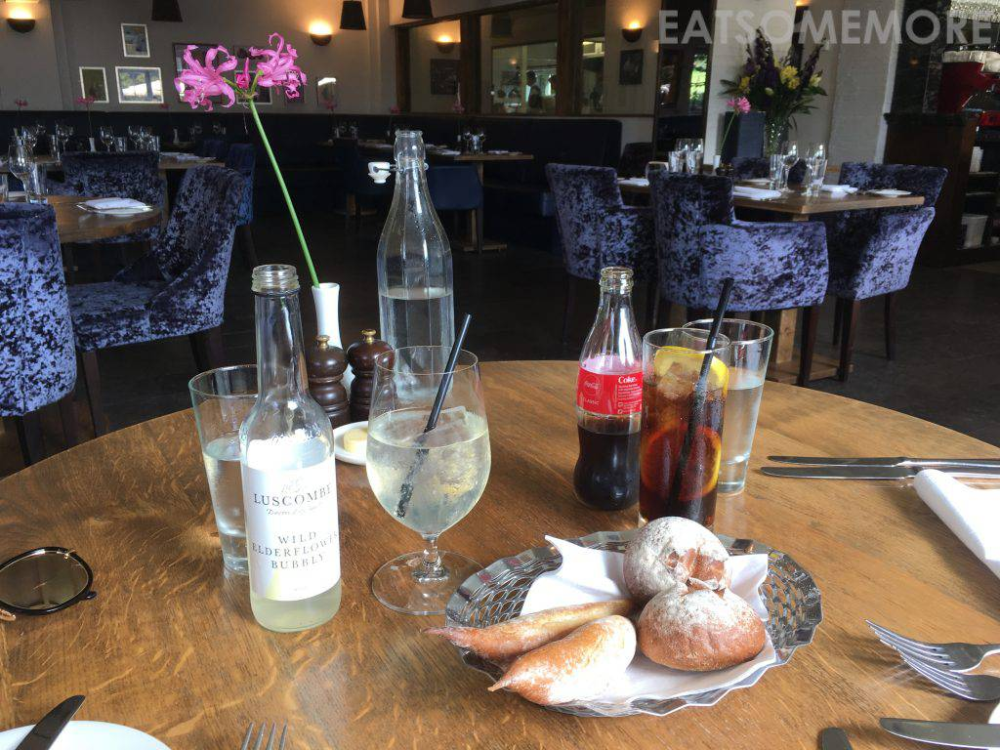
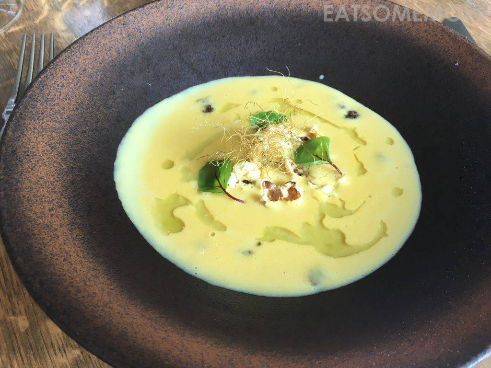
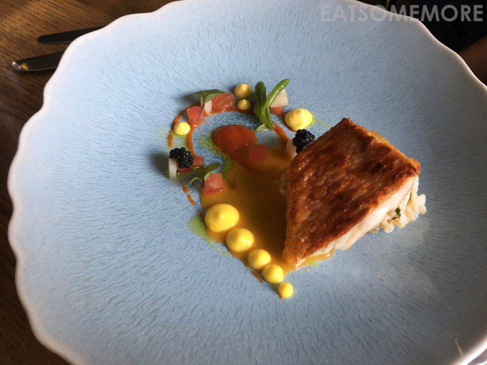
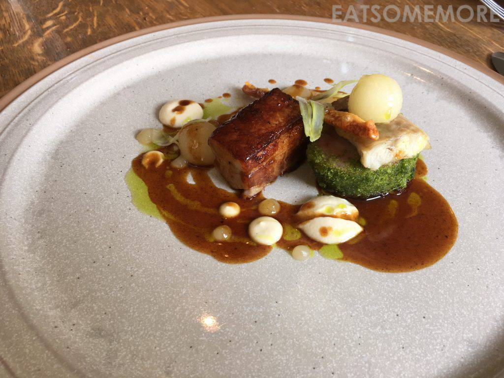
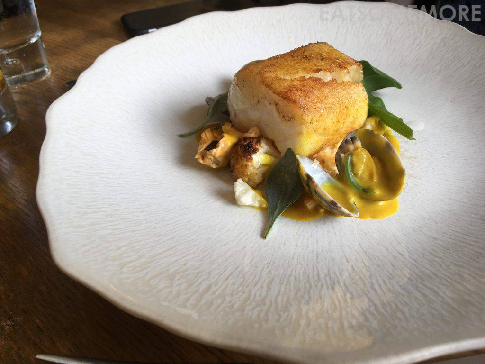
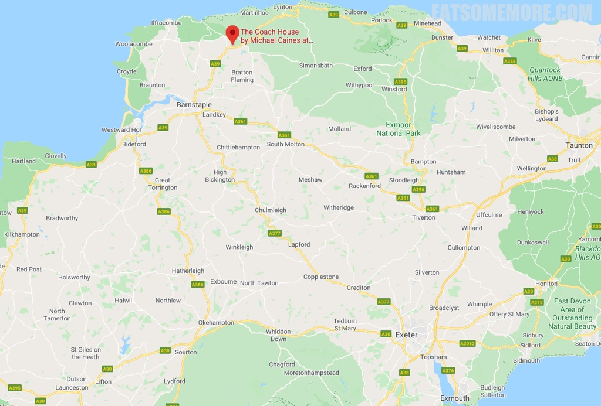

>在日本遇过好多隐于居民区的餐馆，在英国则是有好多隐于山野的饭店。

>藏酒济济，都标着产地和年份。

>然而光天化日之下，我们还是很矜持地点了果味汽水和可乐。刚出炉的餐前面包非常优秀——温热锁湿、外酥内软、筋性适中、面香馥郁。

>头一次吃到有爆米花的玉米浓汤，虽说新鲜有趣、粟香浓郁，但爆米花泡了汤就不脆了呀！

>鱼子酱煎鱼佐各式dressing，各种食物的原味都凸显了出来，又混搭在一起，好有意思。

>红烧猪五花、香煎猪里脊，加上文火炖鳗鱼，个个好吃得风格迥异又相得益彰，再配上新鲜的德文郡苹果果肉，香甜可口、清新解腻、美味更上层楼！

>香煎鳕鱼以及咖喱蛤蜊，食材新鲜、搭配神奇。只是这类一口就消灭的食物，时间隔得太久真的有点忆不起那个当下的感受了。

网站：[https://www.michaelcaines.com/michael-caines-dining/the-coach-house-2/](https://www.michaelcaines.com/michael-caines-dining/the-coach-house-2/)

地址：Kentisbury Grange, Kentisbury EX31 4NL

