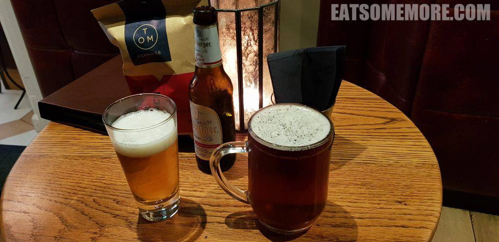
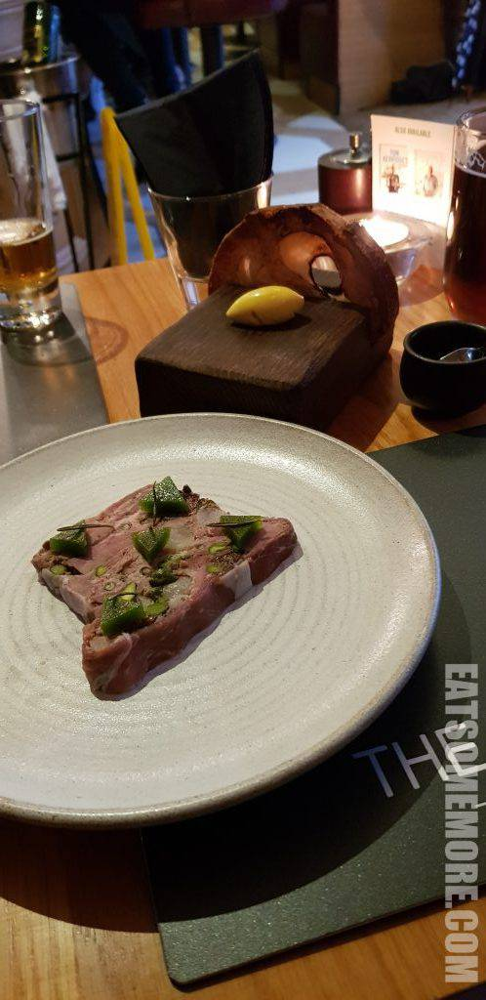
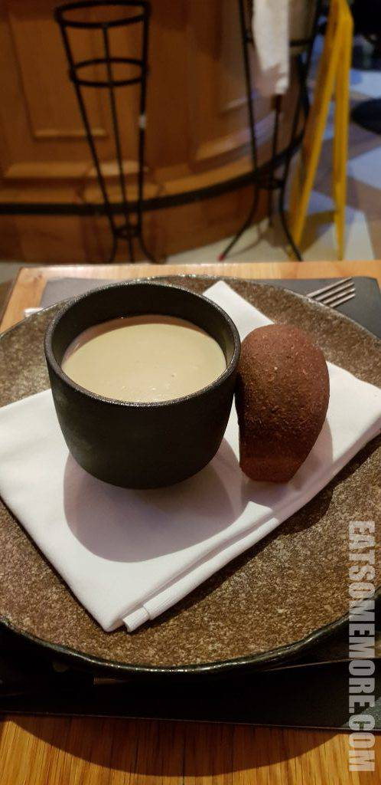
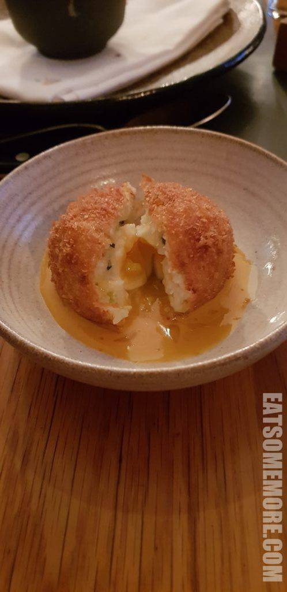
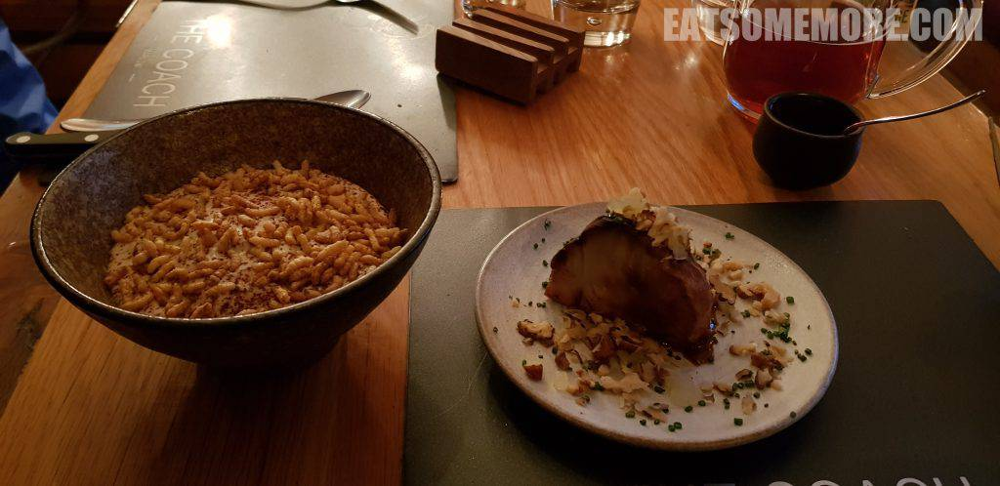
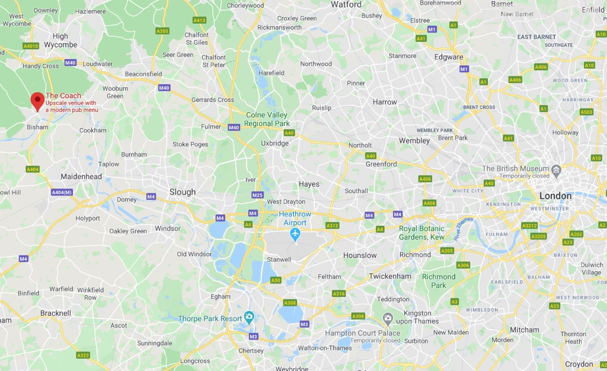

>晚餐时来到了马洛小镇上的米其林一星小酒馆。喝着啤酒，等位也不太难熬了。

>鸭腿、鸭心和鸭胗酱搭配青梅、白兰地啫喱，涂在现烤的酵母面包上，提鲜增香，美味不俗。

>白葡萄酒烩青口贝，贝肉软嫩柔滑，浓汤鲜甜还带有白葡萄酒香。

>鳕鱼苏格兰蛋，外皮酥脆，鳕鱼馅拌着溏心鸡蛋有着双重的鲜香。

>红酒、巧克力、米浆辣炖野味，香辣出众、下饭无两。枫糖烤块根芹，搭配苹果、核桃和细葱碎，又是另一种多元的香味，让人一口接着一口。

网站：[https://www.thecoachmarlow.co.uk/](https://www.thecoachmarlow.co.uk/)

地址：3 West Street, Marlow, Bucks SL7 2LS

