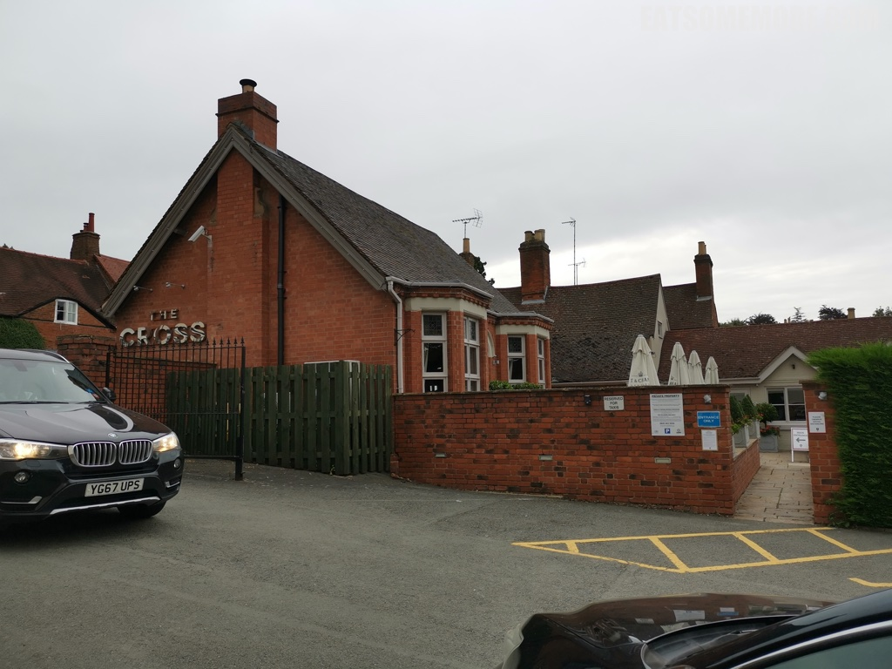
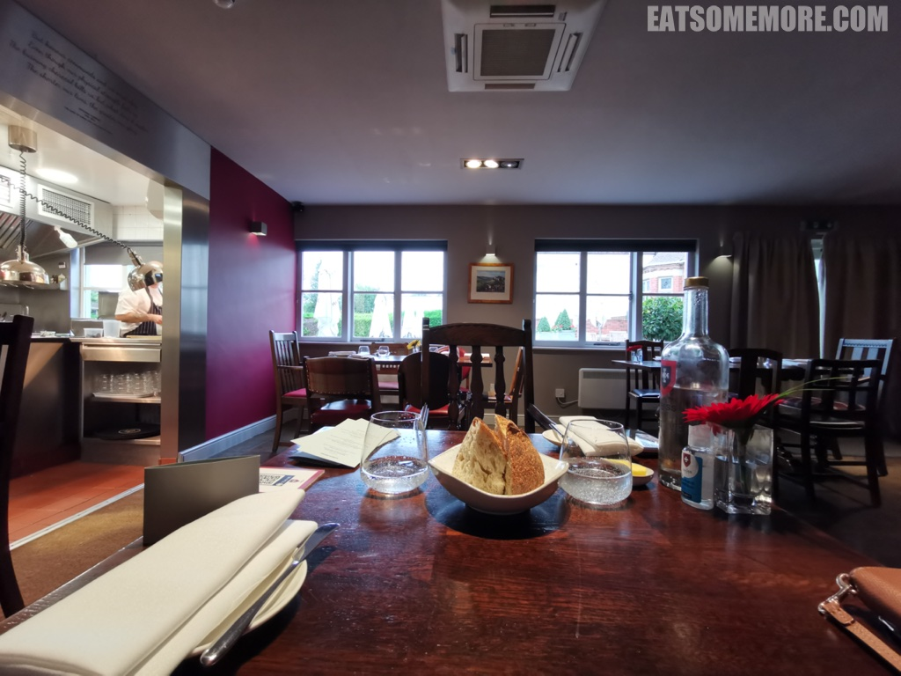
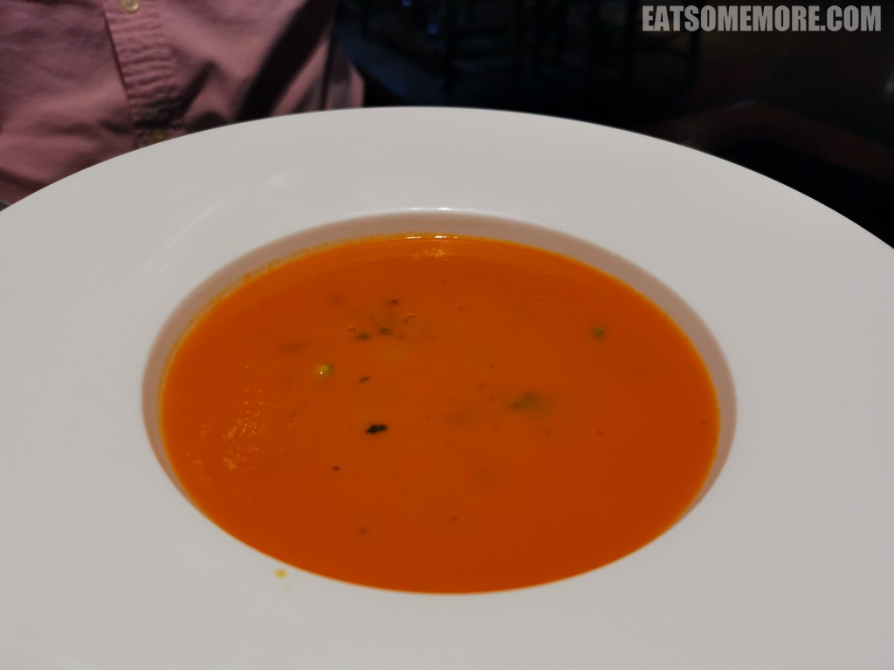
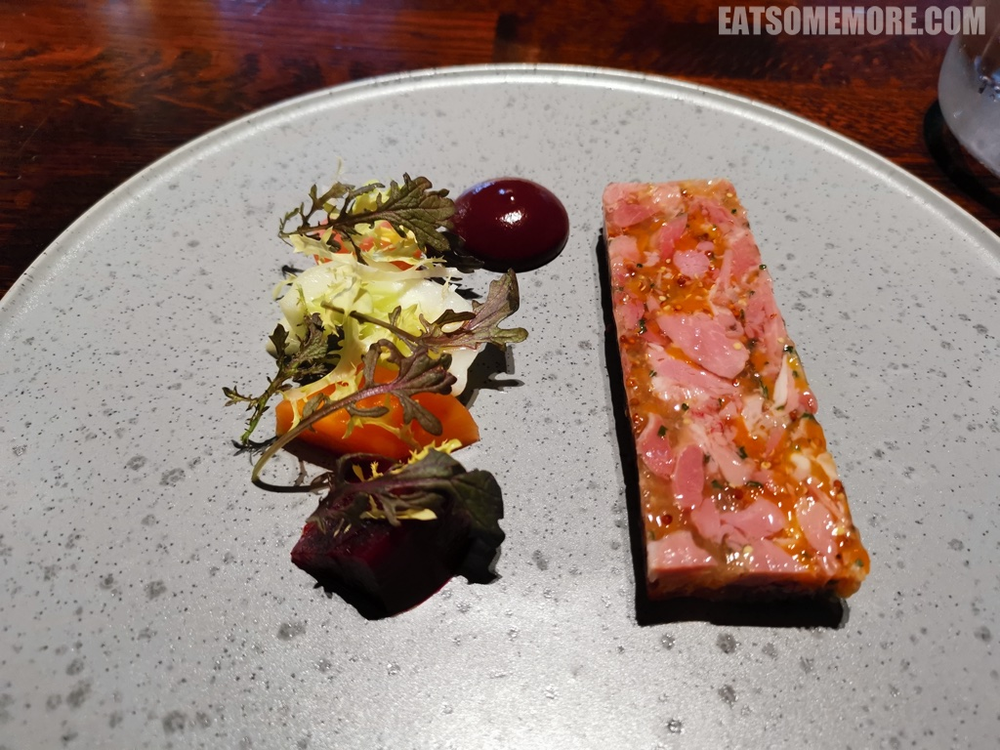
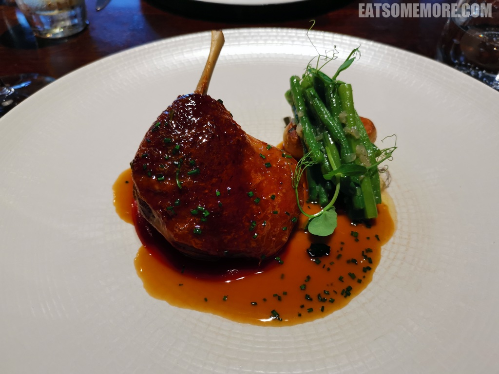
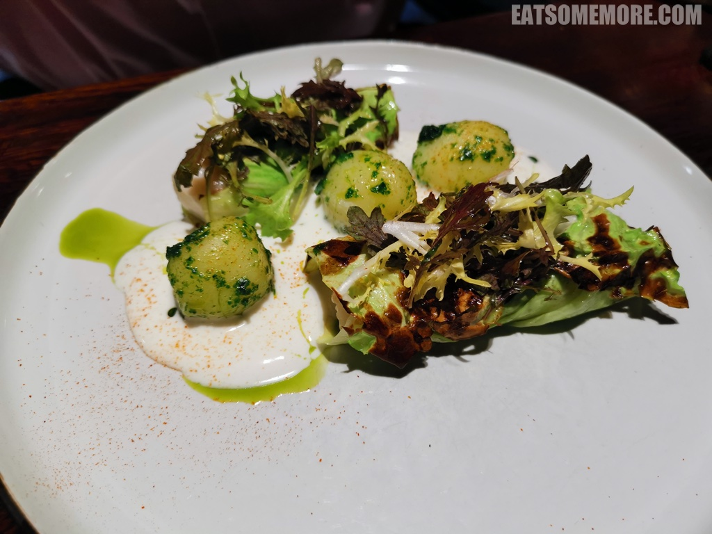
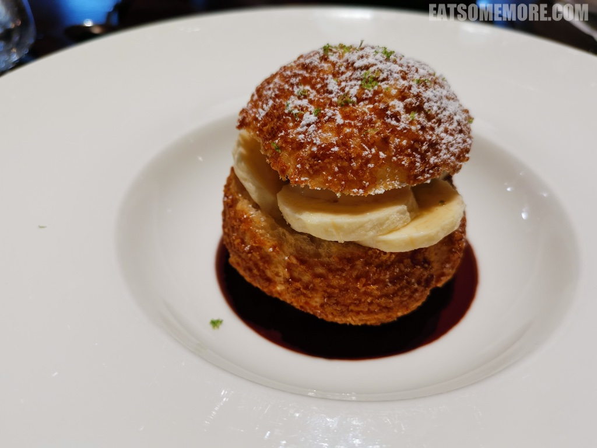
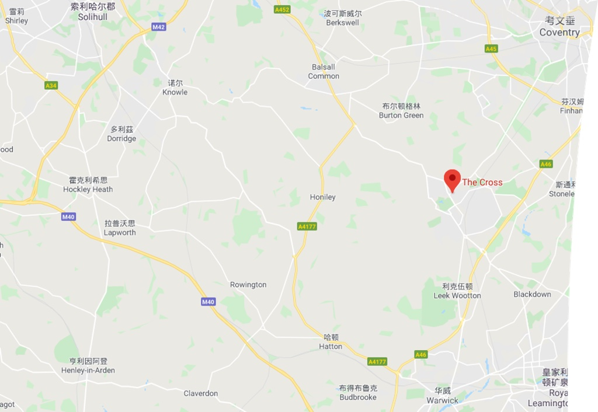

>。

>。

>mill piece tomato soup - courgette, basil, pine kernels。

>terrine of ham hock - pickles, violet mustard, peppery leaves。

>confit leg of creddy carver duck - fondant potatoes, green beans with shallot, plum puree, sherry vinegar sauce。

>cornish hake - gilled hispi cabbage, parsley potatoes, buttermilk, lovage oil。

>banoffiterole - banana andn lime ice cream, dulce de leche。

网站：[https://thecrosskenilworth.co.uk/](https://thecrosskenilworth.co.uk/)

价格：午市套餐 £ 起。

地址：16 NEW STREET, KENILWORTH CV8 2EZ

