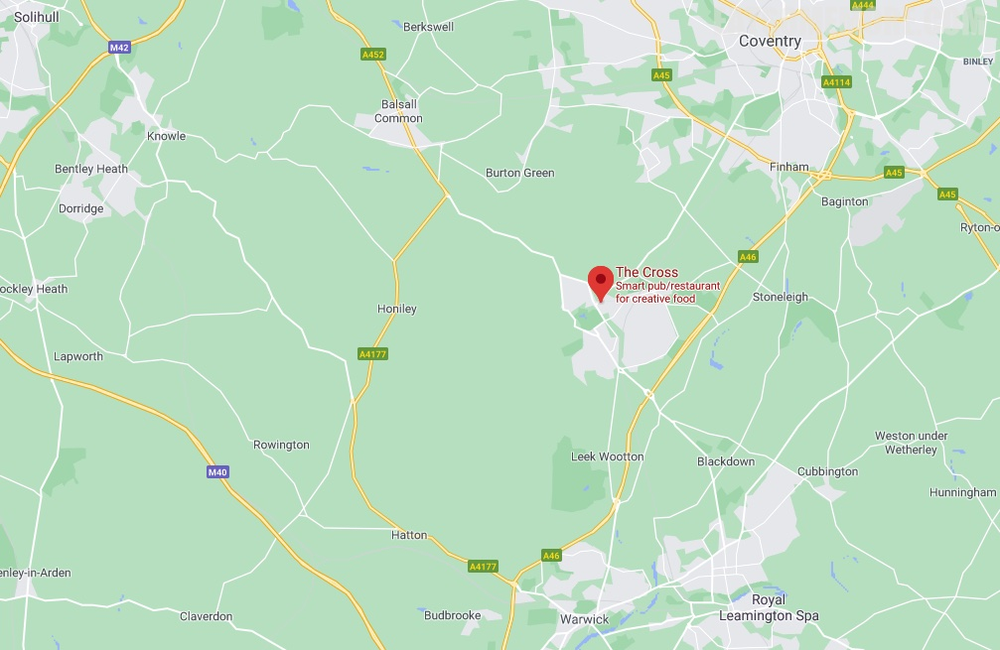

>考文垂西南六英里处的凯尼尔沃思小镇上的十字餐厅拥有米其林一颗星。

>餐厅的特别之处是它的开放式厨房，在主厨的指挥下有条不紊地准备着美餐。

>番茄汤里不但有节瓜、罗勒，还有松子，香气丰富而浓郁。

>咸猪肘肉丁、肉冻、芥菜籽和香草末混合而成的肉酱，不仅凉爽有弹性，还带有果香的咸鲜味道，搭配腌菜、辛味叶菜和紫芥末酱，更添清新鲜爽的口感。

>油封农场鸭腿立在混合着雪莉醋的梅子汁里，咸香酥软的同时，又酸甜可口，搭配脆嫩的四季豆和用高汤煨煮出来的土豆柱，是叫人停不下来的好味道。

>鲜香软嫩的康沃无须鳕鱼块被包裹在煎得清甜的卷心菜当中，沾着香滑的酪乳和独活草油，又特别又美味。

>香蕉太妃焦糖泡芙，酥脆的表皮上撒着糖霜和青柠皮碎，夹着新鲜的香蕉，泡在太妃焦糖酱里，很有想法。

网站：[https://thecrosskenilworth.co.uk/](https://thecrosskenilworth.co.uk/)

价格：平日午市套餐 £29 起。

地址：16 NEW STREET, KENILWORTH CV8 2EZ

