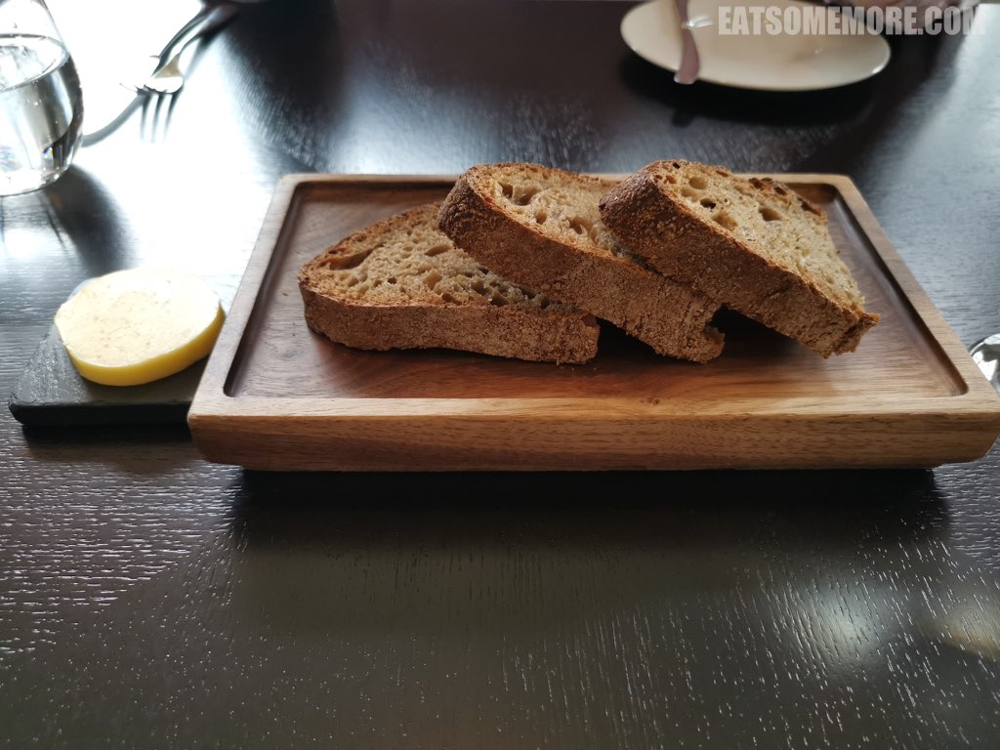

---
title: "海德公园野餐的地理位置＋米其林二星的用餐体验＝Dinner by Heston Blumenthal"
author: "九姨"
date: "2020-04-19"
categories: "美食"
tags: "英国,英格兰,米其林,精选,英国菜,伦敦"
coverImage: "images/IMG_20200112_125745.jpg"
---

>蝉联猫途鹰Tripadvisor网站卓越奖四年、米其林二星的英国菜餐厅Dinner by Heston Blumenthal，与海德公园仅一窗之隔。

>除了优秀的景观，餐厅的菜单也极具巧思，封面上画的是庞贝最后的晚餐，腰封里写着关于番茄酱的冷知识，说真正的番茄酱在1801年在美国首次出现，而此前在英国的“番茄酱”是用蘑菇、黄瓜、鳀鱼、核桃、柠檬或者贝类制成的酸甜酱汁。

>凉透的酸种面包，表皮比较硬，内里则比较柔软，具有极佳的空气感与湿度，还带有一些焦香和香料的味道。

>烟熏三文鱼搭配烟熏甜菜根、腌渍柠檬沙拉、欧芹和酢浆草，鱼肉非常柔软，丰富的脂肪迸发出鱼油的鲜味，与甜菜根和柠檬的酸甜果味意外地特别合衬。蔬菜新鲜得甚至还带着细密的绒毛，饱含清甜的汁水。

>蒜香蜗牛沙拉的酱味很浓，有些夺了蜗牛本身的风味。烤生菜非常脆。蘑菇经过了欧芹和鳀鱼的调味，鲜味翻倍。

>海军上将酱烤鳕鱼和朝鲜蓟，蒜瓣肉已经被烤得全熟，结构虽然松散，肉质却很有嚼劲，配上黄油续随子和去壳褐虾一起吃，更添鲜香层次。

>烤鹌鹑非常的香，弹嫩而入味，骨头上还有些粉色，让我不禁想起我的童年最爱——家乡杭州吴山烤鸡的感觉。

>金箔波希米亚蛋糕，换言之巧克力柚子慕斯蛋糕搭配蜂蜜冰淇淋。

>西梅罗望子塔的上半部分神似焦糖布丁，柔软的奶黄糕体冰冰凉凉，带有天然而含蓄的甜味。在布丁和塔皮之间夹了一层西梅罗望子酱，增添了独特的酸甜风味。

>焦糖巧克力塔在嘴里化开的时候有浓郁的可可香。

>现场使用液氮古法制作的跳跳糖蜂蜜柠檬奶黄雪糕，蛋筒特别的薄和脆。

网站：[https://dinnerbyheston.co.uk/](https://dinnerbyheston.co.uk/)

价格：周一至周日午餐定食£48起，另外也有自选菜单和主厨精选菜单。

地址：66 Knightsbridge, London SW1X 7LA

