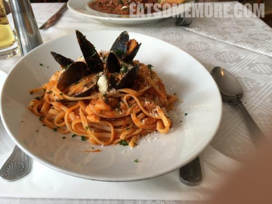
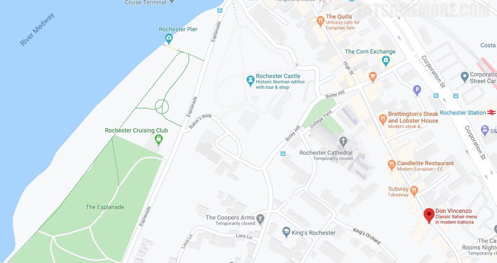

>在典型的英国小镇罗彻斯特，有一间名列前茅的意大利餐厅。红烩鱿鱼，原料新鲜，滋味浓郁，混合芝士的奶香和欧芹的清新，下饭一绝。

>海鲜意大利面简直就是在意大利吃到的味道，油香鲜香芝士香齐齐整整。

网站：[http://www.donvincenzo.co.uk/](http://www.donvincenzo.co.uk/)

地址：108 - 110 High Street, Rochester ME1 1JT

